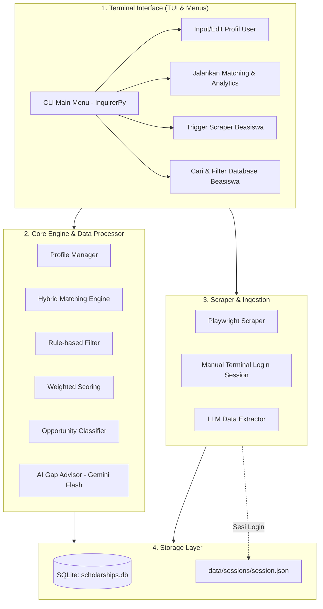

# 🎓 Scholarship Analytics & Matching System (Terminal / CLI Edition)
> **Dokumen Perencanaan Arsitektur, Logika Matching, Web Scraping, dan Roadmap Pengembangan (100% Terminal-Based / TUI)**

---

## 📌 1. Ringkasan & Konsep Proyek
Sistem ini dirancang sebagai **Terminal-based Analytics Dashboard & Recommendation Engine** (TUI - *Terminal User Interface*) yang berjalan sepenuhnya di terminal / command prompt. Pengguna dapat mengelola profil, menjalankan scraping data beasiswa, melakukan kalkulasi peluang, serta melihat visualisasi analitik tanpa perlu membuka web browser atau menjalankan web server lokal.

### Keunggulan Sistem Berbasis Terminal:
* ⚡ **Sangat Ringan & Cepat**: Tanpa *overhead* web framework, rendering instan di terminal.
* ⌨️ **Keyboard-Driven & Efisien**: Navigasi interaktif menggunakan tombol panah / angka (*interactive prompts*).
* 📊 **Estetik dengan TUI Modern**: Menggunakan library **`Rich`** dan **`Plotext`** untuk merender tabel berwarna, panel, *progress bar*, dan grafik ASCII/Unicode langsung di terminal.
* 🔐 **Scraping Terintegrasi Mulus**: Alur login manual browser dan scraping dipicu langsung dari satu sesi terminal yang sama.

---

## 🏗️ 2. Arsitektur Sistem (Terminal Edition)



---

## ⚙️ 3. Tech Stack & Library Terminal

| Komponen | Tools Terpilih | Alasan & Fungsi |
| :--- | :--- | :--- |
| **CLI Styling & Layout** | **`Rich`** | Menghasilkan tabel estetik, panel berwarna, teks formatting Markdown, *syntax highlight*, dan *live spinner*. |
| **Interactive Prompts** | **`InquirerPy`** / **`questionary`** | Menu interaktif dengan navigasi tombol panah ($\uparrow \downarrow$), autocomplete input, dan checklist. |
| **Terminal Plotting / Charts** | **`plotext`** | Menampilkan grafik scatter plot kuadran, bar chart skor, dan histogram langsung di dalam terminal menggunakan karakter ASCII/Unicode. |
| **Database** | **`SQLite`** (`sqlite3` / `SQLAlchemy`) | Penyimpanan lokal mandiri, cepat, dan mudah di-query dengan SQL atau Pandas. |
| **Scraper & Browser Auth** | **`Playwright`** | Membuka browser untuk login manual 1x di terminal, bypass CAPTCHA secara natural, lalu menyimpan cookies sesi. |
| **AI Parser & Gap Advisor** | **`google-genai`** (`gemini-2.5-flash`) | Ekstraksi postingan beasiswa menjadi JSON dan menghasilkan saran perbaikan profil di terminal. |

---

## 🖥️ 4. Mockup Tampilan Terminal Dashboard

Berikut ilustrasi bagaimana analitik ditampilkan di layar terminal menggunakan **`Rich`** dan **`plotext`**:

```text
╭────────────────────────────── 🎓 BEASISWA CHECKER ANALYTICS ──────────────────────────────╮
│  Nama: Adika | Jenjang: S2 | Target: UK, Europe | IPK: 3.65 | IELTS: 6.5 | Pengalaman: 2 Th │
╰────────────────────────────────────────────────────────────────────────────────────────────╯

┏━━━━━━━━━━━━━━━━━━━━┳━━━━━━━━━━━━━━━━━━━━┳━━━━━━━━━━━━━┳━━━━━━━━━━━━━━━━┳━━━━━━━━━━━━━━━━┓
┃ Kategori           ┃ Nama Beasiswa      ┃ Peluang (%) ┃ Status Syarat  ┃ Kuadran        ┃
┣━━━━━━━━━━━━━━━━━━━━╋━━━━━━━━━━━━━━━━━━━━╋━━━━━━━━━━━━━╋━━━━━━━━━━━━━━━━╋━━━━━━━━━━━━━━━━┫
┃ 🟢 Safety (≥80%)   ┃ Chevening UK       ┃ 88% [█████] ┃ Lengkap (100%) ┃ Rekomendasi #1 ┃
┃ 🟢 Safety (≥80%)   ┃ Erasmus Mundus     ┃ 82% [████ ] ┃ Lengkap (100%) ┃ Rekomendasi #2 ┃
┃ 🟡 Target (60-79%) ┃ LPDP Reguler       ┃ 74% [███  ] ┃ Lolos Syarat   ┃ Prioritas #3   ┃
┃ 🔴 Reach (<60%)    ┃ Gates Cambridge    ┃ 52% [██   ] ┃ Perlu Riset    ┃ Tantangan      ┃
┗━━━━━━━━━━━━━━━━━━━━┻━━━━━━━━━━━━━━━━━━━━┻━━━━━━━━━━━━━┻━━━━━━━━━━━━━━━━┻━━━━━━━━━━━━━━━━┛

📊 Peluang & Distribusi Skor:
 100 ┼                                      ╭───╮
  80 ┼                    ╭───╮             │   │
  60 ┼                    │   │    ╭───╮    │   │
  40 ┼           ╭───╮    │   │    │   │    │   │
   0 ┴───────────┴───┴────┴───┴────┴───┴────┴───┴──────────
                 Gates    LPDP    Erasmus  Chevening

💡 AI Gap Analysis & Rekomendasi Tindakan:
 • Target Beasiswa: LPDP Reguler (74%)
   👉 Skor IELTS Anda saat ini 6.5. Jika ditingkatkan ke 7.0, peluang naik menjadi 84%.
   👉 Tambahkan 1 publikasi riset atau bukti leadership untuk memperkuat esai kontribusi.
```

---

## 📊 5. Logika & Formula Matching Engine

1. **Hard Filter**:
   * Eliminasi beasiswa jika: $Usia > MaxAge$, $IPK < MinGPA$, $IELTS < MinIELTS$, atau $Jenjang \notin TargetDegrees$.
2. **Weighted Fit Score**:
   $$\text{Fit Score} = (0.35 \cdot S_{\text{akademik}}) + (0.25 \cdot S_{\text{bahasa}}) + (0.20 \cdot S_{\text{pengalaman}}) + (0.20 \cdot S_{\text{riset/prestasi}})$$
3. **Klasifikasi Peluang**:
   * **Safety** ($\ge 80\%$): Profil di atas rata-rata penerima beasiswa.
   * **Target** ($60\% - 79\%$): Profil pas dan memenuhi semua kriteria utama.
   * **Reach / Dream** ($< 60\%$): Persaingan sangat tinggi atau kualifikasi di batas minimum.

---

## 🗄️ 6. Skema Database (SQLite)

```sql
-- Tabel Beasiswa
CREATE TABLE IF NOT EXISTS scholarships (
    id TEXT PRIMARY KEY,
    name TEXT NOT NULL,
    provider TEXT NOT NULL,
    funding_type TEXT NOT NULL, -- Fully Funded, Partial, dll
    target_degrees TEXT,         -- JSON: ["S1", "S2", "S3"]
    target_countries TEXT,       -- JSON: ["UK", "USA", "Europe"]
    min_gpa REAL,
    min_ielts REAL,
    min_toefl_ibt REAL,
    max_age INTEGER,
    min_work_exp_years INTEGER DEFAULT 0,
    required_documents TEXT,     -- JSON array
    deadline_date DATE,
    source_url TEXT,
    description TEXT,
    created_at TIMESTAMP DEFAULT CURRENT_TIMESTAMP
);

-- Tabel Profil Pengguna
CREATE TABLE IF NOT EXISTS user_profiles (
    id TEXT PRIMARY KEY,
    name TEXT,
    gpa REAL,
    ielts_score REAL,
    toefl_ibt_score REAL,
    age INTEGER,
    target_degree TEXT,
    major_field TEXT,
    work_exp_years INTEGER,
    publications_count INTEGER,
    target_countries TEXT,
    updated_at TIMESTAMP DEFAULT CURRENT_TIMESTAMP
);
```

---

## 📂 7. Struktur Folder Project (Terminal Edition)

```text
BEASISWA-CHECKER/
├── Brainstorming/
│   └── system_analytics_and_architecture.md   # File ini
├── main.py                                    # Entry point utama CLI (Menu & Routing)
├── requirements.txt                           # Dependensi CLI & Data
├── .env                                       # API Key (GEMINI_API_KEY)
├── data/
│   ├── scholarships.db                        # SQLite database lokal
│   └── sessions/                              # Cookie sesi Playwright login manual
├── cli/
│   ├── menus.py                               # Prompt menu interaktif (InquirerPy)
│   ├── views.py                               # Render tabel, panel, & grafik (Rich + Plotext)
│   └── profile_cli.py                         # Form input profil via terminal
├── modules/
│   ├── database.py                            # Operasi CRUD SQLite
│   ├── matching_engine.py                     # Logika kalkulasi skor & kuadran peluang
│   └── ai_advisor.py                          # Gemini API (gap analysis & ringkasan saran)
└── scraper/
    ├── auth_login.py                          # Helper login manual Playwright di terminal
    ├── portal_scraper.py                      # Scraper portal beasiswa
    └── llm_parser.py                          # Parser teks beasiswa mentah ke JSON via LLM
```

---

## 🌐 8. Alur Manual Login & Scraping via Terminal

1. **Jalankan Login Session**:
   * Pilih menu **`[3] Scraper > Login Akun Portal/Sosmed`** di CLI.
   * Playwright membuka browser Chromium interaktif.
   * Anda mengisi username/password dan 2FA langsung di browser tersebut.
   * Tekan tombol `ENTER` di terminal untuk menyimpan status cookies ke `data/sessions/session.json`.
2. **Jalankan Scraper**:
   * Pilih menu **`[3] Scraper > Mulai Scraping Beasiswa`**.
   * Playwright membaca `session.json` dan otomatis menyusuri daftar postingan/artikel beasiswa.
   * Teks mentah diekstrak oleh **Gemini 2.5 Flash** menjadi JSON dan langsung tersimpan ke database `scholarships.db`.

---

## 🚀 9. Rencana Tahapan Eksekusi (Roadmap)

- [ ] **Fase 1: Setup Environment & Dependensi**
  - Install `rich`, `inquirerpy`, `plotext`, `playwright`, `pandas`, `sqlalchemy`, `google-genai`, `python-dotenv`.
- [ ] **Fase 2: Database & Data Beasiswa Awal**
  - Inisialisasi SQLite dan masukkan 5–10 data beasiswa populer (LPDP, Chevening, AAS, Erasmus, MEXT).
- [ ] **Fase 3: Matching & Analytics Engine**
  - Logika scoring, klasifikasi kuadran (Safety/Target/Reach), dan kalkulasi persentase kecocokan.
- [ ] **Fase 4: Antarmuka Terminal (TUI Dashboard)**
  - Bangun menu interaktif di `cli/menus.py` dan render analitik di `cli/views.py` dengan Rich & Plotext.
- [ ] **Fase 5: Scraper Playwright + Manual Login + LLM Parser**
  - Setup login interaktif browser dan parser teks otomatis ke SQLite.
- [ ] **Fase 6: AI Gap Advisor**
  - Tampilkan rekomendasi perbaikan profil langsung di panel Rich terminal.
