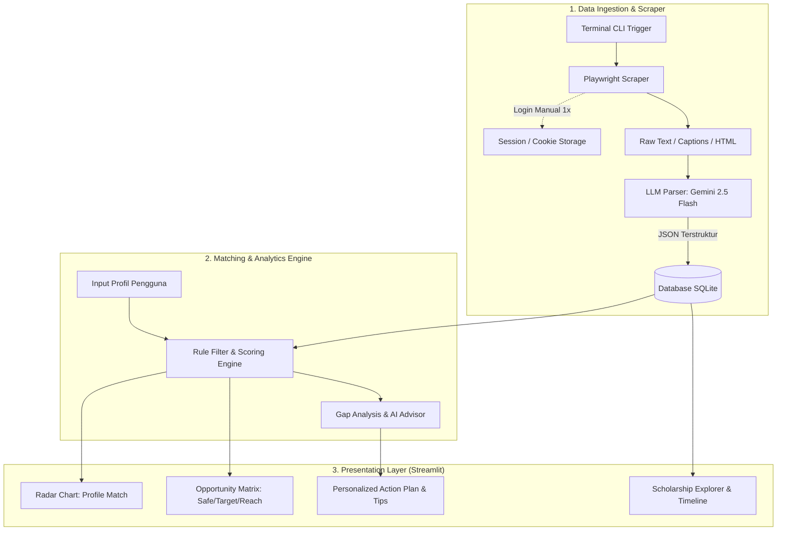

# 🎓 Scholarship Analytics & Matching System
> **Dokumen Perencanaan Arsitektur, Logika Matching, Web Scraping, dan Roadmap Pengembangan**

---

## 📌 1. Ringkasan & Konsep Proyek
Sistem ini dirancang sebagai **Analytics Dashboard & Smart Recommendation Engine** untuk membantu calon pendaftar beasiswa mencocokkan profil mereka (akademik, bahasa, pengalaman kerja, riset/prestasi) dengan katalog beasiswa secara cerdas dan menghitung estimasi peluang lolos (*Fit & Acceptance Probability*).

### Fitur Utama
1. **Interactive Analytics Dashboard**: Visualisasi radar perbandingan kriteria, kuadran peluang (*Opportunity Matrix*), dan timeline *deadline*.
2. **Hybrid Matching Engine**: Kombinasi *Rule-based filtering* (syarat mutlak) + *Weighted Scoring* + *Semantic Similarity*.
3. **Automated Scraping + Manual Terminal Login**: Mengambil data beasiswa dari berbagai portal/sosmed secara otomatis menggunakan **Playwright** dengan sesi *login* manual via terminal.
4. **AI-Assisted Data Parser & Gap Advisor**: Mengubah data *raw* hasil *scraping* menjadi JSON terstruktur dan memberikan saran konkret untuk meningkatkan peluang.

---

## 🏗️ 2. Arsitektur Sistem



---

## ⚙️ 3. Tech Stack & Pilihan Tools

| Layer | Tools Terpilih | Alasan & Keunggulan |
| :--- | :--- | :--- |
| **Frontend & UI Dashboard** | **Streamlit** + **Plotly** | Sangat cepat dikembangkan menggunakan Python, native visualisasi data interaktif, dan mudah di-*tweak*. |
| **Database Layer** | **SQLite** / **SQLAlchemy** | Ringan, *zero-configuration*, tersimpan dalam satu file lokal, dan sangat mudah diintegrasikan dengan Pandas. |
| **Scraping & Automation** | **Playwright (Python)** | Mendukung browser interaktif untuk login manual terminal, bypass CAPTCHA secara natural, dan dapat menyimpan session *cookies*. |
| **AI Parser & Gap Advisor** | **Google Gemini API** (`gemini-2.5-flash`) | Ekstraksi data mentah (*unstructured text*) menjadi skema JSON dengan akurat dan cepat, serta membuat *gap analysis* otomatis. |
| **Data Processing & ML** | **Pandas**, **Scikit-Learn** | Manipulasi dataset, normalisasi bobot nilai, dan kalkulasi *cosine similarity*. |

---

## 📊 4. Logika & Formula Matching Engine

Proses pencocokan dibagi menjadi 3 tahapan berurutan (*Hybrid Matching Pipeline*):

### Tahap 1: Hard Filter (Eligibility Check)
Menyaring beasiswa yang secara mutlak **tidak dapat didaftar** oleh pengguna:
* Batas usia ($Usia_{user} \le MaxAge_{beasiswa}$)
* Jenjang target ($Jenjang_{user} \in TargetDegrees_{beasiswa}$)
* IPK minimum ($IPK_{user} \ge MinGPA_{beasiswa}$)
* Nilai Bahasa minimum ($IELTS_{user} \ge MinIELTS_{beasiswa}$)

### Tahap 2: Weighted Scoring & Matriks Peluang
Menghitung skor kecocokan (*Fit Score*) antara 0 – 100%:

$$\text{Fit Score} = (w_1 \cdot S_{\text{akademik}}) + (w_2 \cdot S_{\text{bahasa}}) + (w_3 \cdot S_{\text{pengalaman}}) + (w_4 \cdot S_{\text{riset/prestasi}})$$

#### Klasifikasi Kuadran Beasiswa (Opportunity Matrix):
* 🟢 **Safety (Peluang $\ge 80\%$)**: Kualifikasi pengguna melampaui syarat rata-rata.
* 🟡 **Target (Peluang $60\% - 79\%$)**: Kualifikasi pengguna sangat cocok dengan target kriteria.
* 🔴 **Reach / Dream (Peluang $< 60\%$)**: Beasiswa sangat kompetitif / kualifikasi pengguna masih berada di batas bawah syarat minimum.

### Tahap 3: AI Gap Analysis
LLM menganalisis gap antara profil pengguna dengan beasiswa yang dituju, menghasilkan *actionable insights*:
* *"Tingkatkan IELTS dari 6.0 ke 6.5 untuk membuka 8 beasiswa baru."*
* *"Beasiswa X memprioritaskan publikasi ilmiah; tambahkan portofolio riset Anda."*

---

## 🗄️ 5. Skema Database (SQLite)

```sql
-- Tabel Beasiswa
CREATE TABLE IF NOT EXISTS scholarships (
    id TEXT PRIMARY KEY,
    name TEXT NOT NULL,
    provider TEXT NOT NULL,
    funding_type TEXT NOT NULL, -- Fully Funded, Partial, Tuition Only
    target_degrees TEXT,         -- JSON array: ["S1", "S2", "S3"]
    target_countries TEXT,       -- JSON array: ["UK", "USA", "Japan", "Global"]
    min_gpa REAL,
    min_ielts REAL,
    min_toefl_ibt REAL,
    max_age INTEGER,
    min_work_exp_years INTEGER DEFAULT 0,
    required_documents TEXT,     -- JSON array
    deadline_date DATE,
    source_url TEXT,
    description TEXT,
    created_at TIMESTAMP DEFAULT CURRENT_TIMESTAMP
);

-- Tabel Profil Pengguna
CREATE TABLE IF NOT EXISTS user_profiles (
    id TEXT PRIMARY KEY,
    name TEXT,
    gpa REAL,
    ielts_score REAL,
    toefl_ibt_score REAL,
    age INTEGER,
    target_degree TEXT,
    major_field TEXT,
    work_exp_years INTEGER,
    publications_count INTEGER,
    target_countries TEXT,
    updated_at TIMESTAMP DEFAULT CURRENT_TIMESTAMP
);
```

---

## 📂 6. Rekomendasi Struktur Folder Project

```text
BEASISWA-CHECKER/
├── Brainstorming/
│   └── system_analytics_and_architecture.md   # File ini
├── app.py                                     # Entry point Streamlit Dashboard
├── requirements.txt                           # Daftar dependensi Python
├── .env                                       # API Key (GEMINI_API_KEY, dll)
├── data/
│   ├── scholarships.db                        # SQLite database lokal
│   └── sessions/                              # Penyimpanan session cookies login
├── modules/
│   ├── database.py                            # Operasi CRUD SQLite
│   ├── matching_engine.py                     # Algoritma scoring & klasifikasi peluang
│   ├── ai_advisor.py                          # Integrasi Gemini API (gap analysis & review)
│   └── visualizer.py                          # Grafik Plotly (Radar, Matrix, Timeline)
└── scraper/
    ├── auth_login.py                          # Helper manual login Playwright via terminal
    ├── portal_scraper.py                      # Scraper portal web beasiswa
    └── llm_parser.py                          # Parser teks mentah ke JSON via LLM
```

---

## 🌐 7. Alur Kerja Scraper & Manual Terminal Login

1. **Inisialisasi Sesi Login**:
   * Jalankan `python scraper/auth_login.py` di terminal.
   * Browser Chromium otomatis terbuka (`headless=False`).
   * Pengguna melakukan login dan melewati autentikasi 2FA / CAPTCHA secara manual.
   * Tekan `ENTER` di terminal untuk menyimpan status cookies ke `data/sessions/session.json`.
2. **Scraping Otomatis Berjalan**:
   * Script scraping membaca `session.json` dan mengambil halaman beasiswa/postingan target.
   * Teks mentah (artikel/caption) dikirim ke **Gemini 2.5 Flash**.
   * Hasil parsing berupa format JSON yang bersih dan langsung di-*insert* ke SQLite `scholarships.db`.

---

## 🚀 8. Rencana Tahapan Eksekusi (Roadmap)

- [ ] **Fase 1**: Setup project, install dependensi (`streamlit`, `playwright`, `plotly`, `google-genai`, `pandas`, `sqlalchemy`).
- [ ] **Fase 2**: Implementasi skema database SQLite dan fungsi CRUD.
- [ ] **Fase 3**: Bangun *Matching Engine* (Rule-based + Weighted Scoring).
- [ ] **Fase 4**: Bangun UI Streamlit Dashboard (Profil Form + Visualisasi Plotly).
- [ ] **Fase 5**: Implementasi Scraper Playwright + Manual Login + LLM Data Extractor.
- [ ] **Fase 6**: Integrasi AI Gap Advisor untuk rekomendasi aksi personal.
