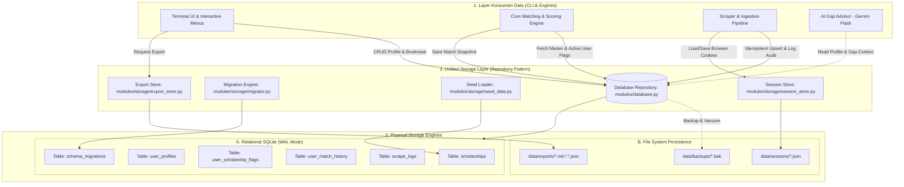
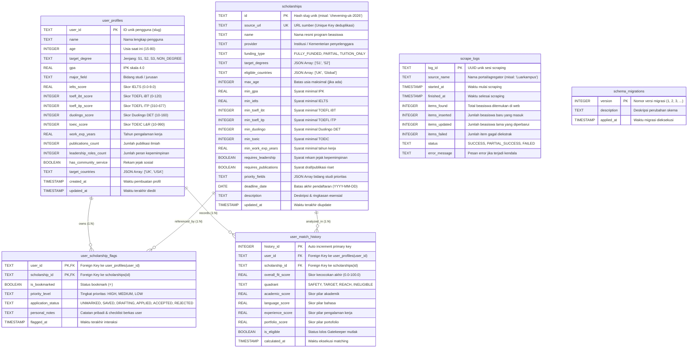
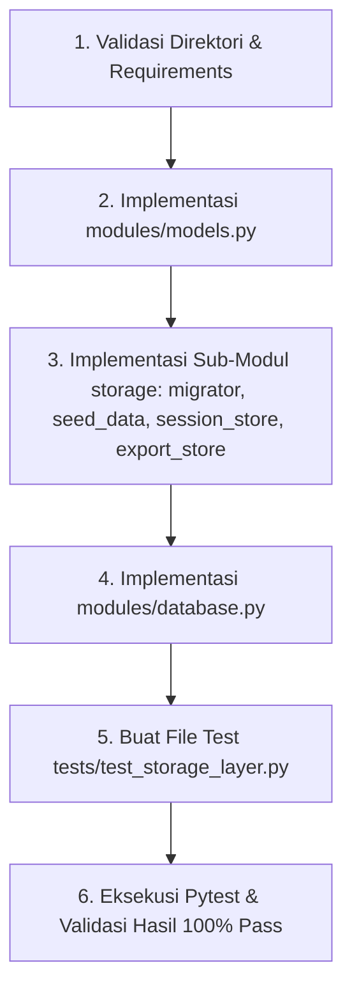

# 🗄️ Technical Specification: Storage Layer & Database Architecture
> **Scholarship Analytics & Matching System (Terminal Edition)**  
> *Spesifikasi Komprehensif & Standar Eksekusi AI Agent: Arsitektur SQLite Performa Tinggi (WAL Mode, ACID, Foreign Key Enforced), Isolasi Data Multi-User Profil, Idempotent Scraper Ingestion Guard, Session State JSON Store, Built-in Migration & Seeding Engine, Repository Pattern Lengkap, Executable Unit Tests (Pytest), dan Panduan Langkah Eksekusi.*

---

> [!IMPORTANT]
> **[REVISION] Single Source of Truth**: Dokumen ini merupakan referensi utama dan definitif untuk:
> 1. Seluruh definisi Pydantic V2 Data Contract (`modules/models.py`)
> 2. DDL Skema Database SQLite (`modules/storage/migrator.py`)
> 3. Implementasi Database Repository (`modules/database.py`)
> 4. Sub-modul Storage (Migration, Seed Data, Session Store, Export Store)
>
> Dokumen spesifikasi lain (`core_engine_and_data_processor.md` dan `scraper_and_ingestion_engine.md`) merujuk pada definisi di dokumen ini tanpa menduplikasi.


## 📑 Daftar Isi
1. [Ringkasan & Filosofi Desain Storage Layer](#1-ringkasan--filosofi-desain-storage-layer)
   - [Peta Referensi Silang Antar-Dokumen](#peta-referensi-silang-antar-dokumen)
2. [Peta Arsitektur Storage Layer & Aliran Data Sistem](#2-peta-arsitektur-storage-layer--aliran-data-sistem)
3. [Entity Relationship Diagram (ERD) & Struktur Relasi Data](#3-entity-relationship-diagram-erd--struktur-relasi-data)
4. [Spesifikasi Skema Database DDL & Optimasi Indeks (SQLite)](#4-spesifikasi-skema-database-ddl--optimasi-indeks-sqlite)
5. [Data Contracts & Integrasi Pydantic V2 Mapping Layer](#5-data-contracts--integrasi-pydantic-v2-mapping-layer)
6. [Mekanisme Inti & Jaminan Integritas Data](#6-mekanisme-inti--jaminan-integritas-data)
   - [A. High-Concurrency SQLite Configuration (WAL Mode & Busy Timeout)](#a-high-concurrency-sqlite-configuration-wal-mode--busy-timeout)
   - [B. Atomic Transaction & Context Manager (Unit of Work)](#b-atomic-transaction--context-manager-unit-of-work)
   - [C. Idempotent Ingestion & Multi-User Isolation Guard](#c-idempotent-ingestion--multi-user-isolation-guard)
   - [D. Built-in Schema Migration Engine (Zero External Framework)](#d-built-in-schema-migration-engine-zero-external-framework)
   - [E. Seed Data Engine & Curated Master Scholarships](#e-seed-data-engine--curated-master-scholarships)
   - [F. Session & Auth State JSON Store (Playwright Storage State)](#f-session--auth-state-json-store-playwright-storage-state)
   - [G. Backup, Restore, & Data Export Subsystem](#g-backup-restore--data-export-subsystem)
7. [Peta Struktur Modul & File Project Storage Layer](#7-peta-struktur-modul--file-project-storage-layer)
8. [Implementasi Kode Python Lengkap (Production-Ready Codebase)](#8-implementasi-kode-python-lengkap-production-ready-codebase)
   - [`modules/database.py` (Unified Database Repository)](#file-1-modulesdatabasepy-unified-database-repository)
   - [`modules/storage/migrator.py` (Lightweight Migration Engine)](#file-2-modulesstoragemigratorpy-lightweight-migration-engine)
   - [`modules/storage/seed_data.py` (Curated Real-World Scholarship Seeds)](#file-3-modulesstorageseed_datapy-curated-real-world-scholarship-seeds)
   - [`modules/storage/session_store.py` (Playwright Auth State Persistence)](#file-4-modulesstoragesession_storepy-playwright-auth-state-persistence)
   - [`modules/storage/export_store.py` (Data & Report Exporter to JSON/CSV/MD)](#file-5-modulesstorageexport_storepy-data--report-exporter)
9. [Executable Unit Tests & Isolation Verification Suite (Pytest)](#9-executable-unit-tests--isolation-verification-suite-pytest)
10. [Panduan Langkah Eksekusi untuk AI Agent](#10-panduan-langkah-eksekusi-untuk-ai-agent)

---

## 1. Ringkasan & Filosofi Desain Storage Layer

Storage Layer adalah fondasi persistensi data pada **Scholarship Analytics & Matching System**. Modul ini dirancang agar sepenuhnya mandiri (*zero external database server dependency*), sangat cepat, andal (*resilient*), serta menjamin integritas data multi-user dengan isolasi yang ketat.

```text
┌─────────────────────────────────────────────────────────────────────────────────────────┐
│                                  STORAGE LAYER PHILOSOPHY                               │
├────────────────────────────┬─────────────────────────────┬──────────────────────────────┤
│ 1. Zero Server Overhead    │ 2. Strict Multi-User Guard  │ 3. Idempotent Ingestion      │
│ SQLite mandiri (Single-    │ Profil, Bookmark, Notes, &  │ Scraper memperbarui katalog  │
│ file DB) berkinerja tinggi │ History terisolasi per user │ master beasiswa tanpa pernah │
│ dengan Write-Ahead Log.    │ tanpa risiko data bocor.    │ merusak data milik user.     │
└────────────────────────────┴─────────────────────────────┴──────────────────────────────┘
```

### [REVISION] Peta Referensi Silang Antar-Dokumen
Dokumen ini merupakan satu dari empat dokumen teknis utama. Hubungan dokumen ini dengan yang lainnya adalah:
- **`core_engine_and_data_processor.md`**: Menggunakan `modules/models.py` yang didefinisikan secara definitif di dokumen ini untuk seluruh input/output matching engine.
- **`scraper_and_ingestion_engine.md`**: Mengandalkan modul database di dokumen ini (`upsert_scholarship`, `SessionStore`) untuk penyimpanan hasil scraping secara aman.
- **`cli_and_interactive_menus.md`**: Menampilkan UI berdasarkan model yang terpusat di dokumen ini dan membaca data langsung dari layer repositori.

### Prinsip Utama Desain:
1. **Single-File Local Persistence (`data/scholarships.db`)**:
   Sistem tidak memerlukan instalasi PostgreSQL, MySQL, atau Docker. Seluruh data relasional disimpan dalam satu file database lokal SQLite yang portabel, mudah di-backup, dan sangat cepat diakses (< 1 ms per query).
2. **High-Performance WAL Mode & Concurrency Safety**:
   Database dikonfigurasi secara eksplisit menggunakan mode **`PRAGMA journal_mode=WAL;`** (*Write-Ahead Logging*), **`PRAGMA busy_timeout=5000;`**, dan **`PRAGMA foreign_keys=ON;`**. Pengaturan ini memungkinkan pembacaan (*concurrent reads*) dan penulisan (*writes*) berjalan mulus tanpa terkunci (*database locked*).
3. **Multi-User Isolation by Architecture**:
   Sistem mendukung pengelolaan banyak profil pengguna (misal: user pribadi, adik, rekan kerja). Semua bookmark (`⭐`), status pendaftaran (`[DRAFTING]`, `[APPLIED]`), dan catatan pribadi diikat oleh kombinasi `user_id` + `scholarship_id`. User A tidak dapat melihat atau mengubah catatan User B.
4. **Idempotent Ingestion & Foreign Key Shield**:
   Ketika modul scraper mengambil 100 data beasiswa baru atau memperbarui informasi deadline/syarat, operasi database dijalankan menggunakan SQL `INSERT INTO ... ON CONFLICT(id) DO UPDATE SET ...`. Hal ini menjamin bahwa **seluruh metadata beasiswa terbarui, namun catatan pribadi, bookmark, dan status aplikasi milik user tetap 100% utuh**.
5. **Dual-Tier Persistence**:
   - **Tier 1 (Structured Relational Data)**: SQLite (`scholarships.db`) untuk master beasiswa, profil user, bookmark/flags, log scraping, dan riwayat kalkulasi (*match snapshots*).
   - **Tier 2 (Session & File State)**: File terstruktur JSON (`data/sessions/*.json`) untuk cookie autentikasi Playwright browser, serta direktori ekspor laporan (`data/exports/`).

---

## 2. Peta Arsitektur Storage Layer & Aliran Data Sistem

Diagram di bawah ini menggambarkan posisi Storage Layer sebagai jembatan persistensi antara antarmuka terminal (TUI/CLI), Core Matching Engine, dan Scraper Ingestion Engine:



---

## 3. Entity Relationship Diagram (ERD) & Struktur Relasi Data

Struktur basis data dirancang dalam bentuk Relational ERD yang dinormalisasi dengan Foreign Keys berkekuatan *Cascading Action*:



---

## 4. Spesifikasi Skema Database DDL & Optimasi Indeks (SQLite)

Berikut adalah DDL SQL lengkap dengan definisi tipe data, batasan validitas (*CHECK constraints*), dan indeks performa tinggi:

```sql
-- =========================================================================
-- SCHOLARSHIP ANALYTICS SYSTEM - PRODUCTION DDL SCHEMA
-- Engine: SQLite 3.35+ (Foreign Keys & UPSERT Enabled)
-- =========================================================================

-- 1. TABEL MASTER BEASISWA (MASTER CATALOG)
CREATE TABLE IF NOT EXISTS scholarships (
    id TEXT PRIMARY KEY,
    source_url TEXT UNIQUE,
    name TEXT NOT NULL,
    provider TEXT NOT NULL,
    funding_type TEXT NOT NULL DEFAULT 'FULLY_FUNDED',
    target_degrees TEXT NOT NULL DEFAULT '["S1","S2"]',      -- Format JSON Array
    eligible_countries TEXT NOT NULL DEFAULT '["Global"]',   -- Format JSON Array
    max_age INTEGER CHECK (max_age IS NULL OR (max_age >= 15 AND max_age <= 100)),
    min_gpa REAL NOT NULL DEFAULT 0.0 CHECK (min_gpa >= 0.0 AND min_gpa <= 4.0),
    min_ielts REAL CHECK (min_ielts IS NULL OR (min_ielts >= 0.0 AND min_ielts <= 9.0)),
    min_toefl_ibt INTEGER CHECK (min_toefl_ibt IS NULL OR (min_toefl_ibt >= 0 AND min_toefl_ibt <= 120)),
    min_toefl_itp INTEGER CHECK (min_toefl_itp IS NULL OR (min_toefl_itp >= 310 AND min_toefl_itp <= 677)),
    min_duolingo INTEGER CHECK (min_duolingo IS NULL OR (min_duolingo >= 10 AND min_duolingo <= 160)),
    min_toeic INTEGER CHECK (min_toeic IS NULL OR (min_toeic >= 10 AND min_toeic <= 990)),
    min_work_exp_years REAL NOT NULL DEFAULT 0.0 CHECK (min_work_exp_years >= 0.0),
    requires_leadership BOOLEAN NOT NULL DEFAULT 0,
    requires_publications BOOLEAN NOT NULL DEFAULT 0,
    priority_fields TEXT DEFAULT '[]',                      -- Format JSON Array
    deadline_date DATE,
    description TEXT,
    updated_at TIMESTAMP DEFAULT CURRENT_TIMESTAMP
);

-- 2. TABEL MULTI-USER PROFILES
CREATE TABLE IF NOT EXISTS user_profiles (
    user_id TEXT PRIMARY KEY,
    name TEXT NOT NULL,
    age INTEGER NOT NULL CHECK (age >= 15 AND age <= 80),
    target_degree TEXT NOT NULL,
    gpa REAL NOT NULL CHECK (gpa >= 0.0 AND gpa <= 4.0),
    major_field TEXT NOT NULL,
    ielts_score REAL CHECK (ielts_score IS NULL OR (ielts_score >= 0.0 AND ielts_score <= 9.0)),
    toefl_ibt_score INTEGER CHECK (toefl_ibt_score IS NULL OR (toefl_ibt_score >= 0 AND toefl_ibt_score <= 120)),
    toefl_itp_score INTEGER CHECK (toefl_itp_score IS NULL OR (toefl_itp_score >= 310 AND toefl_itp_score <= 677)),
    duolingo_score INTEGER CHECK (duolingo_score IS NULL OR (duolingo_score >= 10 AND duolingo_score <= 160)),
    toeic_score INTEGER CHECK (toeic_score IS NULL OR (toeic_score >= 10 AND toeic_score <= 990)),
    work_exp_years REAL NOT NULL DEFAULT 0.0 CHECK (work_exp_years >= 0.0),
    publications_count INTEGER NOT NULL DEFAULT 0 CHECK (publications_count >= 0),
    leadership_roles_count INTEGER NOT NULL DEFAULT 0 CHECK (leadership_roles_count >= 0),
    has_community_service BOOLEAN NOT NULL DEFAULT 0,
    target_countries TEXT NOT NULL DEFAULT '["Global"]',    -- Format JSON Array
    created_at TIMESTAMP DEFAULT CURRENT_TIMESTAMP,
    updated_at TIMESTAMP DEFAULT CURRENT_TIMESTAMP
);

-- 3. TABEL ISOLASI INTERAKSI USER (FLAGS, BOOKMARK, STATUS, NOTES)
CREATE TABLE IF NOT EXISTS user_scholarship_flags (
    user_id TEXT NOT NULL,
    scholarship_id TEXT NOT NULL,
    is_bookmarked BOOLEAN NOT NULL DEFAULT 0,
    priority_level TEXT NOT NULL DEFAULT 'MEDIUM' CHECK (priority_level IN ('HIGH', 'MEDIUM', 'LOW')),
    application_status TEXT NOT NULL DEFAULT 'UNMARKED' CHECK (application_status IN ('UNMARKED', 'SAVED', 'DRAFTING', 'APPLIED', 'ACCEPTED', 'REJECTED')),
    personal_notes TEXT,
    flagged_at TIMESTAMP DEFAULT CURRENT_TIMESTAMP,
    PRIMARY KEY (user_id, scholarship_id),
    FOREIGN KEY (user_id) REFERENCES user_profiles(user_id) ON DELETE CASCADE ON UPDATE CASCADE,
    FOREIGN KEY (scholarship_id) REFERENCES scholarships(id) ON DELETE CASCADE ON UPDATE CASCADE
);

-- 4. TABEL RIWAYAT SNAPSHOT MATCHING ENGINE PER USER
CREATE TABLE IF NOT EXISTS user_match_history (
    history_id INTEGER PRIMARY KEY AUTOINCREMENT,
    user_id TEXT NOT NULL,
    scholarship_id TEXT NOT NULL,
    overall_fit_score REAL NOT NULL CHECK (overall_fit_score >= 0.0 AND overall_fit_score <= 100.0),
    quadrant TEXT NOT NULL CHECK (quadrant IN ('SAFETY', 'TARGET', 'REACH', 'INELIGIBLE')),
    academic_score REAL NOT NULL DEFAULT 0.0,
    language_score REAL NOT NULL DEFAULT 0.0,
    experience_score REAL NOT NULL DEFAULT 0.0,
    portfolio_score REAL NOT NULL DEFAULT 0.0,
    is_eligible BOOLEAN NOT NULL DEFAULT 1,
    calculated_at TIMESTAMP DEFAULT CURRENT_TIMESTAMP,
    FOREIGN KEY (user_id) REFERENCES user_profiles(user_id) ON DELETE CASCADE,
    FOREIGN KEY (scholarship_id) REFERENCES scholarships(id) ON DELETE CASCADE
);

-- 5. TABEL AUDIT LOG SCRAPING & INGESTI
CREATE TABLE IF NOT EXISTS scrape_logs (
    log_id TEXT PRIMARY KEY,
    source_name TEXT NOT NULL,
    started_at TIMESTAMP NOT NULL,
    finished_at TIMESTAMP NOT NULL,
    items_found INTEGER NOT NULL DEFAULT 0,
    items_inserted INTEGER NOT NULL DEFAULT 0,
    items_updated INTEGER NOT NULL DEFAULT 0,
    items_failed INTEGER NOT NULL DEFAULT 0,
    status TEXT NOT NULL CHECK (status IN ('SUCCESS', 'PARTIAL_SUCCESS', 'FAILED')),
    error_message TEXT
);

-- 6. TABEL MANAJEMEN VERSI MIGRASI
CREATE TABLE IF NOT EXISTS schema_migrations (
    version INTEGER PRIMARY KEY,
    description TEXT NOT NULL,
    applied_at TIMESTAMP DEFAULT CURRENT_TIMESTAMP
);

-- =========================================================================
-- OPTIMASI INDEKS (INDEXING PERFORMA QUERY CEPAT)
-- =========================================================================

-- Indeks Pencarian & Filter Beasiswa
CREATE INDEX IF NOT EXISTS idx_scholarships_deadline ON scholarships(deadline_date);
CREATE INDEX IF NOT EXISTS idx_scholarships_min_gpa ON scholarships(min_gpa);
CREATE INDEX IF NOT EXISTS idx_scholarships_funding ON scholarships(funding_type);
CREATE INDEX IF NOT EXISTS idx_scholarships_url ON scholarships(source_url);

-- Indeks Pencarian Relasi User Flags
CREATE INDEX IF NOT EXISTS idx_user_flags_user ON user_scholarship_flags(user_id);
CREATE INDEX IF NOT EXISTS idx_user_flags_bookmarked ON user_scholarship_flags(user_id, is_bookmarked);
CREATE INDEX IF NOT EXISTS idx_user_flags_status ON user_scholarship_flags(user_id, application_status);

-- Indeks Riwayat Analitik Matching
CREATE INDEX IF NOT EXISTS idx_match_history_user ON user_match_history(user_id, calculated_at);
CREATE INDEX IF NOT EXISTS idx_match_history_quadrant ON user_match_history(user_id, quadrant);

-- Indeks Log Scraper
CREATE INDEX IF NOT EXISTS idx_scrape_logs_source ON scrape_logs(source_name, started_at);
```

---

## 5. Data Contracts & Integrasi Pydantic V2 Mapping Layer

Seluruh modul aplikasi berinteraksi dengan database melalui objek schema **Pydantic V2**. Lapisan ini memastikan validasi tipe data yang ketat sebelum masuk ke SQL dan konversi instan dari `sqlite3.Row` menjadi model Python yang aman.

```python
"""
Data Contracts & Pydantic V2 Schemas.
File: modules/models.py (Shared across Core Engine, Scraper, and Storage Layer)
"""

from enum import Enum
from typing import List, Optional, Dict, Any
from pydantic import BaseModel, Field, ConfigDict, field_validator
from datetime import date, datetime
import json

class DegreeLevel(str, Enum):
    S1 = "S1"
    S2 = "S2"
    S3 = "S3"
    NON_DEGREE = "NON_DEGREE"

class FundingType(str, Enum):
    FULLY_FUNDED = "FULLY_FUNDED"
    PARTIAL = "PARTIAL"
    TUITION_ONLY = "TUITION_ONLY"

class OpportunityQuadrant(str, Enum):
    SAFETY = "SAFETY"          # Peluang Sangat Tinggi (>= 80%)
    TARGET = "TARGET"          # Peluang Pas/Sesuai (60% - 79%)
    REACH = "REACH"            # Peluang Kompetitif / Dream (< 60%)
    INELIGIBLE = "INELIGIBLE"  # Tidak lolos kriteria mutlak

class PriorityLevel(str, Enum):
    HIGH = "HIGH"
    MEDIUM = "MEDIUM"
    LOW = "LOW"

class ApplicationStatus(str, Enum):
    UNMARKED = "UNMARKED"
    SAVED = "SAVED"
    DRAFTING = "DRAFTING"
    APPLIED = "APPLIED"
    ACCEPTED = "ACCEPTED"
    REJECTED = "REJECTED"

class LogStatus(str, Enum):
    SUCCESS = "SUCCESS"
    PARTIAL_SUCCESS = "PARTIAL_SUCCESS"
    FAILED = "FAILED"

# ==========================================
# 1. USER PROFILE MODEL
# ==========================================
class UserProfile(BaseModel):
    model_config = ConfigDict(use_enum_values=True)
    
    user_id: str = Field(..., description="ID unik pengguna (slug teks)")
    name: str = Field(..., description="Nama lengkap pengguna")
    age: int = Field(..., ge=15, le=80, description="Usia saat ini")
    target_degree: DegreeLevel = Field(..., description="Jenjang yang dituju")
    gpa: float = Field(..., ge=0.0, le=4.0, description="IPK skala 4.0")
    major_field: str = Field(..., description="Bidang studi / jurusan")
    
    # Kemampuan Bahasa
    ielts_score: Optional[float] = Field(None, ge=0.0, le=9.0)
    toefl_ibt_score: Optional[int] = Field(None, ge=0, le=120)
    toefl_itp_score: Optional[int] = Field(None, ge=310, le=677)
    duolingo_score: Optional[int] = Field(None, ge=10, le=160)
    toeic_score: Optional[int] = Field(None, ge=10, le=990)
    
    # Pengalaman & Portofolio
    work_exp_years: float = Field(default=0.0, ge=0.0)
    publications_count: int = Field(default=0, ge=0)
    leadership_roles_count: int = Field(default=0, ge=0)
    has_community_service: bool = Field(default=False)
    
    # Preferensi Negara
    target_countries: List[str] = Field(default_factory=lambda: ["Global"])
    created_at: Optional[datetime] = None
    updated_at: Optional[datetime] = None

# ==========================================
# 2. SCHOLARSHIP MODEL (MASTER CATALOG)
# ==========================================
class Scholarship(BaseModel):
    model_config = ConfigDict(use_enum_values=True)
    
    id: str = Field(..., description="ID unik slug-hash beasiswa")
    name: str = Field(..., description="Nama resmi beasiswa")
    provider: str = Field(..., description="Penyelenggara beasiswa")
    funding_type: FundingType = Field(default=FundingType.FULLY_FUNDED)
    source_url: Optional[str] = Field(None, description="URL sumber scraping untuk deduplikasi")
    
    # Syarat Mutlak (Hard Criteria)
    target_degrees: List[DegreeLevel] = Field(..., description="Daftar jenjang yang dibuka")
    eligible_countries: List[str] = Field(default_factory=lambda: ["Global"])
    max_age: Optional[int] = Field(None, ge=15, le=100)
    min_gpa: float = Field(default=0.0, ge=0.0, le=4.0)
    
    # Syarat Bahasa
    min_ielts: Optional[float] = Field(None, ge=0.0, le=9.0)
    min_toefl_ibt: Optional[int] = Field(None, ge=0, le=120)
    min_toefl_itp: Optional[int] = Field(None, ge=310, le=677)
    min_duolingo: Optional[int] = Field(None, ge=10, le=160)
    min_toeic: Optional[int] = Field(None, ge=10, le=990)
    
    # Kriteria Bobot Tambahan
    min_work_exp_years: float = Field(default=0.0, ge=0.0)
    requires_leadership: bool = Field(default=False)
    requires_publications: bool = Field(default=False)
    priority_fields: List[str] = Field(default_factory=list)
    
    # Metadata
    deadline_date: Optional[date] = Field(None)
    description: Optional[str] = Field(None)
    updated_at: Optional[datetime] = None

# ==========================================
# 3. USER INTERACTION & FLAGGING MODEL
# ==========================================
class ScholarshipFlag(BaseModel):
    model_config = ConfigDict(use_enum_values=True)
    
    user_id: str
    scholarship_id: str
    is_bookmarked: bool = False
    priority_level: PriorityLevel = PriorityLevel.MEDIUM
    application_status: ApplicationStatus = ApplicationStatus.UNMARKED
    personal_notes: Optional[str] = None
    flagged_at: Optional[datetime] = None

# ==========================================
# 4. AUDIT & LOGGING MODELS
# ==========================================
class ScrapeLog(BaseModel):
    model_config = ConfigDict(use_enum_values=True)
    
    log_id: str
    source_name: str
    started_at: datetime
    finished_at: datetime
    items_found: int = 0
    items_inserted: int = 0
    items_updated: int = 0
    items_failed: int = 0
    status: LogStatus = LogStatus.SUCCESS
    error_message: Optional[str] = None

class MatchHistoryEntry(BaseModel):
    model_config = ConfigDict(use_enum_values=True)
    
    history_id: Optional[int] = None
    user_id: str
    scholarship_id: str
    overall_fit_score: float
    quadrant: OpportunityQuadrant
    academic_score: float
    language_score: float
    experience_score: float
    portfolio_score: float
    is_eligible: bool
    calculated_at: Optional[datetime] = None

# ==========================================
# 5. [REVISION] EVALUATION & REPORT OUTPUT MODELS
# ==========================================
class DimensionScores(BaseModel):
    academic_score: float = Field(..., ge=0.0, le=100.0)
    language_score: float = Field(..., ge=0.0, le=100.0)
    experience_score: float = Field(..., ge=0.0, le=100.0)
    portfolio_score: float = Field(..., ge=0.0, le=100.0)

class EligibilityDetail(BaseModel):
    is_eligible: bool
    passed_criteria: List[str] = Field(default_factory=list)
    failed_reasons: List[str] = Field(default_factory=list)

class MatchResult(BaseModel):
    scholarship: Scholarship
    is_eligible: bool
    overall_fit_score: float = Field(..., ge=0.0, le=100.0)
    quadrant: OpportunityQuadrant
    dimension_scores: DimensionScores
    eligibility_detail: EligibilityDetail
    gap_recommendations: List[str] = Field(default_factory=list)
    user_flag: Optional[ScholarshipFlag] = None

class MatchReport(BaseModel):
    user_id: str
    user_name: str
    total_analyzed: int
    eligible_count: int
    ineligible_count: int
    bookmarked_count: int
    results: List[MatchResult]
```

---

## 6. Mekanisme Inti & Jaminan Integritas Data

### A. High-Concurrency SQLite Configuration (WAL Mode & Busy Timeout)
SQLite secara default menggunakan mode *Rollback Journal* yang dapat menyebabkan *database locking* ketika terdapat operasi penulisan saat pembacaan sedang berlangsung. Untuk menjamin reliabilitas saat CLI berjalan cepat atau saat proses scraping background berlangsung, setiap koneksi database mengeksekusi konfigurasi *pragmas* berikut:

```sql
PRAGMA journal_mode = WAL;          -- Write-Ahead Logging: Pembacaan tidak mengunci penulisan
PRAGMA synchronous = NORMAL;         -- Keseimbangan optimal antara kecepatan disk I/O dan durabilitas
PRAGMA foreign_keys = ON;           -- Mengaktifkan penegakan relasi Foreign Key secara ketat
PRAGMA busy_timeout = 5000;         -- Menunggu hingga 5000ms jika terjadi lock sebelum melempar exception
PRAGMA temp_store = MEMORY;         -- Menyimpan tabel temporary di RAM untuk kecepatan ekstra
```

### B. Atomic Transaction & Context Manager (Unit of Work)
Semua operasi mutasi basis data (Insert, Update, Delete, Batch Upsert) dikontrol oleh Python Context Manager. Jika terjadi kegagalan di tengah proses, seluruh perubahan dibatalkan otomatis (*Automatic Rollback*), mencegah korupsi data (*data corruption*):

```python
# Contoh Pola Penggunaan Transaction Context Manager
with db.transaction() as cursor:
    cursor.execute("UPDATE user_profiles SET gpa = ? WHERE user_id = ?", (3.85, "user_adika"))
    cursor.execute("DELETE FROM user_match_history WHERE user_id = ?", ("user_adika",))
    # Otomatis Commit jika tidak ada error, otomatis Rollback jika terjadi Exception.
```

### C. Idempotent Ingestion & Multi-User Isolation Guard
Ketika Scraper berjalan, scraper hanya melakukan operasi `UPSERT` terhadap tabel `scholarships` berdasarkan `id` atau `source_url`:

```sql
INSERT INTO scholarships (
    id, source_url, name, provider, funding_type, target_degrees, eligible_countries,
    max_age, min_gpa, min_ielts, min_toefl_ibt, min_toefl_itp, min_duolingo, min_toeic,
    min_work_exp_years, requires_leadership, requires_publications, priority_fields,
    deadline_date, description, updated_at
) VALUES (
    :id, :source_url, :name, :provider, :funding_type, :target_degrees, :eligible_countries,
    :max_age, :min_gpa, :min_ielts, :min_toefl_ibt, :min_toefl_itp, :min_duolingo, :min_toeic,
    :min_work_exp_years, :requires_leadership, :requires_publications, :priority_fields,
    :deadline_date, :description, CURRENT_TIMESTAMP
)
ON CONFLICT(id) DO UPDATE SET
    name = excluded.name,
    provider = excluded.provider,
    funding_type = excluded.funding_type,
    target_degrees = excluded.target_degrees,
    eligible_countries = excluded.eligible_countries,
    max_age = excluded.max_age,
    min_gpa = excluded.min_gpa,
    min_ielts = excluded.min_ielts,
    min_toefl_ibt = excluded.min_toefl_ibt,
    min_toefl_itp = excluded.min_toefl_itp,
    min_duolingo = excluded.min_duolingo,
    min_toeic = excluded.min_toeic,
    min_work_exp_years = excluded.min_work_exp_years,
    requires_leadership = excluded.requires_leadership,
    requires_publications = excluded.requires_publications,
    priority_fields = excluded.priority_fields,
    deadline_date = excluded.deadline_date,
    description = excluded.description,
    updated_at = CURRENT_TIMESTAMP;
```

**Bukti Isolasi Data Pengguna**:
1. Query di atas hanya menargetkan tabel `scholarships`.
2. Tabel `user_scholarship_flags` menyimpan data bookmark, catatan pribadi, dan status aplikasi user. Relasi `scholarship_id` tetap utuh karena nilai `id` tidak berubah.
3. Dengan demikian, perbaikan data beasiswa oleh scraper **0% berisiko menghapus atau menimpa catatan pengguna**.

### D. Built-in Schema Migration Engine (Zero External Framework)
Tanpa membutuhkan library eksternal yang berat seperti Alembic, Storage Layer menyediakan modul migrasi mandiri yang mencatat nomor versi migrasi pada tabel `schema_migrations`. Setiap script migrasi dijalankan secara atomik dalam transaksi terisolasi.

### E. Seed Data Engine & Curated Master Scholarships
Saat aplikasi pertama kali dijalankan pada database yang masih kosong, Storage Layer secara otomatis mengisikan data kurasi beasiswa internasional populer (LPDP Reguler, Chevening UK, Australia Awards, MEXT Research, DAAD Helmut-Schmidt, Erasmus Mundus, Fulbright Master, Gates Cambridge, Stipendium Hungaricum, Turkiye Burslari). Hal ini membuat aplikasi langsung siap dipakai (*out of the box*) tanpa harus menunggu proses scraping selesai terlebih dahulu.

### F. Session & Auth State JSON Store (Playwright Storage State)

**[REVISION] Catatan Penting**: Modul ini dikonsolidasikan sebagai manajer sesi tunggal. `modules/scraper/session_manager.py` mendelegasikan I/O file ke `SessionStore` ini, sementara logika spesifik browser/Playwright dipertahankan di modulnya masing-masing.

Untuk sesi login portal beasiswa atau agregator (seperti `luarkampus.id`), modul `SessionStore` menyimpan cookies dan *local storage* browser ke dalam `data/sessions/<target>_session.json`. Hal ini memisahkan data otentikasi browser dari database inti SQLite, sehingga keamanan kredensial sesi tetap terisolasi dan mudah dibersihkan.

### G. Backup, Restore, & Data Export Subsystem
1. **Live Backup**: Memanfaatkan fitur SQLite online backup API (`sqlite3.Connection.backup` / `VACUUM INTO`) untuk membuat file cadangan `.bak` tanpa perlu menghentikan aplikasi.
2. **Export Report**: Menyediakan fungsionalitas ekspor data profil dan hasil matching ke dalam format Markdown (`.md`), JSON terstruktur (`.json`), dan CSV (`.csv`) pada direktori `data/exports/`.

---

## 7. Peta Struktur Modul & File Project Storage Layer

Struktur direktori modul penyimpanan data:

```text
BEASISWA-CHECKER/
├── data/
│   ├── scholarships.db              # Database SQLite Master & Multi-User
│   ├── sessions/                    # Cookie sesi Playwright login (*.json)
│   ├── backups/                     # File cadangan database (*.bak)
│   └── exports/                     # File output laporan (*.md, *.json, *.csv)
├── modules/
│   ├── __init__.py
│   ├── models.py                    # Single Source of Truth Pydantic Schemas
│   ├── database.py                  # Unified SQLite Database Repository Layer
│   └── storage/
│       ├── __init__.py
│       ├── migrator.py              # Lightweight Schema Migration Engine
│       ├── seed_data.py             # Curated Master Scholarship Seed Data
│       ├── session_store.py         # Playwright Storage State JSON Manager
│       └── export_store.py          # Data Exporter to JSON, CSV, & Markdown
└── tests/
    ├── __init__.py
    └── test_storage_layer.py        # Executable Pytest Suite for Storage Layer
```

---

## 8. Implementasi Kode Python Lengkap (Production-Ready Codebase)

### File 1: `modules/database.py` (Unified Database Repository)

```python
"""
Unified SQLite Database Repository.
File: modules/database.py

Menyediakan antarmuka Repository Pattern dengan penanganan transaksi atomik,
konfigurasi WAL mode berkinerja tinggi, isolasi data multi-user,
dan operasi CRUD lengkap yang tervalidasi Pydantic V2.
"""

import sqlite3
import json
import logging
from pathlib import Path
from typing import List, Optional, Dict, Any, Tuple
from contextlib import contextmanager
from datetime import datetime, date

from modules.models import (
    Scholarship, UserProfile, ScholarshipFlag, ScrapeLog, 
    MatchHistoryEntry, DegreeLevel, FundingType, PriorityLevel, 
    ApplicationStatus, OpportunityQuadrant, LogStatus
)
from modules.storage.migrator import SchemaMigrator
from modules.storage.seed_data import get_curated_scholarships

logger = logging.getLogger("StorageLayer")


class Database:
    def __init__(self, db_path: str = "data/scholarships.db", auto_init: bool = True):
        self.db_path = Path(db_path)
        self.db_path.parent.mkdir(parents=True, exist_ok=True)
        if auto_init:
            self.init_db()

    def get_connection(self) -> sqlite3.Connection:
        """
        Membuka koneksi ke SQLite dengan WAL mode, timeout aman, dan row factory dict.
        """
        conn = sqlite3.connect(
            str(self.db_path),
            timeout=10.0,
            detect_types=sqlite3.PARSE_DECLTYPES | sqlite3.PARSE_COLNAMES
        )
        conn.row_factory = sqlite3.Row
        # Eksekusi PRAGMAs untuk reliabilitas & performa tinggi
        conn.execute("PRAGMA journal_mode = WAL;")
        conn.execute("PRAGMA synchronous = NORMAL;")
        conn.execute("PRAGMA foreign_keys = ON;")
        conn.execute("PRAGMA busy_timeout = 5000;")
        conn.execute("PRAGMA temp_store = MEMORY;")
        return conn

    @contextmanager
    def transaction(self):
        """
        Context manager untuk transaksi database atomik (Unit of Work).
        Otomatis commit jika blok selesai tanpa error, rollback jika terjadi exception.
        """
        conn = self.get_connection()
        try:
            yield conn
            conn.commit()
        except Exception as e:
            conn.rollback()
            logger.error(f"Transaksi database dibatalkan (Rollback) karena error: {e}")
            raise
        finally:
            conn.close()

    def init_db(self):
        """Inisialisasi tabel, jalankan migrasi skema, dan isi seed data jika kosong."""
        with self.transaction() as conn:
            migrator = SchemaMigrator(conn)
            migrator.apply_all_migrations()
        
        # Cek apakah master data beasiswa masih kosong, jika ya isi data seed
        if self.count_scholarships() == 0:
            logger.info("Database baru terdeteksi: Menjalankan seeding beasiswa kurasi awal...")
            seeds = get_curated_scholarships()
            self.upsert_scholarships_batch(seeds)
            self.get_or_create_default_user()
            logger.info(f"Berhasil memuat {len(seeds)} data beasiswa kurasi awal.")

    # =========================================================================
    # 1. CRUD OPERATIONS: SCHOLARSHIPS (MASTER DATA)
    # =========================================================================

    def upsert_scholarship(self, scholarship: Scholarship) -> bool:
        """
        Idempotent UPSERT data beasiswa ke master catalog.
        Aman dari overwrite data interaksi user.
        """
        sql = """
        INSERT INTO scholarships (
            id, source_url, name, provider, funding_type, target_degrees, eligible_countries,
            max_age, min_gpa, min_ielts, min_toefl_ibt, min_toefl_itp, min_duolingo, min_toeic,
            min_work_exp_years, requires_leadership, requires_publications, priority_fields,
            deadline_date, description, updated_at
        ) VALUES (
            :id, :source_url, :name, :provider, :funding_type, :target_degrees, :eligible_countries,
            :max_age, :min_gpa, :min_ielts, :min_toefl_ibt, :min_toefl_itp, :min_duolingo, :min_toeic,
            :min_work_exp_years, :requires_leadership, :requires_publications, :priority_fields,
            :deadline_date, :description, CURRENT_TIMESTAMP
        )
        ON CONFLICT(id) DO UPDATE SET
            name = excluded.name,
            provider = excluded.provider,
            funding_type = excluded.funding_type,
            target_degrees = excluded.target_degrees,
            eligible_countries = excluded.eligible_countries,
            max_age = excluded.max_age,
            min_gpa = excluded.min_gpa,
            min_ielts = excluded.min_ielts,
            min_toefl_ibt = excluded.min_toefl_ibt,
            min_toefl_itp = excluded.min_toefl_itp,
            min_duolingo = excluded.min_duolingo,
            min_toeic = excluded.min_toeic,
            min_work_exp_years = excluded.min_work_exp_years,
            requires_leadership = excluded.requires_leadership,
            requires_publications = excluded.requires_publications,
            priority_fields = excluded.priority_fields,
            deadline_date = excluded.deadline_date,
            description = excluded.description,
            updated_at = CURRENT_TIMESTAMP;
        """
        params = self._scholarship_to_db_params(scholarship)
        with self.transaction() as conn:
            conn.execute(sql, params)
        return True

    def upsert_scholarships_batch(self, scholarships: List[Scholarship]) -> int:
        """Batch idempotent upsert dalam satu transaksi atomik berkecepatan tinggi."""
        if not scholarships:
            return 0
        sql = """
        INSERT INTO scholarships (
            id, source_url, name, provider, funding_type, target_degrees, eligible_countries,
            max_age, min_gpa, min_ielts, min_toefl_ibt, min_toefl_itp, min_duolingo, min_toeic,
            min_work_exp_years, requires_leadership, requires_publications, priority_fields,
            deadline_date, description, updated_at
        ) VALUES (
            :id, :source_url, :name, :provider, :funding_type, :target_degrees, :eligible_countries,
            :max_age, :min_gpa, :min_ielts, :min_toefl_ibt, :min_toefl_itp, :min_duolingo, :min_toeic,
            :min_work_exp_years, :requires_leadership, :requires_publications, :priority_fields,
            :deadline_date, :description, CURRENT_TIMESTAMP
        )
        ON CONFLICT(id) DO UPDATE SET
            name = excluded.name,
            provider = excluded.provider,
            funding_type = excluded.funding_type,
            target_degrees = excluded.target_degrees,
            eligible_countries = excluded.eligible_countries,
            max_age = excluded.max_age,
            min_gpa = excluded.min_gpa,
            min_ielts = excluded.min_ielts,
            min_toefl_ibt = excluded.min_toefl_ibt,
            min_toefl_itp = excluded.min_toefl_itp,
            min_duolingo = excluded.min_duolingo,
            min_toeic = excluded.min_toeic,
            min_work_exp_years = excluded.min_work_exp_years,
            requires_leadership = excluded.requires_leadership,
            requires_publications = excluded.requires_publications,
            priority_fields = excluded.priority_fields,
            deadline_date = excluded.deadline_date,
            description = excluded.description,
            updated_at = CURRENT_TIMESTAMP;
        """
        params_list = [self._scholarship_to_db_params(s) for s in scholarships]
        with self.transaction() as conn:
            conn.executemany(sql, params_list)
        return len(scholarships)

    def get_scholarship_by_id(self, scholarship_id: str) -> Optional[Scholarship]:
        """Mengambil data beasiswa berdasarkan ID slug-hash."""
        sql = "SELECT * FROM scholarships WHERE id = ? LIMIT 1;"
        with self.transaction() as conn:
            row = conn.execute(sql, (scholarship_id,)).fetchone()
            if row:
                return self._row_to_scholarship(row)
        return None

    def get_scholarship_by_url(self, source_url: str) -> Optional[Scholarship]:
        """Mengambil data beasiswa berdasarkan URL sumber (untuk deduplikasi)."""
        sql = "SELECT * FROM scholarships WHERE source_url = ? LIMIT 1;"
        with self.transaction() as conn:
            row = conn.execute(sql, (source_url,)).fetchone()
            if row:
                return self._row_to_scholarship(row)
        return None

    def list_scholarships(self, search_query: Optional[str] = None, funding_type: Optional[str] = None) -> List[Scholarship]:
        """Mengambil daftar seluruh beasiswa dengan opsi filter pencarian."""
        sql = "SELECT * FROM scholarships WHERE 1=1"
        params: List[Any] = []
        if search_query:
            sql += " AND (name LIKE ? OR provider LIKE ? OR description LIKE ?)"
            q = f"%{search_query}%"
            params.extend([q, q, q])
        if funding_type:
            sql += " AND funding_type = ?"
            params.append(funding_type)
        sql += " ORDER BY deadline_date ASC NULLS LAST, name ASC;"

        with self.transaction() as conn:
            rows = conn.execute(sql, params).fetchall()
            return [self._row_to_scholarship(r) for r in rows]

    def count_scholarships(self) -> int:
        """Menghitung total beasiswa aktif di katalog master."""
        with self.transaction() as conn:
            row = conn.execute("SELECT COUNT(*) as total FROM scholarships;").fetchone()
            return row["total"] if row else 0

    def delete_scholarship(self, scholarship_id: str) -> bool:
        """Menghapus beasiswa dari master catalog (Foreign key flags akan terhapus via CASCADE)."""
        with self.transaction() as conn:
            cur = conn.execute("DELETE FROM scholarships WHERE id = ?;", (scholarship_id,))
            return cur.rowcount > 0

    # =========================================================================
    # 2. CRUD OPERATIONS: MULTI-USER PROFILES
    # =========================================================================

    def create_user_profile(self, profile: UserProfile) -> bool:
        """Menyimpan profil user baru ke database."""
        sql = """
        INSERT INTO user_profiles (
            user_id, name, age, target_degree, gpa, major_field,
            ielts_score, toefl_ibt_score, toefl_itp_score, duolingo_score, toeic_score,
            work_exp_years, publications_count, leadership_roles_count,
            has_community_service, target_countries, created_at, updated_at
        ) VALUES (
            :user_id, :name, :age, :target_degree, :gpa, :major_field,
            :ielts_score, :toefl_ibt_score, :toefl_itp_score, :duolingo_score, :toeic_score,
            :work_exp_years, :publications_count, :leadership_roles_count,
            :has_community_service, :target_countries, CURRENT_TIMESTAMP, CURRENT_TIMESTAMP
        );
        """
        params = self._user_profile_to_db_params(profile)
        with self.transaction() as conn:
            conn.execute(sql, params)
        return True

    def update_user_profile(self, profile: UserProfile) -> bool:
        """Memperbarui data profil pengguna yang sudah ada."""
        sql = """
        UPDATE user_profiles SET
            name = :name,
            age = :age,
            target_degree = :target_degree,
            gpa = :gpa,
            major_field = :major_field,
            ielts_score = :ielts_score,
            toefl_ibt_score = :toefl_ibt_score,
            toefl_itp_score = :toefl_itp_score,
            duolingo_score = :duolingo_score,
            toeic_score = :toeic_score,
            work_exp_years = :work_exp_years,
            publications_count = :publications_count,
            leadership_roles_count = :leadership_roles_count,
            has_community_service = :has_community_service,
            target_countries = :target_countries,
            updated_at = CURRENT_TIMESTAMP
        WHERE user_id = :user_id;
        """
        params = self._user_profile_to_db_params(profile)
        with self.transaction() as conn:
            cur = conn.execute(sql, params)
            return cur.rowcount > 0

    def get_user_profile(self, user_id: str) -> Optional[UserProfile]:
        """Mengambil profil user berdasarkan user_id."""
        sql = "SELECT * FROM user_profiles WHERE user_id = ? LIMIT 1;"
        with self.transaction() as conn:
            row = conn.execute(sql, (user_id,)).fetchone()
            if row:
                return self._row_to_user_profile(row)
        return None

    def list_user_profiles(self) -> List[UserProfile]:
        """Mengambil daftar seluruh profil user yang tersimpan di sistem."""
        sql = "SELECT * FROM user_profiles ORDER BY name ASC;"
        with self.transaction() as conn:
            rows = conn.execute(sql).fetchall()
            return [self._row_to_user_profile(r) for r in rows]

    def delete_user_profile(self, user_id: str) -> bool:
        """Menghapus profil user beserta seluruh bookmark dan riwayat match-nya (CASCADE)."""
        with self.transaction() as conn:
            cur = conn.execute("DELETE FROM user_profiles WHERE user_id = ?;", (user_id,))
            return cur.rowcount > 0

    def get_or_create_default_user(self) -> UserProfile:
        """Mengambil user default 'user_utama', atau membuatnya jika belum ada."""
        user = self.get_user_profile("user_utama")
        if not user:
            user = UserProfile(
                user_id="user_utama",
                name="Pengguna Utama",
                age=24,
                target_degree=DegreeLevel.S2,
                gpa=3.65,
                major_field="Informatika / Ilmu Komputer",
                ielts_score=6.5,
                work_exp_years=2.0,
                publications_count=1,
                leadership_roles_count=1,
                has_community_service=True,
                target_countries=["Global", "UK", "Europe", "Australia"]
            )
            self.create_user_profile(user)
        return user

    # =========================================================================
    # 3. CRUD OPERATIONS: USER INTERACTION FLAGS, BOOKMARKS, & NOTES
    # =========================================================================

    def set_user_flag(self, flag: ScholarshipFlag) -> bool:
        """
        Menyimpan / memperbarui status bookmark, prioritas, status aplikasi, dan catatan per user.
        """
        sql = """
        INSERT INTO user_scholarship_flags (
            user_id, scholarship_id, is_bookmarked, priority_level, application_status, personal_notes, flagged_at
        ) VALUES (
            :user_id, :scholarship_id, :is_bookmarked, :priority_level, :application_status, :personal_notes, CURRENT_TIMESTAMP
        )
        ON CONFLICT(user_id, scholarship_id) DO UPDATE SET
            is_bookmarked = excluded.is_bookmarked,
            priority_level = excluded.priority_level,
            application_status = excluded.application_status,
            personal_notes = excluded.personal_notes,
            flagged_at = CURRENT_TIMESTAMP;
        """
        with self.transaction() as conn:
            conn.execute(sql, {
                "user_id": flag.user_id,
                "scholarship_id": flag.scholarship_id,
                "is_bookmarked": 1 if flag.is_bookmarked else 0,
                "priority_level": flag.priority_level,
                "application_status": flag.application_status,
                "personal_notes": flag.personal_notes
            })
        return True

    def get_user_flag(self, user_id: str, scholarship_id: str) -> Optional[ScholarshipFlag]:
        """Mengambil data interaksi user terhadap satu beasiswa tertentu."""
        sql = "SELECT * FROM user_scholarship_flags WHERE user_id = ? AND scholarship_id = ? LIMIT 1;"
        with self.transaction() as conn:
            row = conn.execute(sql, (user_id, scholarship_id)).fetchone()
            if row:
                return self._row_to_scholarship_flag(row)
        return None

    def get_user_flags_for_user(self, user_id: str) -> Dict[str, ScholarshipFlag]:
        """
        Mengambil seluruh flag milik user aktif dalam bentuk Dictionary:
        {scholarship_id: ScholarshipFlag}
        """
        sql = "SELECT * FROM user_scholarship_flags WHERE user_id = ?;"
        flags_dict = {}
        with self.transaction() as conn:
            rows = conn.execute(sql, (user_id,)).fetchall()
            for r in rows:
                flag = self._row_to_scholarship_flag(r)
                flags_dict[flag.scholarship_id] = flag
        return flags_dict

    def list_bookmarked_scholarships(self, user_id: str) -> List[Tuple[Scholarship, ScholarshipFlag]]:
        """Mengambil seluruh beasiswa yang di-bookmark oleh user beserta flag-nya."""
        sql = """
        SELECT s.*, f.is_bookmarked, f.priority_level, f.application_status, f.personal_notes, f.flagged_at
        FROM scholarships s
        JOIN user_scholarship_flags f ON s.id = f.scholarship_id
        WHERE f.user_id = ? AND f.is_bookmarked = 1
        ORDER BY f.flagged_at DESC;
        """
        results = []
        with self.transaction() as conn:
            rows = conn.execute(sql, (user_id,)).fetchall()
            for r in rows:
                scholarship = self._row_to_scholarship(r)
                flag = self._row_to_scholarship_flag(r)
                results.append((scholarship, flag))
        return results

    def delete_user_flag(self, user_id: str, scholarship_id: str) -> bool:
        """Menghapus flag/bookmark user pada beasiswa tertentu."""
        with self.transaction() as conn:
            cur = conn.execute("DELETE FROM user_scholarship_flags WHERE user_id = ? AND scholarship_id = ?;", (user_id, scholarship_id))
            return cur.rowcount > 0

    # =========================================================================
    # 4. CRUD OPERATIONS: MATCH HISTORY SNAPSHOTS
    # =========================================================================

    def record_match_snapshots(self, entries: List[MatchHistoryEntry]) -> int:
        """Menyimpan snapshot riwayat kalkulasi matching engine untuk analitik tren waktu."""
        if not entries:
            return 0
        sql = """
        INSERT INTO user_match_history (
            user_id, scholarship_id, overall_fit_score, quadrant,
            academic_score, language_score, experience_score, portfolio_score,
            is_eligible, calculated_at
        ) VALUES (
            :user_id, :scholarship_id, :overall_fit_score, :quadrant,
            :academic_score, :language_score, :experience_score, :portfolio_score,
            :is_eligible, CURRENT_TIMESTAMP
        );
        """
        params_list = [
            {
                "user_id": e.user_id,
                "scholarship_id": e.scholarship_id,
                "overall_fit_score": e.overall_fit_score,
                "quadrant": e.quadrant,
                "academic_score": e.academic_score,
                "language_score": e.language_score,
                "experience_score": e.experience_score,
                "portfolio_score": e.portfolio_score,
                "is_eligible": 1 if e.is_eligible else 0
            }
            for e in entries
        ]
        with self.transaction() as conn:
            conn.executemany(sql, params_list)
        return len(entries)

    def get_user_match_history(self, user_id: str, limit: int = 50) -> List[MatchHistoryEntry]:
        """Mengambil riwayat snapshot matching untuk user tertentu."""
        sql = """
        SELECT * FROM user_match_history 
        WHERE user_id = ? 
        ORDER BY calculated_at DESC 
        LIMIT ?;
        """
        with self.transaction() as conn:
            rows = conn.execute(sql, (user_id, limit)).fetchall()
            return [self._row_to_match_history(r) for r in rows]

    # =========================================================================
    # 5. CRUD OPERATIONS: SCRAPE AUDIT LOGS
    # =========================================================================

    def create_scrape_log(self, log: ScrapeLog) -> bool:
        """Mencatat sesi eksekusi scraping baru."""
        sql = """
        INSERT INTO scrape_logs (
            log_id, source_name, started_at, finished_at,
            items_found, items_inserted, items_updated, items_failed, status, error_message
        ) VALUES (
            :log_id, :source_name, :started_at, :finished_at,
            :items_found, :items_inserted, :items_updated, :items_failed, :status, :error_message
        );
        """
        with self.transaction() as conn:
            conn.execute(sql, {
                "log_id": log.log_id,
                "source_name": log.source_name,
                "started_at": log.started_at.isoformat(),
                "finished_at": log.finished_at.isoformat(),
                "items_found": log.items_found,
                "items_inserted": log.items_inserted,
                "items_updated": log.items_updated,
                "items_failed": log.items_failed,
                "status": log.status,
                "error_message": log.error_message
            })
        return True

    def list_recent_scrape_logs(self, limit: int = 10) -> List[ScrapeLog]:
        """Mengambil riwayat audit log scraping terbaru."""
        sql = "SELECT * FROM scrape_logs ORDER BY started_at DESC LIMIT ?;"
        with self.transaction() as conn:
            rows = conn.execute(sql, (limit,)).fetchall()
            return [self._row_to_scrape_log(r) for r in rows]

    # =========================================================================
    # 6. DATABASE MAINTENANCE & BACKUP
    # =========================================================================

    def backup_database(self, backup_dir: str = "data/backups") -> Path:
        """Membuat backup database online langsung tanpa mengunci database."""
        b_dir = Path(backup_dir)
        b_dir.mkdir(parents=True, exist_ok=True)
        timestamp = datetime.now().strftime("%Y%m%d_%H%M%S")
        backup_file = b_dir / f"scholarships_backup_{timestamp}.bak"

        with self.get_connection() as src_conn:
            bck_conn = sqlite3.connect(str(backup_file))
            with bck_conn:
                src_conn.backup(bck_conn)
            bck_conn.close()

        logger.info(f"Database berhasil di-backup ke: {backup_file}")
        return backup_file

    def vacuum_and_optimize(self):
        """Menjalankan vacuuming dan analisis indeks untuk memadatkan ukuran disk."""
        with self.get_connection() as conn:
            conn.execute("PRAGMA optimize;")
            conn.execute("VACUUM;")
        logger.info("Database optimization & vacuum selesai.")

    # =========================================================================
    # 7. INTERNAL HELPER CONVERTERS (ROW <-> PYDANTIC)
    # =========================================================================

    @staticmethod
    def _scholarship_to_db_params(s: Scholarship) -> Dict[str, Any]:
        return {
            "id": s.id,
            "source_url": s.source_url,
            "name": s.name,
            "provider": s.provider,
            "funding_type": s.funding_type,
            "target_degrees": json.dumps(s.target_degrees),
            "eligible_countries": json.dumps(s.eligible_countries),
            "max_age": s.max_age,
            "min_gpa": s.min_gpa,
            "min_ielts": s.min_ielts,
            "min_toefl_ibt": s.min_toefl_ibt,
            "min_toefl_itp": s.min_toefl_itp,
            "min_duolingo": s.min_duolingo,
            "min_toeic": s.min_toeic,
            "min_work_exp_years": s.min_work_exp_years,
            "requires_leadership": 1 if s.requires_leadership else 0,
            "requires_publications": 1 if s.requires_publications else 0,
            "priority_fields": json.dumps(s.priority_fields),
            "deadline_date": s.deadline_date.isoformat() if s.deadline_date else None,
            "description": s.description
        }

    @staticmethod
    def _row_to_scholarship(row: sqlite3.Row) -> Scholarship:
        # Parse JSON lists
        target_degrees = json.loads(row["target_degrees"]) if row["target_degrees"] else ["S1", "S2"]
        eligible_countries = json.loads(row["eligible_countries"]) if row["eligible_countries"] else ["Global"]
        priority_fields = json.loads(row["priority_fields"]) if row["priority_fields"] else []

        # Parse Date
        d_val = row["deadline_date"]
        deadline = date.fromisoformat(d_val) if d_val else None

        # [REVISION] Parse updated_at
        updated_at_val = row["updated_at"]
        updated_at = datetime.fromisoformat(updated_at_val) if updated_at_val else None

        return Scholarship(
            id=row["id"],
            name=row["name"],
            provider=row["provider"],
            funding_type=row["funding_type"],
            # [REVISION] Handle source_url gracefully
            source_url=row["source_url"] if row["source_url"] else None,
            target_degrees=target_degrees,
            eligible_countries=eligible_countries,
            max_age=row["max_age"],
            min_gpa=row["min_gpa"] if row["min_gpa"] is not None else 0.0,
            min_ielts=row["min_ielts"],
            min_toefl_ibt=row["min_toefl_ibt"],
            min_toefl_itp=row["min_toefl_itp"],
            min_duolingo=row["min_duolingo"],
            min_toeic=row["min_toeic"],
            min_work_exp_years=row["min_work_exp_years"] if row["min_work_exp_years"] is not None else 0.0,
            requires_leadership=bool(row["requires_leadership"]),
            requires_publications=bool(row["requires_publications"]),
            priority_fields=priority_fields,
            deadline_date=deadline,
            description=row["description"],
            updated_at=updated_at  # [REVISION] Add updated_at
        )

    @staticmethod
    def _user_profile_to_db_params(u: UserProfile) -> Dict[str, Any]:
        return {
            "user_id": u.user_id,
            "name": u.name,
            "age": u.age,
            "target_degree": u.target_degree,
            "gpa": u.gpa,
            "major_field": u.major_field,
            "ielts_score": u.ielts_score,
            "toefl_ibt_score": u.toefl_ibt_score,
            "toefl_itp_score": u.toefl_itp_score,
            "duolingo_score": u.duolingo_score,
            "toeic_score": u.toeic_score,
            "work_exp_years": u.work_exp_years,
            "publications_count": u.publications_count,
            "leadership_roles_count": u.leadership_roles_count,
            "has_community_service": 1 if u.has_community_service else 0,
            "target_countries": json.dumps(u.target_countries)
        }

    @staticmethod
    def _row_to_user_profile(row: sqlite3.Row) -> UserProfile:
        target_countries = json.loads(row["target_countries"]) if row["target_countries"] else ["Global"]
        return UserProfile(
            user_id=row["user_id"],
            name=row["name"],
            age=row["age"],
            target_degree=row["target_degree"],
            gpa=row["gpa"],
            major_field=row["major_field"],
            ielts_score=row["ielts_score"],
            toefl_ibt_score=row["toefl_ibt_score"],
            toefl_itp_score=row["toefl_itp_score"],
            duolingo_score=row["duolingo_score"],
            toeic_score=row["toeic_score"],
            work_exp_years=row["work_exp_years"] or 0.0,
            publications_count=row["publications_count"] or 0,
            leadership_roles_count=row["leadership_roles_count"] or 0,
            has_community_service=bool(row["has_community_service"]),
            target_countries=target_countries
        )

    @staticmethod
    def _row_to_scholarship_flag(row: sqlite3.Row) -> ScholarshipFlag:
        return ScholarshipFlag(
            user_id=row["user_id"],
            scholarship_id=row["scholarship_id"],
            is_bookmarked=bool(row["is_bookmarked"]),
            priority_level=row["priority_level"] or PriorityLevel.MEDIUM,
            application_status=row["application_status"] or ApplicationStatus.UNMARKED,
            personal_notes=row["personal_notes"]
        )

    @staticmethod
    def _row_to_scrape_log(row: sqlite3.Row) -> ScrapeLog:
        return ScrapeLog(
            log_id=row["log_id"],
            source_name=row["source_name"],
            started_at=datetime.fromisoformat(row["started_at"]),
            finished_at=datetime.fromisoformat(row["finished_at"]),
            items_found=row["items_found"],
            items_inserted=row["items_inserted"],
            items_updated=row["items_updated"],
            items_failed=row["items_failed"],
            status=row["status"],
            error_message=row["error_message"]
        )

    @staticmethod
    def _row_to_match_history(row: sqlite3.Row) -> MatchHistoryEntry:
        return MatchHistoryEntry(
            history_id=row["history_id"],
            user_id=row["user_id"],
            scholarship_id=row["scholarship_id"],
            overall_fit_score=row["overall_fit_score"],
            quadrant=row["quadrant"],
            academic_score=row["academic_score"],
            language_score=row["language_score"],
            experience_score=row["experience_score"],
            portfolio_score=row["portfolio_score"],
            is_eligible=bool(row["is_eligible"])
        )
```

---

### File 2: `modules/storage/migrator.py` (Lightweight Migration Engine)

```python
"""
Schema Migration Engine.
File: modules/storage/migrator.py

Menyediakan eksekusi migrasi skema SQL terstruktur versi demi versi
tanpa ketergantungan pada library pihak ketiga.
"""

import sqlite3
import logging
from typing import List, Tuple

logger = logging.getLogger("SchemaMigrator")

MIGRATIONS: List[Tuple[int, str, str]] = [
    (
        1,
        "Initial Schema: Core Tables, Multi-User Isolation, Flags, and Indexes",
        """
        -- 1. Master Beasiswa
        CREATE TABLE IF NOT EXISTS scholarships (
            id TEXT PRIMARY KEY,
            source_url TEXT UNIQUE,
            name TEXT NOT NULL,
            provider TEXT NOT NULL,
            funding_type TEXT NOT NULL DEFAULT 'FULLY_FUNDED',
            target_degrees TEXT NOT NULL DEFAULT '["S1","S2"]',
            eligible_countries TEXT NOT NULL DEFAULT '["Global"]',
            max_age INTEGER CHECK (max_age IS NULL OR (max_age >= 15 AND max_age <= 100)),
            min_gpa REAL NOT NULL DEFAULT 0.0 CHECK (min_gpa >= 0.0 AND min_gpa <= 4.0),
            min_ielts REAL CHECK (min_ielts IS NULL OR (min_ielts >= 0.0 AND min_ielts <= 9.0)),
            min_toefl_ibt INTEGER CHECK (min_toefl_ibt IS NULL OR (min_toefl_ibt >= 0 AND min_toefl_ibt <= 120)),
            min_toefl_itp INTEGER CHECK (min_toefl_itp IS NULL OR (min_toefl_itp >= 310 AND min_toefl_itp <= 677)),
            min_duolingo INTEGER CHECK (min_duolingo IS NULL OR (min_duolingo >= 10 AND min_duolingo <= 160)),
            min_toeic INTEGER CHECK (min_toeic IS NULL OR (min_toeic >= 10 AND min_toeic <= 990)),
            min_work_exp_years REAL NOT NULL DEFAULT 0.0 CHECK (min_work_exp_years >= 0.0),
            requires_leadership BOOLEAN NOT NULL DEFAULT 0,
            requires_publications BOOLEAN NOT NULL DEFAULT 0,
            priority_fields TEXT DEFAULT '[]',
            deadline_date DATE,
            description TEXT,
            updated_at TIMESTAMP DEFAULT CURRENT_TIMESTAMP
        );

        -- 2. User Profiles
        CREATE TABLE IF NOT EXISTS user_profiles (
            user_id TEXT PRIMARY KEY,
            name TEXT NOT NULL,
            age INTEGER NOT NULL CHECK (age >= 15 AND age <= 80),
            target_degree TEXT NOT NULL,
            gpa REAL NOT NULL CHECK (gpa >= 0.0 AND gpa <= 4.0),
            major_field TEXT NOT NULL,
            ielts_score REAL CHECK (ielts_score IS NULL OR (ielts_score >= 0.0 AND ielts_score <= 9.0)),
            toefl_ibt_score INTEGER CHECK (toefl_ibt_score IS NULL OR (toefl_ibt_score >= 0 AND toefl_ibt_score <= 120)),
            toefl_itp_score INTEGER CHECK (toefl_itp_score IS NULL OR (toefl_itp_score >= 310 AND toefl_itp_score <= 677)),
            duolingo_score INTEGER CHECK (duolingo_score IS NULL OR (duolingo_score >= 10 AND duolingo_score <= 160)),
            toeic_score INTEGER CHECK (toeic_score IS NULL OR (toeic_score >= 10 AND toeic_score <= 990)),
            work_exp_years REAL NOT NULL DEFAULT 0.0 CHECK (work_exp_years >= 0.0),
            publications_count INTEGER NOT NULL DEFAULT 0 CHECK (publications_count >= 0),
            leadership_roles_count INTEGER NOT NULL DEFAULT 0 CHECK (leadership_roles_count >= 0),
            has_community_service BOOLEAN NOT NULL DEFAULT 0,
            target_countries TEXT NOT NULL DEFAULT '["Global"]',
            created_at TIMESTAMP DEFAULT CURRENT_TIMESTAMP,
            updated_at TIMESTAMP DEFAULT CURRENT_TIMESTAMP
        );

        -- 3. User Flags (Bookmark, Status, Notes)
        CREATE TABLE IF NOT EXISTS user_scholarship_flags (
            user_id TEXT NOT NULL,
            scholarship_id TEXT NOT NULL,
            is_bookmarked BOOLEAN NOT NULL DEFAULT 0,
            priority_level TEXT NOT NULL DEFAULT 'MEDIUM' CHECK (priority_level IN ('HIGH', 'MEDIUM', 'LOW')),
            application_status TEXT NOT NULL DEFAULT 'UNMARKED' CHECK (application_status IN ('UNMARKED', 'SAVED', 'DRAFTING', 'APPLIED', 'ACCEPTED', 'REJECTED')),
            personal_notes TEXT,
            flagged_at TIMESTAMP DEFAULT CURRENT_TIMESTAMP,
            PRIMARY KEY (user_id, scholarship_id),
            FOREIGN KEY (user_id) REFERENCES user_profiles(user_id) ON DELETE CASCADE ON UPDATE CASCADE,
            FOREIGN KEY (scholarship_id) REFERENCES scholarships(id) ON DELETE CASCADE ON UPDATE CASCADE
        );

        -- 4. Match History Snapshots
        CREATE TABLE IF NOT EXISTS user_match_history (
            history_id INTEGER PRIMARY KEY AUTOINCREMENT,
            user_id TEXT NOT NULL,
            scholarship_id TEXT NOT NULL,
            overall_fit_score REAL NOT NULL CHECK (overall_fit_score >= 0.0 AND overall_fit_score <= 100.0),
            quadrant TEXT NOT NULL CHECK (quadrant IN ('SAFETY', 'TARGET', 'REACH', 'INELIGIBLE')),
            academic_score REAL NOT NULL DEFAULT 0.0,
            language_score REAL NOT NULL DEFAULT 0.0,
            experience_score REAL NOT NULL DEFAULT 0.0,
            portfolio_score REAL NOT NULL DEFAULT 0.0,
            is_eligible BOOLEAN NOT NULL DEFAULT 1,
            calculated_at TIMESTAMP DEFAULT CURRENT_TIMESTAMP,
            FOREIGN KEY (user_id) REFERENCES user_profiles(user_id) ON DELETE CASCADE,
            FOREIGN KEY (scholarship_id) REFERENCES scholarships(id) ON DELETE CASCADE
        );

        -- 5. Audit Scrape Logs
        CREATE TABLE IF NOT EXISTS scrape_logs (
            log_id TEXT PRIMARY KEY,
            source_name TEXT NOT NULL,
            started_at TIMESTAMP NOT NULL,
            finished_at TIMESTAMP NOT NULL,
            items_found INTEGER NOT NULL DEFAULT 0,
            items_inserted INTEGER NOT NULL DEFAULT 0,
            items_updated INTEGER NOT NULL DEFAULT 0,
            items_failed INTEGER NOT NULL DEFAULT 0,
            status TEXT NOT NULL CHECK (status IN ('SUCCESS', 'PARTIAL_SUCCESS', 'FAILED')),
            error_message TEXT
        );

        -- 6. Indexes
        CREATE INDEX IF NOT EXISTS idx_scholarships_deadline ON scholarships(deadline_date);
        CREATE INDEX IF NOT EXISTS idx_scholarships_min_gpa ON scholarships(min_gpa);
        CREATE INDEX IF NOT EXISTS idx_scholarships_funding ON scholarships(funding_type);
        CREATE INDEX IF NOT EXISTS idx_scholarships_url ON scholarships(source_url);
        CREATE INDEX IF NOT EXISTS idx_user_flags_user ON user_scholarship_flags(user_id);
        CREATE INDEX IF NOT EXISTS idx_user_flags_bookmarked ON user_scholarship_flags(user_id, is_bookmarked);
        CREATE INDEX IF NOT EXISTS idx_user_flags_status ON user_scholarship_flags(user_id, application_status);
        CREATE INDEX IF NOT EXISTS idx_match_history_user ON user_match_history(user_id, calculated_at);
        CREATE INDEX IF NOT EXISTS idx_match_history_quadrant ON user_match_history(user_id, quadrant); -- [REVISION] Added index consistency
        CREATE INDEX IF NOT EXISTS idx_scrape_logs_source ON scrape_logs(source_name, started_at);
        """
    )
]


class SchemaMigrator:
    def __init__(self, connection: sqlite3.Connection):
        self.conn = connection
        self._ensure_migration_table()

    def _ensure_migration_table(self):
        self.conn.execute("""
        CREATE TABLE IF NOT EXISTS schema_migrations (
            version INTEGER PRIMARY KEY,
            description TEXT NOT NULL,
            applied_at TIMESTAMP DEFAULT CURRENT_TIMESTAMP
        );
        """)

    def get_applied_versions(self) -> List[int]:
        rows = self.conn.execute("SELECT version FROM schema_migrations ORDER BY version ASC;").fetchall()
        return [r[0] for r in rows]

    def apply_all_migrations(self):
        applied = set(self.get_applied_versions())
        for version, desc, sql_script in MIGRATIONS:
            if version not in applied:
                logger.info(f"Menjalankan migrasi skema v{version}: {desc}")
                self.conn.executescript(sql_script)
                self.conn.execute(
                    "INSERT INTO schema_migrations (version, description) VALUES (?, ?);",
                    (version, desc)
                )
                logger.info(f"Migrasi v{version} berhasil diterapkan.")
```

---

### File 3: `modules/storage/seed_data.py` (Curated Real-World Scholarship Seeds)

```python
"""
Curated Seed Data Generator.
File: modules/storage/seed_data.py

Menyediakan data awal program beasiswa internasional populer
untuk inisialisasi otomatis pada database baru.
"""

from typing import List
from datetime import date
from modules.models import Scholarship, DegreeLevel, FundingType


def get_curated_scholarships() -> List[Scholarship]:
    return [
        Scholarship(
            id="lpdp-reguler-2026",
            name="Beasiswa LPDP Reguler S2/S3",
            provider="Lembaga Pengelola Dana Pendidikan (Kemenkeu RI)",
            funding_type=FundingType.FULLY_FUNDED,
            source_url="https://lpdp.kemenkeu.go.id/beasiswa-reguler",
            target_degrees=[DegreeLevel.S2, DegreeLevel.S3],
            eligible_countries=["Global", "UK", "USA", "Europe", "Australia", "Japan", "Singapore"],
            max_age=35,
            min_gpa=3.00,
            min_ielts=6.5,
            min_toefl_ibt=80,
            min_toefl_itp=None,
            min_duolingo=115,
            min_toeic=800,
            min_work_exp_years=0.0,
            requires_leadership=True,
            requires_publications=False,
            priority_fields=["STEM", "Kesehatan", "Ekonomi", "Pendidikan", "Sosial Humaniora"],
            deadline_date=date(2026, 7, 15),
            description="Beasiswa penuh dari Pemerintah RI untuk program Magister dan Doktor di perguruan tinggi terbaik dunia."
        ),
        Scholarship(
            id="chevening-awards-uk",
            name="Chevening Scholarships UK",
            provider="UK Foreign, Commonwealth & Development Office (FCDO)",
            funding_type=FundingType.FULLY_FUNDED,
            source_url="https://www.chevening.org/scholarship/indonesia/",
            target_degrees=[DegreeLevel.S2],
            eligible_countries=["UK"],
            max_age=None,
            min_gpa=3.00,
            min_ielts=6.5,
            min_toefl_ibt=79,
            min_toefl_itp=None,
            min_duolingo=105,
            min_toeic=700,
            min_work_exp_years=2.0,  # Syarat mutlak 2800 jam / 2 tahun kerja
            requires_leadership=True,
            requires_publications=False,
            priority_fields=["Leadership", "Public Policy", "International Relations", "Tech", "Sustainability"],
            deadline_date=date(2026, 11, 5),
            description="Beasiswa bergengsi Pemerintah Inggris untuk calon pemimpin masa depan menempuh studi Master 1 tahun di UK."
        ),
        Scholarship(
            id="australia-awards-aas",
            name="Australia Awards Scholarships (AAS)",
            provider="Department of Foreign Affairs and Trade (DFAT Australia)",
            funding_type=FundingType.FULLY_FUNDED,
            source_url="https://www.australiaawardsindonesia.org/",
            target_degrees=[DegreeLevel.S2, DegreeLevel.S3],
            eligible_countries=["Australia"],
            max_age=42,
            min_gpa=2.90,
            min_ielts=6.0,
            min_toefl_ibt=68,
            min_toefl_itp=525,
            min_duolingo=None,
            min_toeic=650,
            min_work_exp_years=1.0,
            requires_leadership=True,
            requires_publications=False,
            priority_fields=["Health Security", "Stability", "Economic Recovery"],
            deadline_date=date(2026, 4, 30),
            description="Beasiswa bergengsi Pemerintah Australia untuk mendukung pembangunan SDM di kawasan Indo-Pasifik."
        ),
        Scholarship(
            id="mext-japan-postgraduate",
            name="MEXT Japanese Government Scholarship (Research/Postgraduate)",
            provider="Ministry of Education, Culture, Sports, Science and Tech (Monbukagakusho)",
            funding_type=FundingType.FULLY_FUNDED,
            source_url="https://www.id.emb-japan.go.jp/sch_mext.html",
            target_degrees=[DegreeLevel.S2, DegreeLevel.S3],
            eligible_countries=["Japan"],
            max_age=34,
            min_gpa=3.20,
            min_ielts=6.0,
            min_toefl_ibt=72,
            min_toefl_itp=543,
            min_duolingo=100,
            min_toeic=785,
            min_work_exp_years=0.0,
            requires_leadership=False,
            requires_publications=True,
            priority_fields=["Engineering", "Science", "Japanese Studies", "Biotechnology"],
            deadline_date=date(2026, 5, 22),
            description="Beasiswa penuh Pemerintah Jepang untuk program riset, magister, dan doktoral tanpa ikatan dinas."
        ),
        Scholarship(
            id="erasmus-mundus-emjmd",
            name="Erasmus Mundus Joint Master Degree (EMJMD)",
            provider="European Commission (European Union)",
            funding_type=FundingType.FULLY_FUNDED,
            source_url="https://www.eacea.ec.europa.eu/scholarships/erasmus-mundus-catalogue_en",
            target_degrees=[DegreeLevel.S2],
            eligible_countries=["Europe", "Germany", "France", "Netherlands", "Italy", "Spain"],
            max_age=None,
            min_gpa=3.30,
            min_ielts=6.5,
            min_toefl_ibt=90,
            min_toefl_itp=None,
            min_duolingo=115,
            min_toeic=800,
            min_work_exp_years=0.0,
            requires_leadership=False,
            requires_publications=False,
            priority_fields=["Interdisciplinary Studies", "AI", "Data Science", "Renewable Energy"],
            deadline_date=date(2026, 1, 15),
            description="Program master gabungan Uni Eropa di mana mahasiswa berkuliah di minimal 2 negara Eropa berbeda."
        ),
        Scholarship(
            id="daad-epos-germany",
            name="DAAD EPOS (Development-Related Postgraduate Courses)",
            provider="Deutscher Akademischer Austauschdienst (DAAD Jerman)",
            funding_type=FundingType.FULLY_FUNDED,
            source_url="https://www.daad.id/en/find-funding/scholarships-for-postgraduates/",
            target_degrees=[DegreeLevel.S2, DegreeLevel.S3],
            eligible_countries=["Germany"],
            max_age=None,
            min_gpa=3.00,
            min_ielts=6.0,
            min_toefl_ibt=80,
            min_toefl_itp=550,
            min_duolingo=105,
            min_toeic=750,
            min_work_exp_years=2.0,
            requires_leadership=False,
            requires_publications=False,
            priority_fields=["Economic Sciences", "Engineering", "Environmental Sciences", "Public Health"],
            deadline_date=date(2026, 9, 30),
            description="Beasiswa penuh dari pemerintah Jerman untuk profesional berpengalaman dari negara berkembang."
        ),
        Scholarship(
            id="fulbright-indonesia-master",
            name="Fulbright Master's Degree Scholarship",
            provider="AMINEF & US Department of State",
            funding_type=FundingType.FULLY_FUNDED,
            source_url="https://www.aminef.or.id/grants-for-indonesians/fulbright-programs/",
            target_degrees=[DegreeLevel.S2],
            eligible_countries=["USA"],
            max_age=None,
            min_gpa=3.00,
            min_ielts=6.5,
            min_toefl_ibt=80,
            min_toefl_itp=550,
            min_duolingo=110,
            min_toeic=780,
            min_work_exp_years=0.0,
            requires_leadership=True,
            requires_publications=False,
            priority_fields=["Humanities", "Social Sciences", "STEM", "Arts"],
            deadline_date=date(2026, 2, 15),
            description="Beasiswa penuh bergengsi dari pemerintah Amerika Serikat untuk menempuh program Master di AS."
        ),
        Scholarship(
            id="gates-cambridge-scholarship",
            name="Gates Cambridge Scholarship",
            provider="Bill and Melinda Gates Foundation & University of Cambridge",
            funding_type=FundingType.FULLY_FUNDED,
            source_url="https://www.gatescambridge.org/apply/",
            target_degrees=[DegreeLevel.S2, DegreeLevel.S3],
            eligible_countries=["UK"],
            max_age=None,
            min_gpa=3.80,
            min_ielts=7.5,
            min_toefl_ibt=110,
            min_toefl_itp=None,
            min_duolingo=135,
            min_toeic=950,
            min_work_exp_years=0.0,
            requires_leadership=True,
            requires_publications=True,
            priority_fields=["All Cambridge Courses"],
            deadline_date=date(2026, 12, 3),
            description="Beasiswa paling selektif di dunia untuk calon pemimpin global berprestasi luar biasa di University of Cambridge."
        ),
        Scholarship(
            id="stipendium-hungaricum",
            name="Stipendium Hungaricum Scholarship",
            provider="Tempus Public Foundation (Pemerintah Hungaria)",
            funding_type=FundingType.FULLY_FUNDED,
            source_url="https://stipendiumhungaricum.hu/",
            target_degrees=[DegreeLevel.S1, DegreeLevel.S2, DegreeLevel.S3],
            eligible_countries=["Hungary", "Europe"],
            max_age=None,
            min_gpa=3.00,
            min_ielts=5.5,
            min_toefl_ibt=65,
            min_toefl_itp=500,
            min_duolingo=90,
            min_toeic=600,
            min_work_exp_years=0.0,
            requires_leadership=False,
            requires_publications=False,
            priority_fields=["Agriculture", "Engineering", "Natural Sciences", "Economics"],
            deadline_date=date(2026, 1, 16),
            description="Beasiswa penuh dari Pemerintah Hungaria mencakup biaya kuliah, tunjangan bulanan, asrama, dan asuransi."
        ),
        Scholarship(
            id="turkiye-burslari-scholarship",
            name="Türkiye Bursları (YTB)",
            provider="Government of Türkiye (Presidency for Turks Abroad)",
            funding_type=FundingType.FULLY_FUNDED,
            source_url="https://www.turkiyeburslari.gov.tr/",
            target_degrees=[DegreeLevel.S1, DegreeLevel.S2, DegreeLevel.S3],
            eligible_countries=["Turkey"],
            max_age=30,
            min_gpa=3.00,
            min_ielts=6.0,
            min_toefl_ibt=75,
            min_toefl_itp=520,
            min_duolingo=95,
            min_toeic=650,
            min_work_exp_years=0.0,
            requires_leadership=False,
            requires_publications=False,
            priority_fields=["All Fields", "Turkish Language & Culture", "Engineering", "Medicine"],
            deadline_date=date(2026, 2, 20),
            description="Beasiswa penuh komprehensif mencakup kursus bahasa Turki 1 tahun, akomodasi, tiket pesawat, dan uang saku."
        )
    ]
```

---

### File 4: `modules/storage/session_store.py` (Playwright Auth State Persistence)

```python
"""
Session & Auth State JSON Store.
File: modules/storage/session_store.py

Menangani pembacaan, penulisan, validasi masa berlaku, dan pembersihan
cookies serta storage state Playwright pada folder data/sessions.
"""

import json
import logging
from pathlib import Path
from typing import Optional, Dict, Any

logger = logging.getLogger("SessionStore")


class SessionStore:
    def __init__(self, sessions_dir: str = "data/sessions"):
        self.sessions_dir = Path(sessions_dir)
        self.sessions_dir.mkdir(parents=True, exist_ok=True)

    def get_session_file_path(self, session_name: str) -> Path:
        """Mengembalikan path file session.json untuk target platform tertentu."""
        safe_name = "".join(c for c in session_name if c.isalnum() or c in ("-", "_")).lower()
        return self.sessions_dir / f"{safe_name}_session.json"

    def has_valid_session(self, session_name: str) -> bool:
        """Mengecek apakah sesi tersimpan dan memiliki cookies yang tidak kosong."""
        file_path = self.get_session_file_path(session_name)
        if not file_path.exists():
            return False
        try:
            with open(file_path, "r", encoding="utf-8") as f:
                data = json.load(f)
                return "cookies" in data and isinstance(data["cookies"], list) and len(data["cookies"]) > 0
        except Exception as e:
            logger.warning(f"File sesi {file_path} rusak atau tidak valid: {e}")
            return False

    def load_session(self, session_name: str) -> Optional[Dict[str, Any]]:
        """Membaca data JSON session state Playwright."""
        file_path = self.get_session_file_path(session_name)
        if not self.has_valid_session(session_name):
            return None
        try:
            with open(file_path, "r", encoding="utf-8") as f:
                return json.load(f)
        except Exception as e:
            logger.error(f"Gagal membaca session {session_name}: {e}")
            return None

    def save_session(self, session_name: str, state_data: Dict[str, Any]) -> bool:
        """Menyimpan storage state Playwright ke format JSON."""
        file_path = self.get_session_file_path(session_name)
        try:
            with open(file_path, "w", encoding="utf-8") as f:
                json.dump(state_data, f, indent=2)
            logger.info(f"Sesi {session_name} berhasil disimpan ke: {file_path}")
            return True
        except Exception as e:
            logger.error(f"Gagal menulis session {session_name}: {e}")
            return False

    def clear_session(self, session_name: str) -> bool:
        """Menghapus file sesi untuk login ulang."""
        file_path = self.get_session_file_path(session_name)
        if file_path.exists():
            file_path.unlink()
            logger.info(f"Sesi {session_name} telah dihapus.")
            return True
        return False
```

---

### File 5: `modules/storage/export_store.py` (Data & Report Exporter)

```python
"""
Data & Report Exporter.
File: modules/storage/export_store.py

Menyediakan fungsi untuk mengekspor data master beasiswa, profil user,
dan laporan analisis matching ke dalam format Markdown (.md), JSON (.json), dan CSV (.csv).
"""

import json
import csv
from pathlib import Path
from typing import List, Dict, Any, Optional
from datetime import datetime

from modules.models import Scholarship, UserProfile, ScholarshipFlag


class ExportStore:
    def __init__(self, exports_dir: str = "data/exports"):
        self.exports_dir = Path(exports_dir)
        self.exports_dir.mkdir(parents=True, exist_ok=True)

    def export_scholarships_to_json(self, scholarships: List[Scholarship], filename: Optional[str] = None) -> Path:
        """Mengekspor daftar beasiswa ke file JSON."""
        fname = filename or f"scholarships_export_{datetime.now().strftime('%Y%m%d_%H%M%S')}.json"
        out_path = self.exports_dir / fname
        data = [s.model_dump(mode="json") for s in scholarships]
        with open(out_path, "w", encoding="utf-8") as f:
            json.dump(data, f, indent=2, ensure_ascii=False)
        return out_path

    def export_scholarships_to_csv(self, scholarships: List[Scholarship], filename: Optional[str] = None) -> Path:
        """Mengekspor daftar beasiswa ke spreadsheet CSV."""
        fname = filename or f"scholarships_export_{datetime.now().strftime('%Y%m%d_%H%M%S')}.csv"
        out_path = self.exports_dir / fname
        
        fieldnames = [
            "id", "name", "provider", "funding_type", "deadline_date",
            "min_gpa", "min_ielts", "min_toefl_ibt", "min_toeic",
            "min_work_exp_years", "source_url"
        ]
        
        with open(out_path, "w", newline="", encoding="utf-8") as f:
            writer = csv.DictWriter(f, fieldnames=fieldnames, extrasaction="ignore")
            writer.writeheader()
            for s in scholarships:
                row = s.model_dump(mode="json")
                writer.writerow(row)
        return out_path

    def export_user_bookmarks_to_markdown(
        self, user: UserProfile, bookmarked_items: List[tuple], filename: Optional[str] = None
    ) -> Path:
        """Mengekspor daftar bookmark beasiswa user ke file Markdown siap baca."""
        fname = filename or f"bookmarks_{user.user_id}_{datetime.now().strftime('%Y%m%d')}.md"
        out_path = self.exports_dir / fname

        lines = [
            f"# ⭐ Daftar Beasiswa Tersimpan: {user.name} (`{user.user_id}`)",
            f"> Diekspor pada: {datetime.now().strftime('%Y-%m-%d %H:%M:%S')}",
            "",
            "| Prioritas | Nama Beasiswa | Penyelenggara | Deadline | Status Aplikasi | Catatan Pribadi |",
            "| :---: | :--- | :--- | :---: | :---: | :--- |"
        ]

        for s, flag in bookmarked_items:
            prio = f"🔥 {flag.priority_level}" if flag.priority_level == "HIGH" else flag.priority_level
            deadline = s.deadline_date.isoformat() if s.deadline_date else "TBA"
            notes = flag.personal_notes or "-"
            lines.append(f"| {prio} | **{s.name}** | {s.provider} | `{deadline}` | `{flag.application_status}` | {notes} |")

        with open(out_path, "w", encoding="utf-8") as f:
            f.write("\n".join(lines))

        return out_path
```

---

## 9. Executable Unit Tests & Isolation Verification Suite (Pytest)

Test suite komprehensif di `tests/test_storage_layer.py` ini menguji seluruh skenario fungsionalitas, konkurensi, ACID rollback, isolasi data multi-user, dan integritas idempotent ingestion:

```python
"""
Storage Layer Verification & Unit Tests.
File: tests/test_storage_layer.py
"""

import pytest
import sqlite3
import tempfile
import os
from pathlib import Path
from datetime import date, datetime

from modules.database import Database
from modules.models import (
    Scholarship, UserProfile, ScholarshipFlag, DegreeLevel, FundingType,
    PriorityLevel, ApplicationStatus, OpportunityQuadrant, MatchHistoryEntry,
    ScrapeLog, LogStatus
)
from modules.storage.session_store import SessionStore
from modules.storage.export_store import ExportStore


@pytest.fixture
def temp_db():
    """Fixture membuat database SQLite sementara untuk pengujian terisolasi."""
    fd, path = tempfile.mkstemp(suffix=".db")
    os.close(fd)
    db = Database(db_path=path, auto_init=True)
    yield db
    if os.path.exists(path):
        os.remove(path)


def test_database_initialization_and_seeding(temp_db):
    """Menguji apakah inisialisasi awal otomatis mengisi seed data beasiswa dan default user."""
    count = temp_db.count_scholarships()
    assert count >= 10, "Seed beasiswa awal harus memiliki minimal 10 program."
    
    default_user = temp_db.get_user_profile("user_utama")
    assert default_user is not None
    assert default_user.name == "Pengguna Utama"
    assert default_user.target_degree == DegreeLevel.S2


def test_user_profile_crud_operations(temp_db):
    """Menguji pembuatan, pembacaan, pembaruan, dan penghapusan profil user."""
    profile = UserProfile(
        user_id="user_budi",
        name="Budi Santoso",
        age=27,
        target_degree=DegreeLevel.S2,
        gpa=3.75,
        major_field="Teknik Elektro",
        ielts_score=7.0,
        toeic_score=850,
        work_exp_years=3.0,
        target_countries=["UK", "Germany"]
    )
    # Create
    assert temp_db.create_user_profile(profile) is True
    
    # Read
    saved = temp_db.get_user_profile("user_budi")
    assert saved is not None
    assert saved.name == "Budi Santoso"
    assert saved.toeic_score == 850
    assert saved.target_countries == ["UK", "Germany"]
    
    # Update
    saved.gpa = 3.85
    saved.work_exp_years = 4.0
    assert temp_db.update_user_profile(saved) is True
    
    updated = temp_db.get_user_profile("user_budi")
    assert updated.gpa == 3.85
    assert updated.work_exp_years == 4.0
    
    # Delete
    assert temp_db.delete_user_profile("user_budi") is True
    assert temp_db.get_user_profile("user_budi") is None


def test_idempotent_scholarship_upsert_and_user_isolation(temp_db):
    """
    CRITICAL TEST:
    Menguji bahwa scraper yang memperbarui metadata beasiswa (UPSERT)
    TIDAK PERNAH menghapus atau mengubah bookmark/catatan pribadi milik user!
    """
    # 1. Setup User dan Bookmark
    user = temp_db.get_or_create_default_user()
    scholarship_id = "chevening-awards-uk"
    
    flag = ScholarshipFlag(
        user_id=user.user_id,
        scholarship_id=scholarship_id,
        is_bookmarked=True,
        priority_level=PriorityLevel.HIGH,
        application_status=ApplicationStatus.DRAFTING,
        personal_notes="Sudah menyelesaikan draf esai leadership."
    )
    assert temp_db.set_user_flag(flag) is True
    
    # Pastikan flag tersimpan
    initial_flag = temp_db.get_user_flag(user.user_id, scholarship_id)
    assert initial_flag.is_bookmarked is True
    assert initial_flag.priority_level == PriorityLevel.HIGH
    assert initial_flag.personal_notes == "Sudah menyelesaikan draf esai leadership."
    
    # 2. Simulasikan Scraper memperbarui data Beasiswa (misal deadline diperpanjang)
    scraped_update = Scholarship(
        id=scholarship_id,
        name="Chevening Scholarships UK (Updated Title)",
        provider="UK Government (FCDO)",
        funding_type=FundingType.FULLY_FUNDED,
        source_url="https://www.chevening.org/scholarship/indonesia/",
        target_degrees=[DegreeLevel.S2],
        eligible_countries=["UK"],
        min_gpa=3.20,      # Nilai berubah
        min_ielts=7.0,     # Nilai berubah
        min_work_exp_years=2.0,
        deadline_date=date(2026, 11, 20), # Deadline berubah
        description="Deskripsi terupdate dari scraper."
    )
    assert temp_db.upsert_scholarship(scraped_update) is True
    
    # 3. Verifikasi Data Master Beasiswa Berhasil Terupdate
    updated_sch = temp_db.get_scholarship_by_id(scholarship_id)
    assert updated_sch.name == "Chevening Scholarships UK (Updated Title)"
    assert updated_sch.min_gpa == 3.20
    assert updated_sch.min_ielts == 7.0
    assert updated_sch.deadline_date == date(2026, 11, 20)
    
    # 4. VERIFIKASI UTAMA: Flag & Notes User TETAP 100% UTUH!
    protected_flag = temp_db.get_user_flag(user.user_id, scholarship_id)
    assert protected_flag is not None
    assert protected_flag.is_bookmarked is True
    assert protected_flag.priority_level == PriorityLevel.HIGH
    assert protected_flag.application_status == ApplicationStatus.DRAFTING
    assert protected_flag.personal_notes == "Sudah menyelesaikan draf esai leadership."


def test_multi_user_flag_isolation(temp_db):
    """Menguji bahwa interaksi User A dan User B tidak saling tercampur."""
    # Buat User A dan User B
    user_a = UserProfile(user_id="user_a", name="User A", age=22, target_degree=DegreeLevel.S1, gpa=3.5, major_field="IT")
    user_b = UserProfile(user_id="user_b", name="User B", age=25, target_degree=DegreeLevel.S2, gpa=3.8, major_field="Teknik")
    temp_db.create_user_profile(user_a)
    temp_db.create_user_profile(user_b)
    
    target_sch = "lpdp-reguler-2026"
    
    # User A bookmark beasiswa dengan priority HIGH
    flag_a = ScholarshipFlag(
        user_id="user_a",
        scholarship_id=target_sch,
        is_bookmarked=True,
        priority_level=PriorityLevel.HIGH,
        personal_notes="Catatan User A"
    )
    temp_db.set_user_flag(flag_a)
    
    # User B bookmark beasiswa yang sama dengan priority LOW
    flag_b = ScholarshipFlag(
        user_id="user_b",
        scholarship_id=target_sch,
        is_bookmarked=True,
        priority_level=PriorityLevel.LOW,
        personal_notes="Catatan User B"
    )
    temp_db.set_user_flag(flag_b)
    
    # Verifikasi isolasi
    res_a = temp_db.get_user_flag("user_a", target_sch)
    res_b = temp_db.get_user_flag("user_b", target_sch)
    
    assert res_a.priority_level == PriorityLevel.HIGH
    assert res_a.personal_notes == "Catatan User A"
    
    assert res_b.priority_level == PriorityLevel.LOW
    assert res_b.personal_notes == "Catatan User B"


def test_transaction_atomic_rollback_on_error(temp_db):
    """Menguji bahwa transaksi database otomatis membatalkan perubahan (Rollback) jika terjadi error."""
    user = temp_db.get_or_create_default_user()
    initial_gpa = user.gpa
    
    with pytest.raises(Exception):
        with temp_db.transaction() as conn:
            conn.execute("UPDATE user_profiles SET gpa = ? WHERE user_id = ?", (3.99, user.user_id))
            # Sengaja memicu query error sintaks
            conn.execute("INSERT INTO non_existent_table VALUES ('error');")
            
    # Nilai GPA harus tetap ke nilai awal (tidak berubah menjadi 3.99)
    current_user = temp_db.get_user_profile(user.user_id)
    assert current_user.gpa == initial_gpa


def test_scrape_log_audit_recording(temp_db):
    """Menguji pencatatan audit log scraping."""
    log = ScrapeLog(
        log_id="log-test-123",
        source_name="Luarkampus Scraper",
        started_at=datetime(2026, 8, 19, 10, 0, 0),
        finished_at=datetime(2026, 8, 19, 10, 0, 5),
        items_found=10,
        items_inserted=2,
        items_updated=8,
        items_failed=0,
        status=LogStatus.SUCCESS
    )
    assert temp_db.create_scrape_log(log) is True
    
    logs = temp_db.list_recent_scrape_logs(5)
    assert len(logs) >= 1
    assert logs[0].log_id == "log-test-123"
    assert logs[0].items_inserted == 2


def test_session_store_persistence():
    """Menguji penyimpanan dan pembacaan cookie session JSON."""
    with tempfile.TemporaryDirectory() as tmp_dir:
        store = SessionStore(sessions_dir=tmp_dir)
        session_name = "luarkampus"
        
        assert store.has_valid_session(session_name) is False
        
        mock_data = {
            "cookies": [{"name": "session_id", "value": "xyz123", "domain": "luarkampus.id"}],
            "origins": []
        }
        assert store.save_session(session_name, mock_data) is True
        assert store.has_valid_session(session_name) is True
        
        loaded = store.load_session(session_name)
        assert loaded["cookies"][0]["value"] == "xyz123"
        
        store.clear_session(session_name)
        assert store.has_valid_session(session_name) is False
```

---

## 10. Panduan Langkah Eksekusi untuk AI Agent

Berikut adalah urutan langkah eksekusi yang wajib diikuti oleh AI Agent saat mengimplementasikan Storage Layer ke dalam repositori:



### Checklist Tahapan Eksekusi:

1. **Tahap 1: Persiapan Environment & Direktori**
   - Buat direktori: `data/`, `data/sessions/`, `data/backups/`, `data/exports/`, `modules/storage/`, dan `tests/`.
   - Pastikan paket dependensi terinstal di `requirements.txt`: `pydantic>=2.0.0`, `pytest>=7.0.0`.

2. **Tahap 2: Sinkronisasi Model Pydantic V2 (`modules/models.py`)**
   - Pastikan entitas `Scholarship`, `UserProfile`, `ScholarshipFlag`, `ScrapeLog`, dan `MatchHistoryEntry` sudah terdefinisi lengkap sesuai [Bagian 5](#5-data-contracts--integrasi-pydantic-v2-mapping-layer).

3. **Tahap 3: Implementasi Sub-Modul Storage**
   - Tulis file `modules/storage/__init__.py`.
   - Tulis file `modules/storage/migrator.py` (Mesin migrasi skema SQL).
   - Tulis file `modules/storage/seed_data.py` (Koleksi data beasiswa kurasi).
   - Tulis file `modules/storage/session_store.py` (Manajer storage state Playwright).
   - Tulis file `modules/storage/export_store.py` (Ekspor JSON, CSV, Markdown).

4. **Tahap 4: Implementasi Database Repository (`modules/database.py`)**
   - Tulis file `modules/database.py` dengan konfigurasi WAL mode, Transaction Context Manager, dan seluruh metode CRUD terisolasi.

5. **Tahap 5: Eksekusi Unit Test Pytest**
   - Jalankan pengujian di terminal:
     ```bash
     pytest tests/test_storage_layer.py -v
     ```
   - Pastikan seluruh 7 test case bernilai **PASSED (100%)** tanpa peringatan runtime.

6. **Tahap 6: Integrasi dengan Core Engine & Scraper Pipeline**
   - Sambungkan `Database` ke `modules/matching_engine.py` untuk penarikan data katalog dan penyimpanan snapshot riwayat.
   - Sambungkan `Database` ke `modules/scraper/pipeline.py` untuk idempotent upsert beasiswa hasil scraping.
