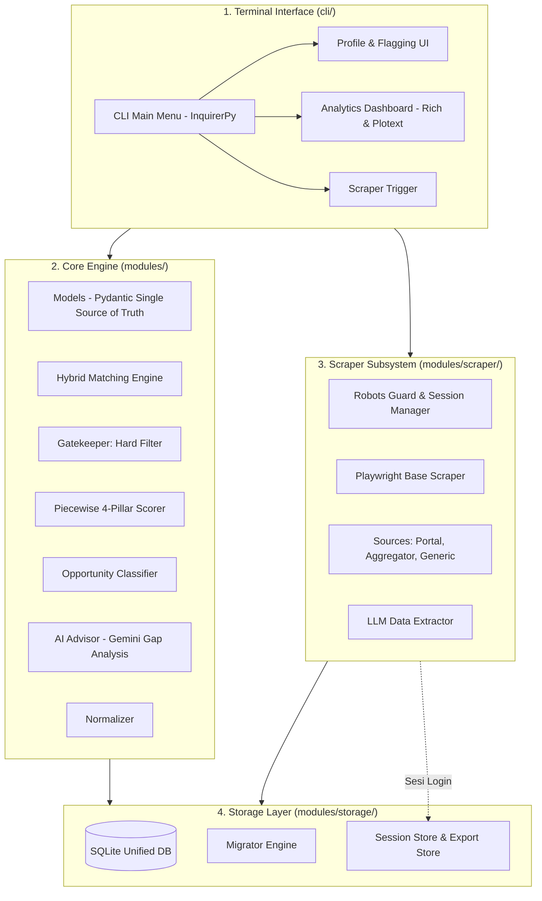

# 🎓 Scholarship Analytics & Matching System (Terminal / CLI Edition)
> **Dokumen Perencanaan Arsitektur, Logika Matching, Web Scraping, dan Roadmap Pengembangan (Ringkasan Tingkat Tinggi)**

---

## 📌 1. Ringkasan & Konsep Proyek
Sistem ini dirancang sebagai **Terminal-based Analytics Dashboard & Recommendation Engine** (TUI - *Terminal User Interface*) yang berjalan sepenuhnya di terminal. Pengguna dapat mengelola profil, menjalankan scraping data beasiswa, melakukan kalkulasi peluang, serta melihat visualisasi analitik tanpa perlu membuka web browser atau menjalankan web server lokal.

### Fitur Kunci & Konsep Utama:
* ⚡ **Multi-User Profile Management**: Mendukung banyak profil pengguna secara independen dengan isolasi data penuh di dalam database lokal.
* ⌨️ **Flagging & Bookmarking**: Setiap pengguna memiliki daftar beasiswa tersimpan (bookmark), penetapan prioritas, status aplikasi, dan catatan pribadi tersendiri (terisolasi per-user).
* 🔐 **Idempotent Ingestion & Session Persistence**: Proses *scraping* atau masuknya data beasiswa baru ke dalam tabel master dijamin tidak akan merusak atau menimpa flag/catatan pengguna yang sudah ada. Terdapat manajemen sesi (*cookies* login) untuk menghindari proses otentikasi berulang.
* 🤖 **Robots.txt Guard & Migrator**: Kepatuhan otomatis terhadap aturan *scraping* sumber (*politeness*) dan memiliki fungsionalitas manajemen versi skema database (Migrator Engine).

---

## 🏗️ 2. Arsitektur Sistem (Mermaid Diagram)



---

## ⚙️ 3. Tech Stack & Library Terminal

| Komponen | Tools Terpilih | Alasan & Fungsi |
| :--- | :--- | :--- |
| **Data Validation** | **`Pydantic (V2)`** | *Single Source of Truth* untuk pendefinisian skema profil, validasi input, dan *data contracts*. |
| **CLI Styling & Layout** | **`Rich`** | Menghasilkan tabel estetik, panel berwarna, formatting teks Markdown, dan animasi *live spinner*. |
| **Interactive Prompts** | **`InquirerPy`** | Menu interaktif yang elegan dengan navigasi keyboard ($\uparrow \downarrow$), autocomplete input, dan form *checklist*. |
| **Terminal Plotting** | **`plotext`** | Menampilkan visualisasi data analitik seperti grafik sebaran kuadran dan histogram bar di terminal menggunakan karakter ASCII/Unicode. |
| **Database** | **`SQLite`** | Sistem manajemen basis data bawaan (*built-in*) yang mendukung pemisahan profil secara mandiri dan cepat diakses secara lokal. |
| **Scraper & Browser Auth**| **`Playwright`** | Bypass deteksi anti-bot, mengeksekusi konten JavaScript dinamis, login interaktif dan *session persistence*. |
| **AI Data & Gap Advisor**| **`google-genai`** | Digunakan untuk ekstraksi data tak terstruktur (`gemini-2.5-flash`) menjadi format JSON, serta menghasilkan ringkasan panduan *action plan* untuk pendaftar. |
| **Environment Control** | **`python-dotenv`** | Memuat manajemen variabel konfigurasi sensitif (*environment variables*). |

---

## 🖥️ 4. Mockup Tampilan Terminal Dashboard `[PROTOTYPE]`

```text
╭────────────────────────────── 🎓 BEASISWA CHECKER ANALYTICS ──────────────────────────────╮
│  User: Adika | Jenjang: S2 | Target: UK, Europe | IPK: 3.65 | IELTS Eq: 6.5 | Kerja: 2 Th │
╰────────────────────────────────────────────────────────────────────────────────────────────╯

┏━━━━━━━━━━━━━━━━━━━━┳━━━━━━━━━━━━━━━━━━━━┳━━━━━━━━━━━━━┳━━━━━━━━━━━━━━━━┳━━━━━━━━━━━━━━━━┓
┃ Kategori           ┃ Nama Beasiswa      ┃ Peluang (%) ┃ Status Syarat  ┃ Flag / Notes   ┃
┣━━━━━━━━━━━━━━━━━━━━╋━━━━━━━━━━━━━━━━━━━━╋━━━━━━━━━━━━━╋━━━━━━━━━━━━━━━━╋━━━━━━━━━━━━━━━━┫
┃ 🟢 Safety (≥80%)   ┃ Chevening UK       ┃ 88% [█████] ┃ Lengkap (100%) ┃ ⭐ HIGH (SAVED)┃
┃ 🟢 Safety (≥80%)   ┃ Erasmus Mundus     ┃ 82% [████ ] ┃ Lengkap (100%) ┃ -              ┃
┃ 🟡 Target (60-79%) ┃ LPDP Reguler       ┃ 74% [███  ] ┃ Lolos Syarat   ┃ ⭐ MED (DRAFT) ┃
┃ 🔴 Reach (<60%)    ┃ Gates Cambridge    ┃ 52% [██   ] ┃ Perlu Riset    ┃ -              ┃
┗━━━━━━━━━━━━━━━━━━━━┻━━━━━━━━━━━━━━━━━━━━┻━━━━━━━━━━━━━┻━━━━━━━━━━━━━━━━┻━━━━━━━━━━━━━━━━┛

💡 AI Gap Analysis & Rekomendasi Tindakan:
 • Target Beasiswa: LPDP Reguler (74%)
   👉 Skor IELTS ekuivalen Anda saat ini 6.5. Tingkatkan ke 7.0 untuk keamanan pada pilar bahasa.
   👉 Tambahkan 1 publikasi riset atau sertifikasi kepemimpinan untuk mendongkrak skor portofolio.
```

---

## 📊 5. Logika & Formula Matching Engine (Piecewise Math)

1. **Gatekeeper (Hard Filter)**: Penjaga gerbang kriteria absolut. Mengeliminasi instan beasiswa jika syarat mutlak usia maksimal, IPK minimal, skor kecakapan bahasa, dan negara tujuan tidak terpenuhi oleh pengguna.
2. **Piecewise Scorer (Anti Division-by-Zero)**: Sistem kalkulasi skor terbobot yang menggunakan fungsi matematika *Piecewise* (*diminishing returns*), sehingga peningkatan kompetensi di batas atas dinilai secara realistis tanpa bias linear.
3. **Overall Weighted Fit Score**:
   $$\text{Fit Score} = (0.35 \cdot S_{\text{acad}}) + (0.25 \cdot S_{\text{lang}}) + (0.20 \cdot S_{\text{exp}}) + (0.20 \cdot S_{\text{port}})$$
4. **Opportunity Quadrant**:
   * **`SAFETY`** ($\ge 80\%$): Profil pendaftar memiliki peluang yang sangat kuat dan *outstanding*.
   * **`TARGET`** ($60\% - 79\%$): Profil berada dalam rentang kompetitif realistis, cukup pas untuk standar persaingan.
   * **`REACH`** ($< 60\%$): Status yang menandakan persaingan tinggi di batas mimpi; pendaftar hanya memenuhi persyaratan batas terbawah.

---

## 🗄️ 6. Skema Database (SQLite) & Isolasi Multi-User

Data sistem berpusat pada SQLite dengan desain relasional mandiri dan fungsional yang terdiri dari 6 tabel utama:

1. **`scholarships`**: Tabel utama berisikan repositori terpusat data beasiswa (*single source of truth* dari *Scraper*).
2. **`user_profiles`**: Mengelola konfigurasi profil spesifik dari berbagai pengguna (*multi-user*).
3. **`user_scholarship_flags`**: Tabel penyambung (*junction table*) untuk memfasilitasi status interaksi unik tiap user secara terisolasi (*Bookmarks*, *Priority Levels*, *Application Status*, dan *Notes*).
4. **`user_match_history`**: Tabel *snapshot* pencatatan riwayat hasil perbandingan/kalkulasi skor pengguna dari masa ke masa.
5. **`scrape_logs`**: Basis rekaman log aktivitas sistem, audit keberhasilan injeksi *bot crawler*, dan pemantauan eror.
6. **`schema_migrations`**: Mengendalikan sistem *versioning* versi tabel untuk kelancaran migrasi pembaruan *database*.

---

## 📂 7. Struktur Folder Project (Definitive)

```text
BEASISWA-CHECKER/
├── main.py
├── requirements.txt
├── .env
├── data/
│   ├── scholarships.db
│   ├── sessions/
│   ├── backups/
│   └── exports/
├── modules/
│   ├── __init__.py
│   ├── models.py                    # Single Source of Truth Pydantic Schemas
│   ├── database.py                  # Unified SQLite Database Repository
│   ├── normalizer.py
│   ├── gatekeeper.py
│   ├── scoring.py
│   ├── matching_engine.py
│   ├── ai_advisor.py
│   ├── storage/
│   │   ├── __init__.py
│   │   ├── migrator.py
│   │   ├── seed_data.py
│   │   ├── session_store.py
│   │   └── export_store.py
│   └── scraper/
│       ├── __init__.py
│       ├── robots_guard.py
│       ├── session_manager.py       # (Delegates to storage/session_store.py)
│       ├── base_scraper.py
│       ├── llm_extractor.py
│       ├── pipeline.py
│       ├── cli_view.py
│       └── sources/
│           ├── __init__.py
│           ├── portal_scraper.py
│           ├── aggregator_scraper.py
│           └── generic_scraper.py
├── cli/
│   ├── menus.py
│   ├── views.py
│   └── profile_cli.py
└── tests/
    ├── test_core_engine.py
    ├── test_scraper_ingestion.py
    └── test_storage_layer.py
```

---

## 🚀 8. Rencana Tahapan Eksekusi (Roadmap)

- [ ] **Fase 1: Setup Environment, Models & Database Migrator**
  - Inisiasi `pydantic` models, modul penyimpanan (Storage Layer), pembentukan `sqlite3` driver, dan perancangan *migration engine* yang memvalidasi pembentukan struktur awal 6 tabel database.
- [ ] **Fase 2: Multi-User Profile & Data Normalization Engine**
  - Pembuatan sistem input TUI terminal untuk mengelola entri form banyak profil pengguna secara persisten dan perancangan `normalizer.py` multi-bahasa.
- [ ] **Fase 3: Core Matching Engine & Flagging**
  - Menyusun `gatekeeper.py` (kelayakan mutlak), `scoring.py` (*Piecewise Math*), `matching_engine.py`, serta fungsi relasional *bookmark/flagging* yang aman bagi masing-masing user.
- [ ] **Fase 4: Scraper Subsystem & Ingestion Pipeline**
  - Membangun fungsionalitas pengamanan `robots_guard`, arsitektur hirarkis sumber *scraper* multi-portal, *session manager* login, dan ekstraktor otomatis bertenaga LLM Gemini Flash berintegritas *Ingestion Idempotent*.
- [ ] **Fase 5: AI Gap Advisor & TUI Dashboard Interface**
  - Mengimplementasikan prompt saran cerdas untuk membangun *Action Plan* gap kompetensi. Finalisasi UI/UX berbasis terminal menggunakan kombinasi library `Rich` (Tabel/Panel) dan `Plotext` (Data Visualisasi).
- [ ] **Fase 6: Testing & Quality Assurance**
  - Membuat otomasi *test suite* mendalam menggunakan Pytest (fokus pada `test_core_engine`, `test_scraper_ingestion`, dan `test_storage_layer`).

---

## 🗺️ 9. Peta Dokumen Spesifikasi

Proyek perancangan BEASISWA CHECKER terdiri dari 4 (empat) dokumen pedoman inti. Dokumen ini adalah ringkasan tingkat tertinggi, rincian teknis mendalam perihal *source code*, pemodelan matematis, abstraksi OOP, dan interaksi data tersebar pada tiga dokumen spesifikasi berikut:

1. **`system_analytics_and_architecture.md`**: (Dokumen ini) Ringkasan arsitektur sistem, bagan interaksi subsistem, hirarki proyek direktori absolut, dan rencana pengembangan (*Roadmap*).
2. **`core_engine_and_data_processor.md`**: Mendefinisikan Pydantic Models, logika pencocokan *Piecewise Math* 4-Pilar (*Scoring Engine*), mekanisme perlindungan Hard Filter (*Gatekeeper*), mesin normalisasi skor kemahiran bahasa, serta konvensi pengelolaan variabel.
3. **`scraper_and_ingestion_engine.md`**: Menjabarkan arsitektur ekstraksi data *headless browser* Playwright, pengawal *Robots.txt*, kerangka sumber portal beragam, integrasi pengolahan teks *AI Extractor/Parser*, otentikasi login peramban, serta protokol integritas *Ingestion Idempotent*.
4. **`storage_layer_and_database_architecture.md`**: Mengulas seluk-beluk skema SQLite untuk 6 (enam) entitas tabel multi-user, desain modul *Migrator*, pembentukan Repositori fungsional CRUD, rutinitas pencadangan data otomatis (*Backup*), manajemen simpanan laporan eksport, dan pengelolaan *cookie* sesi.
