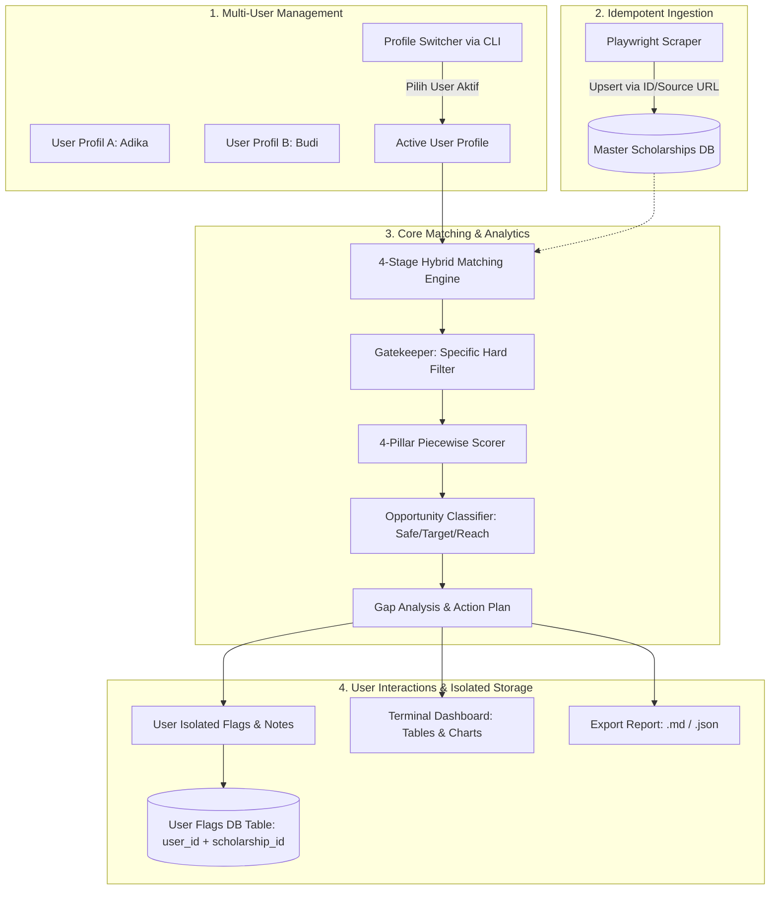

# 🧠 Technical Specification: Core Engine & Data Processor
> **Scholarship Analytics & Matching System (Terminal Edition)**  
> *Spesifikasi Komprehensif: Teori Matematis, Multi-User Isolation, Skema Data & Flagging, Sub-Engine Normalisasi, Scraper Idempotent, dan Panduan Eksekusi AI Agent.*

---

## 📑 Daftar Isi
1. [Ringkasan & Filosofi Desain](#1-ringkasan--filosofi-desain)
2. [Landasan Teori: Gatekeeper, 4 Pilar, & Piecewise Math](#2-landasan-teori-gatekeeper-4-pilar--piecewise-math)
3. [Data Contracts & Skema Data (Pydantic V2)](#3-data-contracts--skema-data-pydantic-v2)
4. [Skema Database (SQLite) & Isolasi Multi-User Data](#4-skema-database-sqlite--isolasi-multi-user-data)
5. [Sub-Engine Normalisasi Multi-Tes Bahasa (Termasuk TOEIC)](#5-sub-engine-normalisasi-multi-tes-bahasa-termasuk-toeic)
6. [Pipeline Algoritma Hybrid Matching 4-Tahap](#6-pipeline-algoritma-hybrid-matching-4-tahap)
7. [Spesifikasi Visualisasi Terminal & Export Laporan](#7-spesifikasi-visualisasi-terminal--export-laporan)
8. [Implementasi Kode Python Lengkap (Ready-to-Run)](#8-implementasi-kode-python-lengkap-ready-to-run)
9. [Executable Unit Tests (Pytest)](#9-executable-unit-tests-pytest)
10. [Panduan Langkah Eksekusi untuk AI Agent](#10-panduan-langkah-eksekusi-untuk-ai-agent)

---

## 1. Ringkasan & Filosofi Desain

**Core Engine & Data Processor** adalah modul pemrosesan data mandiri yang bertugas mencocokkan profil pengguna dengan basis data beasiswa secara presisi, deterministik, dan bebas dari *runtime error*.

### Prinsip Utama Sistem:
* **Multi-User Profile Management (Isolasi Akun Penuh)**: Sistem mendukung banyak profil pengguna yang terpisah secara independen di database lokal (misal: akun untuk anggota keluarga/teman yang berbeda). Pengguna dapat menambah, mengedit, menghapus, atau berganti (*switch*) profil aktif kapan saja via terminal.
* **Isolasi Flagging, Bookmark, & Catatan Pribadi per User**: Setiap user memiliki daftar bookmark (`⭐ Bookmarked`), tingkat prioritas (`HIGH`, `MEDIUM`, `LOW`), status pendaftaran (`SAVED`, `DRAFTING`, `APPLIED`), dan catatan pribadi yang **terisolasi secara mandiri**. Bookmark User A tidak akan bercampur dengan User B.
* **Idempotent Scraper Data Guard**: Proses scraping data beasiswa baru ke tabel master tidak akan pernah menghapus, mengubah, atau merusak data *flag*, *bookmark*, dan *notes* pribadi milik user manapun.
* **Zero-Division & None-Safe Math**: Seluruh kalkulasi matematis menangani input opsional (`None`), nilai $0$, dan skenario batas secara aman.



---

## 2. Landasan Teori: Gatekeeper, 4 Pilar, & Piecewise Math

### A. Gatekeeper (Penjaga Gerbang Syarat Mutlak)
* **Mengapa Diperlukan?** Penyelenggara beasiswa memiliki aturan administratif kaku yang menggugurkan pendaftar secara biner (`True/False`). Jika pendaftar berusia 36 tahun pada beasiswa yang membatasi usia maksimal 35 tahun, pendaftar akan **100% gugur otomatis**, meskipun IPK-nya 4.00.
* **Granularitas Aturan**: Bersifat **spesifik per beasiswa**, bukan acuan umum.
  * *Chevening*: Wajib $\ge 2$ tahun kerja, tanpa batas usia.
  * *LPDP Reguler*: Batas usia ketat (S2 max 35 th), tanpa syarat minimal pengalaman kerja.
  * *MEXT*: Batas usia ketat ($< 35$ th), syarat IPK ketat.

### B. Rasionalisasi 4 Pilar Penilaian
Sistem menggunakan 4 pilar inti yang merekayasa balik rubrik komite beasiswa internasional:
1. **Akademik ($S_{\text{acad}}$ - Bobot 35%)**: Mengukur kapasitas intelektual dan konsistensi studi.
2. **Bahasa ($S_{\text{lang}}$ - Bobot 25%)**: Mengukur kesiapan komunikasi akademik (IELTS, TOEFL, TOEIC, DET).
3. **Pengalaman Kerja ($S_{\text{exp}}$ - Bobot 20%)**: Mengukur kematangan profesional dan relevansi industri.
4. **Portofolio & Kontribusi ($S_{\text{port}}$ - Bobot 20%)**: Mengukur *leadership*, publikasi riset, dan dampak sosial (*social impact*).

### C. Formula Matematis Piecewise (Fungsi Sepotong-sepotong)
Kenaikan profil pendaftar di dunia nyata tidak bersifat linear biasa ($y = mx + c$). Kenaikan IPK dari $2.95 \rightarrow 3.05$ jauh lebih berpengaruh terhadap kelulusan berkas dibanding $3.85 \rightarrow 3.95$. Digunakan **Fungsi Piecewise** untuk memberikan bobot realistis dengan *diminishing returns* di batas atas dan penalti tajam di bawah batas ambang (*threshold*).

---

## 3. Data Contracts & Skema Data (Pydantic V2)

```python
from enum import Enum
from typing import List, Optional, Dict
from pydantic import BaseModel, Field, ConfigDict
from datetime import date

class DegreeLevel(str, Enum):
    S1 = "S1"
    S2 = "S2"
    S3 = "S3"
    NON_DEGREE = "NON_DEGREE"

class FundingType(str, Enum):
    FULLY_FUNDED = "FULLY_FUNDED"
    PARTIAL = "PARTIAL"
    TUITION_ONLY = "TUITION_ONLY"

class OpportunityQuadrant(str, Enum):
    SAFETY = "SAFETY"          # Peluang Sangat Tinggi (>= 80%)
    TARGET = "TARGET"          # Peluang Pas/Sesuai (60% - 79%)
    REACH = "REACH"            # Peluang Kompetitif / Dream (< 60%)
    INELIGIBLE = "INELIGIBLE"  # Tidak memenuhi syarat mutlak

class PriorityLevel(str, Enum):
    HIGH = "HIGH"
    MEDIUM = "MEDIUM"
    LOW = "LOW"

class ApplicationStatus(str, Enum):
    UNMARKED = "UNMARKED"
    SAVED = "SAVED"
    DRAFTING = "DRAFTING"
    APPLIED = "APPLIED"
    ACCEPTED = "ACCEPTED"
    REJECTED = "REJECTED"

# ==========================================
# 1. USER PROFILE MODEL (MULTI-USER SUPPORT)
# ==========================================
class UserProfile(BaseModel):
    model_config = ConfigDict(use_enum_values=True)
    
    user_id: str = Field(..., description="ID unik pengguna (misal: 'user_adika', 'user_budi')")
    name: str = Field(..., description="Nama lengkap pemilik profil")
    age: int = Field(..., ge=15, le=80, description="Usia saat ini")
    target_degree: DegreeLevel = Field(..., description="Jenjang yang dituju")
    
    # Akademik
    gpa: float = Field(..., ge=0.0, le=4.0, description="IPK skala 4.0")
    major_field: str = Field(..., description="Bidang studi / jurusan")
    
    # Kemampuan Bahasa
    ielts_score: Optional[float] = Field(None, ge=0.0, le=9.0)
    toefl_ibt_score: Optional[int] = Field(None, ge=0, le=120)
    toefl_itp_score: Optional[int] = Field(None, ge=310, le=677)
    duolingo_score: Optional[int] = Field(None, ge=10, le=160)
    toeic_score: Optional[int] = Field(None, ge=10, le=990, description="Skor TOEIC L&R (10-990)")
    
    # Pengalaman & Portofolio
    work_exp_years: float = Field(default=0.0, ge=0.0, description="Tahun pengalaman kerja")
    publications_count: int = Field(default=0, ge=0, description="Jumlah publikasi ilmiah")
    leadership_roles_count: int = Field(default=0, ge=0, description="Jumlah riwayat kepemimpinan")
    has_community_service: bool = Field(default=False, description="Memiliki rekam jejak sosial")
    
    # Preferensi
    target_countries: List[str] = Field(default_factory=lambda: ["Global"])

# ==========================================
# 2. SCHOLARSHIP MODEL
# ==========================================
class Scholarship(BaseModel):
    model_config = ConfigDict(use_enum_values=True)
    
    id: str = Field(..., description="ID unik (Hash URL / Slug)")
    name: str = Field(..., description="Nama beasiswa")
    provider: str = Field(..., description="Penyelenggara")
    funding_type: FundingType = Field(default=FundingType.FULLY_FUNDED)
    source_url: Optional[str] = Field(None, description="URL sumber untuk deduplikasi scraper")
    
    # Syarat Mutlak (Hard Criteria)
    target_degrees: List[DegreeLevel] = Field(..., description="Jenjang yang dibuka")
    eligible_countries: List[str] = Field(default_factory=lambda: ["Global"])
    max_age: Optional[int] = Field(None, ge=15, le=100)
    min_gpa: float = Field(default=0.0, ge=0.0, le=4.0)
    
    # Syarat Bahasa
    min_ielts: Optional[float] = Field(None, ge=0.0, le=9.0)
    min_toefl_ibt: Optional[int] = Field(None, ge=0, le=120)
    min_toefl_itp: Optional[int] = Field(None, ge=310, le=677)
    min_duolingo: Optional[int] = Field(None, ge=10, le=160)
    min_toeic: Optional[int] = Field(None, ge=10, le=990)
    
    # Preferensi (Soft Criteria)
    min_work_exp_years: float = Field(default=0.0, ge=0.0)
    requires_leadership: bool = Field(default=False)
    requires_publications: bool = Field(default=False)
    priority_fields: List[str] = Field(default_factory=list)
    
    # Metadata
    deadline_date: Optional[date] = Field(None)
    description: Optional[str] = Field(None)

# ==========================================
# 3. INTERACTION & FLAGGING MODEL (PER USER)
# ==========================================
class ScholarshipFlag(BaseModel):
    model_config = ConfigDict(use_enum_values=True)
    
    user_id: str
    scholarship_id: str
    is_bookmarked: bool = False
    priority_level: PriorityLevel = PriorityLevel.MEDIUM
    application_status: ApplicationStatus = ApplicationStatus.UNMARKED
    personal_notes: Optional[str] = None

# ==========================================
# 4. EVALUATION & REPORT OUTPUT MODELS
# ==========================================
class DimensionScores(BaseModel):
    academic_score: float = Field(..., ge=0.0, le=100.0)
    language_score: float = Field(..., ge=0.0, le=100.0)
    experience_score: float = Field(..., ge=0.0, le=100.0)
    portfolio_score: float = Field(..., ge=0.0, le=100.0)

class EligibilityDetail(BaseModel):
    is_eligible: bool
    passed_criteria: List[str] = Field(default_factory=list)
    failed_reasons: List[str] = Field(default_factory=list)

class MatchResult(BaseModel):
    scholarship: Scholarship
    is_eligible: bool
    overall_fit_score: float = Field(..., ge=0.0, le=100.0)
    quadrant: OpportunityQuadrant
    dimension_scores: DimensionScores
    eligibility_detail: EligibilityDetail
    gap_recommendations: List[str] = Field(default_factory=list)
    user_flag: Optional[ScholarshipFlag] = None

class MatchReport(BaseModel):
    user_id: str
    user_name: str
    total_analyzed: int
    eligible_count: int
    ineligible_count: int
    bookmarked_count: int
    results: List[MatchResult]
```

---

## 4. Skema Database (SQLite) & Isolasi Multi-User Data

Desain tabel SQLite dengan isolasi data antar-pengguna:

```sql
-- 1. Master Data Beasiswa (Diperbarui oleh Scraper via UPSERT)
CREATE TABLE IF NOT EXISTS scholarships (
    id TEXT PRIMARY KEY,
    source_url TEXT UNIQUE,              -- Kunci unik untuk deteksi duplikasi scraper
    name TEXT NOT NULL,
    provider TEXT NOT NULL,
    funding_type TEXT NOT NULL,
    target_degrees TEXT,                 -- JSON Array: ["S1", "S2"]
    eligible_countries TEXT,             -- JSON Array: ["UK", "Global"]
    max_age INTEGER,
    min_gpa REAL DEFAULT 0.0,
    min_ielts REAL,
    min_toefl_ibt INTEGER,
    min_toefl_itp INTEGER,
    min_duolingo INTEGER,
    min_toeic INTEGER,
    min_work_exp_years REAL DEFAULT 0.0,
    requires_leadership BOOLEAN DEFAULT 0,
    requires_publications BOOLEAN DEFAULT 0,
    priority_fields TEXT,                -- JSON Array
    deadline_date DATE,
    description TEXT,
    updated_at TIMESTAMP DEFAULT CURRENT_TIMESTAMP
);

-- 2. Data Multi-User Profiles (Tiap user memiliki ID dan data terpisah)
CREATE TABLE IF NOT EXISTS user_profiles (
    user_id TEXT PRIMARY KEY,
    name TEXT NOT NULL,
    age INTEGER NOT NULL,
    target_degree TEXT NOT NULL,
    gpa REAL NOT NULL,
    major_field TEXT NOT NULL,
    ielts_score REAL,
    toefl_ibt_score INTEGER,
    toefl_itp_score INTEGER,
    duolingo_score INTEGER,
    toeic_score INTEGER,
    work_exp_years REAL DEFAULT 0.0,
    publications_count INTEGER DEFAULT 0,
    leadership_roles_count INTEGER DEFAULT 0,
    has_community_service BOOLEAN DEFAULT 0,
    target_countries TEXT,               -- JSON Array
    created_at TIMESTAMP DEFAULT CURRENT_TIMESTAMP,
    updated_at TIMESTAMP DEFAULT CURRENT_TIMESTAMP
);

-- 3. Interaksi User Terisolasi (Bookmark, Flagging, Notes per User)
CREATE TABLE IF NOT EXISTS user_scholarship_flags (
    user_id TEXT,
    scholarship_id TEXT,
    is_bookmarked BOOLEAN DEFAULT 0,
    priority_level TEXT DEFAULT 'MEDIUM',        -- HIGH, MEDIUM, LOW
    application_status TEXT DEFAULT 'UNMARKED',  -- SAVED, DRAFTING, APPLIED, ACCEPTED, REJECTED
    personal_notes TEXT,
    flagged_at TIMESTAMP DEFAULT CURRENT_TIMESTAMP,
    PRIMARY KEY (user_id, scholarship_id),
    FOREIGN KEY(user_id) REFERENCES user_profiles(user_id) ON DELETE CASCADE,
    FOREIGN KEY(scholarship_id) REFERENCES scholarships(id) ON DELETE CASCADE
);
```

### Logika Scraper Idempotent (Anti-Overwrite):
```sql
-- Saat scraper menemukan data beasiswa:
-- HANYA update metadata beasiswa, JANGAN menyentuh tabel user_scholarship_flags!
INSERT INTO scholarships (id, source_url, name, provider, funding_type, target_degrees, min_gpa, min_ielts, deadline_date)
VALUES (:id, :source_url, :name, :provider, :funding_type, :target_degrees, :min_gpa, :min_ielts, :deadline_date)
ON CONFLICT(id) DO UPDATE SET
    name = excluded.name,
    min_gpa = excluded.min_gpa,
    min_ielts = excluded.min_ielts,
    deadline_date = excluded.deadline_date,
    updated_at = CURRENT_TIMESTAMP;
```

---

## 5. Sub-Engine Normalisasi Multi-Tes Bahasa (Termasuk TOEIC)

Matriks konversi standar CEFR ke skala **IELTS Equivalent ($0.0 - 9.0$)**:

| IELTS | TOEFL iBT | TOEFL ITP | Duolingo (DET) | TOEIC (L&R) | CEFR | Normalized Index ($0-100$) |
| :---: | :---: | :---: | :---: | :---: | :---: | :---: |
| **9.0** | 118 – 120 | 677 | 155 – 160 | 970 – 990 | C2 | **100.0** |
| **8.5** | 115 – 117 | 660 | 145 – 150 | 945 – 965 | C2 | **94.4** |
| **8.0** | 110 – 114 | 640 | 135 – 140 | 890 – 940 | C1 | **88.8** |
| **7.5** | 102 – 109 | 610 | 125 – 130 | 830 – 885 | C1 | **83.3** |
| **7.0** | 94 – 101 | 580 | 115 – 120 | 785 – 825 | C1 | **77.7** |
| **6.5** | 79 – 93 | 550 | 105 – 110 | 700 – 780 | B2 | **72.2** |
| **6.0** | 60 – 78 | 500 | 95 – 100 | 600 – 695 | B2 | **66.6** |
| **5.5** | 46 – 59 | 470 | 85 – 90 | 500 – 595 | B2 | **61.1** |
| **5.0** | 35 – 45 | 440 | 75 – 80 | 400 – 495 | B1 | **55.5** |
| **< 5.0** | < 35 | < 440 | < 75 | < 400 | A1-B1 | **< 50.0** |

---

## 6. Pipeline Algoritma Hybrid Matching 4-Tahap

### Stage 1: Gatekeeper Filter (Kelayakan Mutlak)
* Mengecek kesesuaian: `target_degree`, `max_age`, `min_gpa`, `Language Check (None-safe)`, dan `Country overlap`.
* Jika gagal di salah satu: $\rightarrow$ `is_eligible = False`, `quadrant = INELIGIBLE`.

### Stage 2: 4-Pillar Piecewise Scorer (Anti Division-by-Zero)

#### 1. Skor Akademik ($S_{\text{acad}} \in [0, 100]$):
* **Jika $\text{GPA} < \text{min\_gpa}$ (Di bawah syarat minimal)**:
  $$\text{Score} = \max\left(0.0, \min\left(50.0, \frac{\text{GPA}}{\max(0.1, \text{min\_gpa})} \times 50.0\right)\right)$$
* **Jika $\text{GPA} \ge 3.85$ (Sangat Kompetitif)**:
  $$\text{Score} = 100.0$$
* **Jika $3.50 \le \text{GPA} < 3.85$**:
  $$\text{Score} = 85.0 + \left(\frac{\text{GPA} - 3.50}{0.35}\right) \times 15.0$$
* **Jika $3.00 \le \text{GPA} < 3.50$**:
  $$\text{Score} = 70.0 + \left(\frac{\text{GPA} - 3.00}{0.50}\right) \times 15.0$$
* **Jika $\text{min\_gpa} \le \text{GPA} < 3.00$**:
  $$\text{Score} = 60.0 + \max(0.0, (\text{GPA} - \text{min\_gpa}) \times 20.0)$$

#### 2. Skor Bahasa ($S_{\text{lang}} \in [0, 100]$):
$$\text{Surplus} = \text{User Best IELTS Equivalent} - \text{Min Req IELTS Equivalent}$$

* **Jika Tidak Ada Syarat Bahasa ($\text{Req} = 0.0$)**: $100.0$ (jika User $\ge 6.5$) atau $75.0$ (jika User $\ge 5.0$).
* **Jika $\text{Surplus} \ge 1.0$ (Melampaui syarat $\ge 1.0$ band)**:
  $$\text{Score} = 100.0$$
* **Jika $0.0 \le \text{Surplus} < 1.0$**:
  $$\text{Score} = 85.0 + (\text{Surplus} \times 15.0)$$
* **Jika $\text{Surplus} < 0.0$ (Di bawah syarat bahasa)**:
  $$\text{Score} = \max(0.0, 70.0 - (|\text{Surplus}| \times 25.0))$$

#### 3. Skor Pengalaman Kerja ($S_{\text{exp}} \in [0, 100]$):
* **Jika $\text{Exp} < \text{min\_exp}$ (Di bawah syarat pengalaman kerja)**:
  $$\text{Score} = \left(\frac{\text{Exp}}{\max(1.0, \text{min\_exp})}\right) \times 60.0$$
* **Jika $\text{Exp} \ge (\text{min\_exp} + 2.0)$ atau $\text{Exp} \ge 4.0$ th**:
  $$\text{Score} = 100.0$$
* **Jika $\text{min\_exp} \le \text{Exp} < (\text{min\_exp} + 2.0)$**:
  $$\text{Score} = 80.0 + \min(20.0, (\text{Exp} - \text{min\_exp}) \times 10.0)$$

#### 4. Skor Portofolio & Kontribusi ($S_{\text{port}} \in [0, 100]$):
$$\text{Score} = \min(100.0, (\text{Publikasi} \times 20.0) + (\text{Leadership} \times 15.0) + \text{Bonus Sosial})$$
*(Catatan: Bonus Sosial $= +20.0$ jika memiliki rekam jejak pengabdian masyarakat/organisasi)*

#### 5. Overall Weighted Fit Score:
$$\text{Fit Score} = (0.35 \times S_{\text{acad}}) + (0.25 \times S_{\text{lang}}) + (0.20 \times S_{\text{exp}}) + (0.20 \times S_{\text{port}})$$

### Stage 3: Opportunity Quadrant Classification
* $\text{Fit Score} \ge 80.0 \rightarrow$ **`SAFETY`** (Peluang Sangat Tinggi)
* $60.0 \le \text{Fit Score} < 80.0 \rightarrow$ **`TARGET`** (Peluang Pas/Realistis)
* $\text{Fit Score} < 60.0 \rightarrow$ **`REACH`** (Peluang Kompetitif)

### Stage 4: Actionable Gap Analysis
Mendeteksi defisit skor secara otomatis dan menyusun *action plan*:
* *"Skor bahasa kurang +0.5 IELTS / TOEIC +50 untuk memenuhi batas aman."*
* *"Beasiswa ini memprioritaskan rekam jejak riset (siapkan min. 1 draf publikasi)."*

---

## 7. Spesifikasi Visualisasi Terminal & Export Laporan (Temporary / Prototype View)

> [!IMPORTANT]
> **Catatan Status Desain TUI**:  
> Desain antarmuka terminal (TUI) pada dokumen ini berstatus **TEMPORARY / PROTOTYPE (Work in Progress)** untuk keperluan fungsionalitas dan pengujian awal. Tampilan visual final (tata letak grafik, skema warna, dan tata letak panel) akan disempurnakan pada iterasi desain antarmuka berikutnya tanpa mengubah logika kalkulasi matching engine.

### A. Tampilan Visual di Terminal (Menggunakan `Rich` + `Plotext`)
1. **Header User Aktif**: Menampilkan nama dan identitas user yang sedang aktif di bagian atas dashboard.
2. **Radar Chart (Keseimbangan 4 Pilar)**: Menampilkan bentuk jaring 4 pilar di terminal untuk melihat kelemahan spesifik pengguna.
3. **Opportunity Matrix (Kuadran Peluang)**: Tabel berwarna yang mengelompokkan beasiswa berdasarkan status kelayakan dan tingkat peluang.
4. **Peringkat Top Beasiswa**: Bar chart ASCII skor peluang tertinggi.
5. **Flag & Priority Badges**: Tanda `⭐ Bookmarked`, `🔥 HIGH Priority`, dan status aplikasi (`[DRAFTING]`, `[APPLIED]`).

### B. Fitur Export Laporan (`export_report`)
Engine menyediakan fungsi untuk mengekspor laporan matching lengkap ke dalam:
* **Markdown (`.md`)**: Laporan rapi siap baca/cetak berisi tabel kuadran, analisis gap per beasiswa, dan *checklist roadmap*.
* **JSON (`.json`)**: Data mentah terstruktur untuk arsip atau integrasi lebih lanjut.

---

## 8. Implementasi Kode Python Lengkap (Ready-to-Run)

### `modules/normalizer.py`
```python
from typing import Optional
from modules.models import UserProfile, Scholarship

class Normalizer:
    @staticmethod
    def toefl_ibt_to_ielts(score: Optional[int]) -> float:
        if score is None: return 0.0
        if score >= 118: return 9.0
        if score >= 115: return 8.5
        if score >= 110: return 8.0
        if score >= 102: return 7.5
        if score >= 94: return 7.0
        if score >= 79: return 6.5
        if score >= 60: return 6.0
        if score >= 46: return 5.5
        if score >= 35: return 5.0
        return max(0.0, round((score / 35.0) * 4.5, 1))

    @staticmethod
    def toefl_itp_to_ielts(score: Optional[int]) -> float:
        if score is None: return 0.0
        if score >= 677: return 9.0
        if score >= 660: return 8.5
        if score >= 640: return 8.0
        if score >= 610: return 7.5
        if score >= 580: return 7.0
        if score >= 550: return 6.5
        if score >= 500: return 6.0
        if score >= 470: return 5.5
        if score >= 440: return 5.0
        return max(0.0, round((score / 440.0) * 4.5, 1))

    @staticmethod
    def duolingo_to_ielts(score: Optional[int]) -> float:
        if score is None: return 0.0
        if score >= 155: return 9.0
        if score >= 145: return 8.5
        if score >= 135: return 8.0
        if score >= 125: return 7.5
        if score >= 115: return 7.0
        if score >= 105: return 6.5
        if score >= 95: return 6.0
        if score >= 85: return 5.5
        if score >= 75: return 5.0
        return max(0.0, round((score / 75.0) * 4.5, 1))

    @staticmethod
    def toeic_to_ielts(score: Optional[int]) -> float:
        if score is None: return 0.0
        if score >= 970: return 9.0
        if score >= 945: return 8.5
        if score >= 890: return 8.0
        if score >= 830: return 7.5
        if score >= 785: return 7.0
        if score >= 700: return 6.5
        if score >= 600: return 6.0
        if score >= 500: return 5.5
        if score >= 400: return 5.0
        return max(0.0, round((score / 400.0) * 4.5, 1))

    @classmethod
    def get_best_ielts_equivalent(cls, user: UserProfile) -> float:
        scores = [
            user.ielts_score or 0.0,
            cls.toefl_ibt_to_ielts(user.toefl_ibt_score),
            cls.toefl_itp_to_ielts(user.toefl_itp_score),
            cls.duolingo_to_ielts(user.duolingo_score),
            cls.toeic_to_ielts(user.toeic_score)
        ]
        return max(scores)

    @classmethod
    def get_scholarship_min_ielts(cls, s: Scholarship) -> float:
        reqs = []
        if s.min_ielts is not None: reqs.append(s.min_ielts)
        if s.min_toefl_ibt is not None: reqs.append(cls.toefl_ibt_to_ielts(s.min_toefl_ibt))
        if s.min_toefl_itp is not None: reqs.append(cls.toefl_itp_to_ielts(s.min_toefl_itp))
        if s.min_duolingo is not None: reqs.append(cls.duolingo_to_ielts(s.min_duolingo))
        if s.min_toeic is not None: reqs.append(cls.toeic_to_ielts(s.min_toeic))
        
        return min(reqs) if reqs else 0.0
```

---

### `modules/gatekeeper.py`
```python
from modules.models import UserProfile, Scholarship, EligibilityDetail
from modules.normalizer import Normalizer

class EligibilityFilter:
    @staticmethod
    def evaluate(user: UserProfile, scholarship: Scholarship) -> EligibilityDetail:
        passed = []
        failed = []
        
        # 1. Target Degree
        if user.target_degree in scholarship.target_degrees:
            passed.append(f"Jenjang sesuai: {user.target_degree}")
        else:
            failed.append(f"Jenjang target ({user.target_degree}) tidak dibuka (Tersedia: {scholarship.target_degrees})")
            
        # 2. Age Limit (Specific per scholarship)
        if scholarship.max_age is not None:
            if user.age <= scholarship.max_age:
                passed.append(f"Usia memenuhi syarat ({user.age} <= {scholarship.max_age} th)")
            else:
                failed.append(f"Usia ({user.age} th) melebihi batas maksimal ({scholarship.max_age} th)")
        else:
            passed.append("Tidak ada batasan usia maksimal")
            
        # 3. Minimum GPA
        if user.gpa >= scholarship.min_gpa:
            passed.append(f"IPK memenuhi syarat ({user.gpa:.2f} >= {scholarship.min_gpa:.2f})")
        else:
            failed.append(f"IPK ({user.gpa:.2f}) di bawah batas minimum ({scholarship.min_gpa:.2f})")
            
        # 4. Language Check (Explicit None-Safe)
        has_any_lang_req = any([
            scholarship.min_ielts is not None,
            scholarship.min_toefl_ibt is not None,
            scholarship.min_toefl_itp is not None,
            scholarship.min_duolingo is not None,
            scholarship.min_toeic is not None
        ])
        
        if not has_any_lang_req:
            passed.append("Tidak ada syarat sertifikat bahasa wajib")
        else:
            lang_passed = False
            # Check individual certificates
            if scholarship.min_ielts is not None and user.ielts_score is not None and user.ielts_score >= scholarship.min_ielts:
                lang_passed = True
            elif scholarship.min_toefl_ibt is not None and user.toefl_ibt_score is not None and user.toefl_ibt_score >= scholarship.min_toefl_ibt:
                lang_passed = True
            elif scholarship.min_toefl_itp is not None and user.toefl_itp_score is not None and user.toefl_itp_score >= scholarship.min_toefl_itp:
                lang_passed = True
            elif scholarship.min_duolingo is not None and user.duolingo_score is not None and user.duolingo_score >= scholarship.min_duolingo:
                lang_passed = True
            elif scholarship.min_toeic is not None and user.toeic_score is not None and user.toeic_score >= scholarship.min_toeic:
                lang_passed = True
            else:
                # Check via highest equivalent
                best_user = Normalizer.get_best_ielts_equivalent(user)
                min_req = Normalizer.get_scholarship_min_ielts(scholarship)
                if best_user >= min_req and best_user > 0.0:
                    lang_passed = True

            if lang_passed:
                passed.append("Sertifikat bahasa memenuhi kriteria")
            else:
                failed.append("Skor sertifikat bahasa belum memenuhi syarat minimum")
                
        # 5. Country Match
        is_global = any(c.upper() == "GLOBAL" for c in scholarship.eligible_countries)
        user_has_global = any(c.upper() == "GLOBAL" for c in user.target_countries)
        country_overlap = bool(set([c.lower() for c in user.target_countries]) & set([c.lower() for c in scholarship.eligible_countries]))
        
        if is_global or user_has_global or country_overlap:
            passed.append("Negara target sesuai")
        else:
            failed.append(f"Negara target ({user.target_countries}) di luar cakupan beasiswa ({scholarship.eligible_countries})")
            
        return EligibilityDetail(
            is_eligible=(len(failed) == 0),
            passed_criteria=passed,
            failed_reasons=failed
        )
```

---

### `modules/scoring.py`
```python
from typing import Dict, Optional
from modules.models import UserProfile, Scholarship, DimensionScores
from modules.normalizer import Normalizer

class ScoringEngine:
    @staticmethod
    def calculate_dimensions(user: UserProfile, scholarship: Scholarship) -> DimensionScores:
        # 1. Academic Score (Strict Piecewise Order)
        min_gpa = scholarship.min_gpa
        gpa = user.gpa
        if gpa < min_gpa:
            eff_min = max(0.1, min_gpa)
            acad = max(0.0, min(50.0, (gpa / eff_min) * 50.0))
        elif gpa >= 3.85:
            acad = 100.0
        elif gpa >= 3.5:
            acad = 85.0 + ((gpa - 3.5) / 0.35) * 15.0
        elif gpa >= 3.0:
            acad = 70.0 + ((gpa - 3.0) / 0.5) * 15.0
        else:
            acad = 60.0 + max(0.0, (gpa - min_gpa) * 20.0)
            
        # 2. Language Score
        user_ielts = Normalizer.get_best_ielts_equivalent(user)
        req_ielts = Normalizer.get_scholarship_min_ielts(scholarship)
        
        if req_ielts == 0.0:
            lang = 100.0 if user_ielts >= 6.5 else (75.0 if user_ielts >= 5.0 else 60.0)
        else:
            surplus = user_ielts - req_ielts
            if surplus >= 1.0:
                lang = 100.0
            elif surplus >= 0.0:
                lang = 85.0 + (surplus * 15.0)
            else:
                lang = max(0.0, 70.0 - (abs(surplus) * 25.0))
                
        # 3. Work Experience Score
        min_exp = scholarship.min_work_exp_years
        exp = user.work_exp_years
        if exp < min_exp:
            work = (exp / max(1.0, min_exp)) * 60.0
        elif exp >= (min_exp + 2.0) or exp >= 4.0:
            work = 100.0
        else:
            work = 80.0 + min(20.0, (exp - min_exp) * 10.0)
            
        # 4. Portfolio & Contribution Score
        pub_score = min(50.0, user.publications_count * 20.0)
        lead_score = min(30.0, user.leadership_roles_count * 15.0)
        comm_score = 20.0 if user.has_community_service else 0.0
        port = min(100.0, pub_score + lead_score + comm_score)
        
        return DimensionScores(
            academic_score=round(min(100.0, max(0.0, acad)), 2),
            language_score=round(min(100.0, max(0.0, lang)), 2),
            experience_score=round(min(100.0, max(0.0, work)), 2),
            portfolio_score=round(min(100.0, max(0.0, port)), 2)
        )

    @staticmethod
    def compute_overall_fit(dimensions: DimensionScores, weights: Optional[Dict[str, float]] = None) -> float:
        w = weights or {"academic": 0.35, "language": 0.25, "experience": 0.20, "portfolio": 0.20}
        total = (
            dimensions.academic_score * w["academic"] +
            dimensions.language_score * w["language"] +
            dimensions.experience_score * w["experience"] +
            dimensions.portfolio_score * w["portfolio"]
        )
        return round(min(100.0, max(0.0, total)), 2)
```

---

### `modules/matching_engine.py`
```python
from typing import List, Dict, Optional
from modules.models import (
    UserProfile, Scholarship, MatchResult, MatchReport, 
    OpportunityQuadrant, DimensionScores, ScholarshipFlag
)
from modules.gatekeeper import EligibilityFilter
from modules.scoring import ScoringEngine
from modules.normalizer import Normalizer

class MatchingEngine:
    def __init__(self, scholarships: List[Scholarship], user_flags: Optional[Dict[str, ScholarshipFlag]] = None):
        """
        Matching engine yang menerima katalog beasiswa dan flag/bookmark milik user aktif.
        user_flags: Dictionary {scholarship_id: ScholarshipFlag} untuk user yang sedang aktif.
        """
        self.scholarships = scholarships
        self.user_flags = user_flags or {}

    @staticmethod
    def generate_gap_recommendations(
        user: UserProfile, scholarship: Scholarship, dimensions: DimensionScores, is_eligible: bool
    ) -> List[str]:
        recs = []
        user_ielts = Normalizer.get_best_ielts_equivalent(user)
        req_ielts = Normalizer.get_scholarship_min_ielts(scholarship)
        
        # 1. Language Gap
        if req_ielts > 0.0:
            if user_ielts < req_ielts:
                gap = round(req_ielts - user_ielts, 1)
                recs.append(f"❌ Skor bahasa kurang +{gap} IELTS eq (Target: {req_ielts:.1f}). Rekomendasi: Ambil kursus intensif IELTS/TOEIC/TOEFL.")
            elif req_ielts <= user_ielts < req_ielts + 0.5:
                recs.append(f"⚠️ Skor bahasa memenuhi batas minimal ({user_ielts:.1f}). Tingkatkan +0.5 IELTS / +50 TOEIC untuk memaksimalkan skor pilar bahasa ke 85+%.")
                
        # 2. Work Experience Gap
        if user.work_exp_years < scholarship.min_work_exp_years:
            gap_exp = round(scholarship.min_work_exp_years - user.work_exp_years, 1)
            recs.append(f"❌ Pengalaman kerja kurang {gap_exp} tahun dari syarat minimum ({scholarship.min_work_exp_years} th).")
            
        # 3. Portfolio & Publication
        if scholarship.requires_publications and user.publications_count == 0:
            recs.append("💡 Beasiswa ini mengutamakan riset. Siapkan min. 1 draf publikasi atau proceeding ilmiah.")
            
        if scholarship.requires_leadership and user.leadership_roles_count == 0:
            recs.append("💡 Tambahkan portofolio organisasi/leadership untuk memperkuat esai kontribusi.")
            
        if not is_eligible and not recs:
            recs.append("❌ Profil belum memenuhi kriteria administratif mutlak beasiswa ini.")
            
        return recs

    def evaluate_single(self, user: UserProfile, scholarship: Scholarship) -> MatchResult:
        eligibility = EligibilityFilter.evaluate(user, scholarship)
        dim_scores = ScoringEngine.calculate_dimensions(user, scholarship)
        fit_score = ScoringEngine.compute_overall_fit(dim_scores)
        
        if not eligibility.is_eligible:
            quadrant = OpportunityQuadrant.INELIGIBLE
        elif fit_score >= 80.0:
            quadrant = OpportunityQuadrant.SAFETY
        elif fit_score >= 60.0:
            quadrant = OpportunityQuadrant.TARGET
        else:
            quadrant = OpportunityQuadrant.REACH
            
        gaps = self.generate_gap_recommendations(user, scholarship, dim_scores, eligibility.is_eligible)
        user_flag = self.user_flags.get(scholarship.id)
        
        return MatchResult(
            scholarship=scholarship,
            is_eligible=eligibility.is_eligible,
            overall_fit_score=fit_score,
            quadrant=quadrant,
            dimension_scores=dim_scores,
            eligibility_detail=eligibility,
            gap_recommendations=gaps,
            user_flag=user_flag
        )

    def evaluate_all(self, user: UserProfile) -> MatchReport:
        results = [self.evaluate_single(user, s) for s in self.scholarships]
        # Sort: Bookmarked first, then eligible, then highest fit score
        results.sort(
            key=lambda r: (
                r.user_flag.is_bookmarked if r.user_flag else False,
                r.is_eligible,
                r.overall_fit_score
            ),
            reverse=True
        )
        
        eligible_cnt = sum(1 for r in results if r.is_eligible)
        bookmarked_cnt = sum(1 for r in results if r.user_flag and r.user_flag.is_bookmarked)
        
        return MatchReport(
            user_id=user.user_id,
            user_name=user.name,
            total_analyzed=len(results),
            eligible_count=eligible_cnt,
            ineligible_count=len(results) - eligible_cnt,
            bookmarked_count=bookmarked_cnt,
            results=results
        )

    @staticmethod
    def export_report_to_markdown(report: MatchReport, user: UserProfile, output_path: str = "scholarship_match_report.md") -> str:
        """Mengekspor laporan hasil matching user aktif ke file Markdown."""
        lines = [
            f"# 🎓 Laporan Analisis Beasiswa: {user.name} (`{user.user_id}`)",
            f"> **Jenjang Target**: {user.target_degree} | **IPK**: {user.gpa} | **IELTS Eq**: {Normalizer.get_best_ielts_equivalent(user)} | **Pengalaman**: {user.work_exp_years} th",
            "",
            "## 📊 Ringkasan Peluang",
            f"- **Total Beasiswa Dianalisis**: {report.total_analyzed}",
            f"- **Beasiswa Memenuhi Syarat**: {report.eligible_count}",
            f"- **Beasiswa Tersimpan (Bookmarked)**: {report.bookmarked_count}",
            "",
            "## 🏆 Daftar Rekomendasi Beasiswa",
            "| Prioritas | Nama Beasiswa | Peluang | Kuadran | Status Syarat | Status Aplikasi |",
            "| :--- | :--- | :---: | :---: | :--- | :--- |"
        ]
        
        for r in report.results:
            prio = f"⭐ {r.user_flag.priority_level.value}" if (r.user_flag and r.user_flag.is_bookmarked) else "-"
            status_app = r.user_flag.application_status.value if r.user_flag else "UNMARKED"
            status_syarat = "✅ Lolos" if r.is_eligible else "❌ Tidak Lolos"
            lines.append(f"| {prio} | **{r.scholarship.name}** | **{r.overall_fit_score:.1f}%** | `{r.quadrant.value}` | {status_syarat} | `{status_app}` |")
            
        lines.append("\n## 💡 Action Plan & Gap Analysis Detail\n")
        for r in report.results:
            if r.gap_recommendations:
                lines.append(f"### 📌 {r.scholarship.name} ({r.overall_fit_score:.1f}%)")
                for gap in r.gap_recommendations:
                    lines.append(f"- {gap}")
                lines.append("")
                
        content = "\n".join(lines)
        with open(output_path, "w", encoding="utf-8") as f:
            f.write(content)
        return output_path
```

---

## 9. Executable Unit Tests (Pytest)

Simpan di `tests/test_core_engine.py`:

```python
import pytest
from modules.models import (
    UserProfile, Scholarship, DegreeLevel, FundingType, 
    OpportunityQuadrant, ScholarshipFlag, PriorityLevel, ApplicationStatus
)
from modules.matching_engine import MatchingEngine
from modules.normalizer import Normalizer

@pytest.fixture
def sample_scholarships():
    return [
        Scholarship(
            id="lpdp-reguler",
            name="Beasiswa LPDP Reguler",
            provider="LPDP RI",
            funding_type=FundingType.FULLY_FUNDED,
            target_degrees=[DegreeLevel.S2, DegreeLevel.S3],
            max_age=35,
            min_gpa=3.0,
            min_ielts=6.5,
            min_work_exp_years=0.0,
            requires_leadership=True
        ),
        Scholarship(
            id="chevening-uk",
            name="Chevening Scholarship",
            provider="UK Foreign Office",
            funding_type=FundingType.FULLY_FUNDED,
            target_degrees=[DegreeLevel.S2],
            max_age=None,
            min_gpa=3.0,
            min_ielts=6.5,
            min_work_exp_years=2.0,
            requires_leadership=True,
            eligible_countries=["UK", "Global"]
        )
    ]

def test_language_normalizer():
    # Test TOEIC conversion
    assert Normalizer.toeic_to_ielts(850) == 7.5
    assert Normalizer.toeic_to_ielts(785) == 7.0
    assert Normalizer.toeic_to_ielts(None) == 0.0
    
    # Test TOEFL iBT conversion
    assert Normalizer.toefl_ibt_to_ielts(105) == 7.5
    assert Normalizer.toefl_ibt_to_ielts(None) == 0.0

def test_multi_user_isolation(sample_scholarships):
    # User A: Adika (Mem-bookmark Chevening)
    user_a = UserProfile(
        user_id="user_adika",
        name="Adika",
        age=26,
        target_degree=DegreeLevel.S2,
        gpa=3.85,
        major_field="Computer Science",
        ielts_score=7.5,
        work_exp_years=3.0,
        publications_count=2,
        leadership_roles_count=2,
        has_community_service=True,
        target_countries=["UK", "Global"]
    )
    flags_user_a = {
        "chevening-uk": ScholarshipFlag(
            user_id="user_adika",
            scholarship_id="chevening-uk",
            is_bookmarked=True,
            priority_level=PriorityLevel.HIGH,
            application_status=ApplicationStatus.DRAFTING,
            personal_notes="Fokus esai leadership"
        )
    }
    
    # User B: Budi (Tidak mem-bookmark Chevening, bookmark LPDP)
    user_b = UserProfile(
        user_id="user_budi",
        name="Budi",
        age=24,
        target_degree=DegreeLevel.S2,
        gpa=3.20,
        major_field="Mechanical Engineering",
        toeic_score=750, # Setara IELTS 6.5
        work_exp_years=1.0,
        target_countries=["Global"]
    )
    flags_user_b = {
        "lpdp-reguler": ScholarshipFlag(
            user_id="user_budi",
            scholarship_id="lpdp-reguler",
            is_bookmarked=True,
            priority_level=PriorityLevel.MEDIUM,
            application_status=ApplicationStatus.SAVED
        )
    }
    
    # Evaluasi User A
    engine_a = MatchingEngine(sample_scholarships, user_flags=flags_user_a)
    report_a = engine_a.evaluate_all(user_a)
    assert report_a.user_id == "user_adika"
    assert report_a.bookmarked_count == 1
    assert report_a.results[0].scholarship.id == "chevening-uk"
    assert report_a.results[0].user_flag.is_bookmarked is True
    
    # Evaluasi User B (Terisolasi dari User A)
    engine_b = MatchingEngine(sample_scholarships, user_flags=flags_user_b)
    report_b = engine_b.evaluate_all(user_b)
    assert report_b.user_id == "user_budi"
    assert report_b.bookmarked_count == 1
    assert report_b.results[0].scholarship.id == "lpdp-reguler"
    assert report_b.results[0].user_flag.is_bookmarked is True
    
    # Pastikan Chevening milik User B tidak ter-bookmark
    chevening_b = next(r for r in report_b.results if r.scholarship.id == "chevening-uk")
    assert chevening_b.user_flag is None

def test_ineligible_due_to_age(sample_scholarships):
    user = UserProfile(
        user_id="user_senior",
        name="Kandidat Senior",
        age=42,  # LPDP batas usia 35
        target_degree=DegreeLevel.S2,
        gpa=3.90,
        major_field="Management",
        ielts_score=7.0,
        work_exp_years=10.0,
        target_countries=["Global"]
    )
    
    engine = MatchingEngine(sample_scholarships)
    report = engine.evaluate_all(user)
    
    lpdp_res = next(r for r in report.results if r.scholarship.id == "lpdp-reguler")
    assert lpdp_res.is_eligible is False
    assert lpdp_res.quadrant == OpportunityQuadrant.INELIGIBLE
    assert any("Usia" in reason for reason in lpdp_res.eligibility_detail.failed_reasons)
```

---

## 10. Panduan Langkah Eksekusi untuk AI Agent

Saat AI Agent / Developer mulai mengeksekusi kode sistem ini, ikuti urutan berikut:

1. **Langkah 1**: Install dependensi:
   ```bash
   pip install pydantic>=2.5.0 pytest
   ```
2. **Langkah 2**: Buat file `modules/models.py` (Data contract multi-user & flagging di **Bagian 3**).
3. **Langkah 3**: Buat file `modules/normalizer.py` (Normalisasi multi-bahasa di **Bagian 8**).
4. **Langkah 4**: Buat file `modules/gatekeeper.py` dan `modules/scoring.py` (Di **Bagian 8**).
5. **Langkah 5**: Buat file `modules/matching_engine.py` (Di **Bagian 8**).
6. **Langkah 6**: Buat file `tests/test_core_engine.py` (Di **Bagian 9**) dan jalankan:
   ```bash
   pytest -v tests/test_core_engine.py
   ```
7. **Langkah 7**: Sambungkan engine ke modul SQLite dan TUI Terminal (`cli/views.py` & `main.py`).
