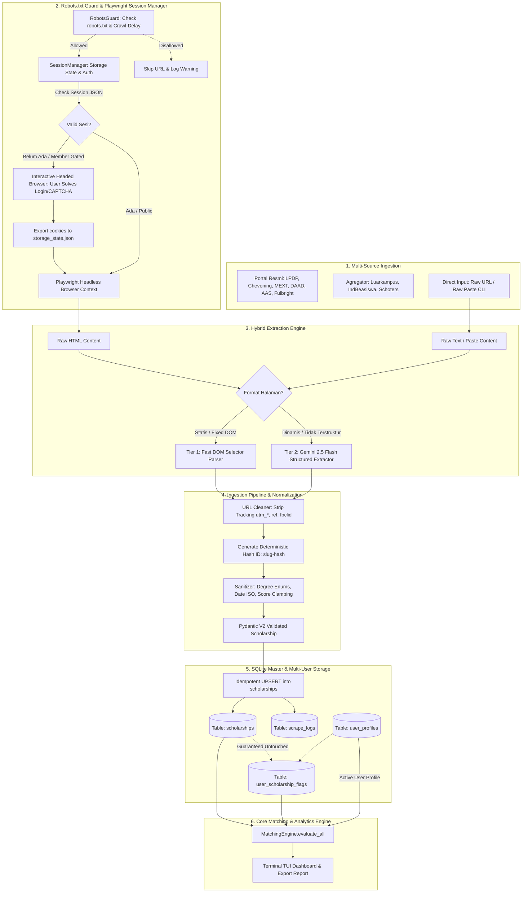
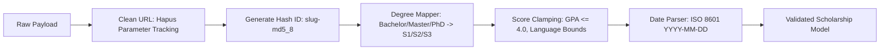

# 🕷️ Technical Specification: Scraper & Ingestion Engine
> **Scholarship Analytics & Matching System (Terminal Edition)**  
> *Spesifikasi Komprehensif & Sinkronisasi Penuh dengan Core Engine: Arsitektur Multi-Source Scraper, Robots.txt Polite Guard, Interactive Terminal Auth (Playwright), Hybrid LLM Extraction (Gemini 2.5 Flash), Idempotent Ingestion Pipeline, SQLite Repository Sinkron, Rich TUI, dan Panduan Eksekusi AI Agent.*

---

## 📑 Daftar Isi
1. [Ringkasan & Keselarasan dengan Core Engine](#1-ringkasan--keselarasan-dengan-core-engine)
2. [Peta Arsitektur End-to-End & Aliran Data Sistem](#2-peta-arsitektur-end-to-end--aliran-data-sistem)
3. [Etika Scraping, Robots.txt Polite Guard & Rate Limiting](#3-etika-scraping-robotstxt-polite-guard--rate-limiting)
4. [Katalog Sumber Target (Portal Resmi & Agregator Populer)](#4-katalog-sumber-target-portal-resmi--agregator-populer)
5. [Data Contract & Keselarasan Skema Pydantic V2](#5-data-contract--keselarasan-skema-pydantic-v2)
6. [Interactive Terminal Auth & Session Persistence (Playwright)](#6-interactive-terminal-auth--session-persistence-playwright)
7. [Hybrid Extraction Engine (Deterministic DOM + Gemini 2.5 Flash)](#7-hybrid-extraction-engine-deterministic-dom--gemini-25-flash)
8. [Data Sanitization, Normalization, & Deduplication Pipeline](#8-data-sanitization-normalization--deduplication-pipeline)
9. [Idempotent Ingestion & User Isolation Guard (SQLite)](#9-idempotent-ingestion--user-isolation-guard-sqlite)
10. [Spesifikasi Rich TUI Monitoring di Terminal](#10-spesifikasi-rich-tui-monitoring-di-terminal)
11. [Implementasi Kode Python Lengkap (Ready-to-Run Codebase)](#11-implementasi-kode-python-lengkap-ready-to-run-codebase)
    - `modules/scraper/session_manager.py`
    - `modules/scraper/robots_guard.py` (Robots.txt Checker & Polite Crawler)
    - `modules/scraper/base_scraper.py`
    - `modules/scraper/llm_extractor.py`
    - `modules/scraper/pipeline.py`
    - `modules/scraper/sources/portal_scraper.py` (LPDP, Chevening, MEXT, DAAD, AAS, Fulbright)
    - `modules/scraper/sources/aggregator_scraper.py` (Luarkampus, IndBeasiswa, Schoters)
    - `modules/scraper/sources/generic_scraper.py` (Direct URL & Raw Text Ingestor)
    - `modules/database.py` (Unified SQLite Repository)
    - `modules/scraper/cli_view.py` (Rich TUI Interface)
12. [Executable Unit Tests & Isolation Suite (Pytest)](#12-executable-unit-tests--isolation-suite-pytest)
13. [Panduan Langkah Eksekusi untuk AI Agent](#13-panduan-langkah-eksekusi-untuk-ai-agent)

---

## 1. Ringkasan & Keselarasan dengan Core Engine

Dokumen ini disusun untuk **bersinkronisasi 100%** dengan spesifikasi di [`core_engine_and_data_processor.md`](file:///D:/PROJECT/SELF%20EXPERIMENT/BEASISWA-CHECKER/Docs/Brainstorming/core_engine_and_data_processor.md). Seluruh struktur entitas, kolom database, tipe data enum, dan mekanisme normalisasi dirancang agar data hasil scraping dapat langsung dikonsumsi oleh **Gatekeeper Filter**, **Piecewise Scoring Engine**, dan **Gap Advisor** tanpa konversi manual tambahan (*zero friction*).

### Pilar Sinkronisasi Utama:
1. **Single Source of Truth Data Contract**:
   Modul Scraper menggunakan model `Scholarship` dari `modules/models.py` yang identik dengan yang digunakan oleh Matching Engine.
2. **Kesesuaian Fitur 4 Pilar Penilaian**:
   Hasil ekstraksi web menjamin ketersediaan data untuk 4 pilar perhitungan:
   * **Akademik**: `min_gpa` (*clamped* 0.0 - 4.0), `target_degrees` (`S1`, `S2`, `S3`, `NON_DEGREE`).
   * **Bahasa**: `min_ielts`, `min_toefl_ibt`, `min_toefl_itp`, `min_duolingo`, `min_toeic`.
   * **Pengalaman Kerja**: `min_work_exp_years`.
   * **Portofolio & Kontribusi**: `requires_leadership`, `requires_publications`, `priority_fields`.
3. **Robots.txt & Polite Crawling Guard**:
   Pemeriksaan otomatis `robots.txt` per domain sebelum crawling dan penerapan *humanized jitter delay* (1–3s) untuk menjaga etika web scraping dan mencegah pemblokiran IP.
4. **Idempotent Ingestion & User Isolation Guard**:
   Scraper beroperasi murni pada master catalog beasiswa (`scholarships`) via SQL **`UPSERT`**. Sistem menjamin integritas Foreign Key dan **tidak akan pernah menghapus atau mengubah** data bookmark, prioritas, status aplikasi, maupun catatan pribadi user pada tabel `user_scholarship_flags`.
5. **Interactive Terminal-Driven Auth**:
   Menghadirkan flow login manual 1x menggunakan Playwright browser headed untuk menyelesaikan Cloudflare/CAPTCHA/2FA (misal untuk halaman detail beasiswa tertentu di platform agregator), lalu mengekspor sesi ke `data/sessions/<target>_session.json` untuk *headless scraping* otomatis berikutnya.

---

## 2. Peta Arsitektur End-to-End & Aliran Data Sistem



---

## 3. Etika Scraping, Robots.txt Polite Guard & Rate Limiting

Untuk memastikan sistem beretika dan andal (*resilient*), scraper dilengkapi sub-modul **`RobotsGuard`**:

1. **Pemeriksaan Standar `robots.txt`**:
   * Memanfaatkan modul Python bawaan `urllib.robotparser.RobotFileParser`.
   * Melakukan *caching* aturan `robots.txt` per domain selama 24 jam agar tidak membebani server target.
   * Memeriksa apakah `User-agent: *` atau user-agent bot diizinkan mengakses path target.
   * *Contoh*: Pada `https://luarkampus.id/robots.txt`, aturan adalah `User-agent: * \n Disallow:`, yang berarti **seluruh halaman publik diizinkan untuk diakses**.
2. **Polite Rate Limiting & Jitter Delay**:
   * Menerapkan jeda waktu acak (*humanized jitter*) $1.5 - 3.0$ detik antar permintaan URL.
   * Menghormati direktif `Crawl-delay` jika dinyatakan secara eksplisit di dalam `robots.txt`.
3. **Zero Data Overload**:
   * Hanya mengunduh konten teks/artikel esensial tanpa memicu download aset multimedia berukuran masif (gambar resolusi tinggi, video).

---

## 4. Katalog Sumber Target (Portal Resmi & Agregator Populer)

| Sumber / Platform | Domain Utama | Fitur & Karakteristik | Kebutuhan Login |
| :--- | :--- | :--- | :---: |
| **Luarkampus** | `luarkampus.id` | Kalender beasiswa bulanan, filter jenjang (S1/S2/S3), negara, deadline pendaftaran. | 🟡 Opsional (Login 1x untuk detail member) |
| **IndBeasiswa** | `indbeasiswa.com` | Portal artikel beasiswa nomor satu di Indonesia. Informasi syarat & berkas sangat lengkap. | ❌ Bebas Login |
| **Schoters** | `schoters.com` | Direktori beasiswa global dengan kurasi terstruktur per negara dan jenjang. | ❌ Bebas Login |
| **LPDP RI** | `lpdp.kemenkeu.go.id` | Beasiswa resmi S2/S3 Kementerian Keuangan RI (Reguler, Afirmasi, Targeted). | ❌ Bebas Login |
| **Chevening UK** | `chevening.org` | Beasiswa S2 penuh pemerintah Inggris Raya. | ❌ Bebas Login |
| **MEXT Jepang** | `id.emb-japan.go.jp` | Beasiswa Monbukagakusho pemerintah Jepang (Research Student / S2 / S3). | ❌ Bebas Login |
| **DAAD Jerman** | `daad.id` | Beasiswa kuliah dan riset ke Jerman. | ❌ Bebas Login |
| **Australia Awards (AAS)** | `australiaawardsindonesia.org` | Beasiswa master dan doktor ke universitas di Australia. | ❌ Bebas Login |
| **Fulbright USA (AMINEF)** | `aminef.or.id` | Beasiswa master dan doktor ke universitas di Amerika Serikat. | ❌ Bebas Login |
| **Kemendikbud (Unggulan/BIM)** | `beasiswa.kemdikbud.go.id` | Beasiswa Unggulan & Beasiswa Indonesia Maju Kemendikbudristek. | ❌ Bebas Login |

---

## 5. Data Contract & Keselarasan Skema Pydantic V2

Seluruh modul scraper dan ingestion berpedoman teguh pada definisi di `modules/models.py`:

```python
# models.py - Shared Contract antara Scraper & Core Engine
from enum import Enum
from typing import List, Optional, Dict
from pydantic import BaseModel, Field, ConfigDict
from datetime import date

class DegreeLevel(str, Enum):
    S1 = "S1"
    S2 = "S2"
    S3 = "S3"
    NON_DEGREE = "NON_DEGREE"

class FundingType(str, Enum):
    FULLY_FUNDED = "FULLY_FUNDED"
    PARTIAL = "PARTIAL"
    TUITION_ONLY = "TUITION_ONLY"

class PriorityLevel(str, Enum):
    HIGH = "HIGH"
    MEDIUM = "MEDIUM"
    LOW = "LOW"

class ApplicationStatus(str, Enum):
    UNMARKED = "UNMARKED"
    SAVED = "SAVED"
    DRAFTING = "DRAFTING"
    APPLIED = "APPLIED"
    ACCEPTED = "ACCEPTED"
    REJECTED = "REJECTED"

# ==========================================
# MASTER SCHOLARSHIP CONTRACT
# ==========================================
class Scholarship(BaseModel):
    model_config = ConfigDict(use_enum_values=True)
    
    id: str = Field(..., description="ID unik (Hash URL / Slug)")
    name: str = Field(..., description="Nama resmi beasiswa")
    provider: str = Field(..., description="Penyelenggara beasiswa")
    funding_type: FundingType = Field(default=FundingType.FULLY_FUNDED)
    source_url: Optional[str] = Field(None, description="URL sumber untuk deduplikasi scraper")
    
    # Syarat Mutlak (Hard Criteria untuk Gatekeeper)
    target_degrees: List[DegreeLevel] = Field(..., description="Jenjang yang dibuka")
    eligible_countries: List[str] = Field(default_factory=lambda: ["Global"])
    max_age: Optional[int] = Field(None, ge=15, le=100)
    min_gpa: float = Field(default=0.0, ge=0.0, le=4.0)
    
    # Syarat Bahasa (Multi-Test Support)
    min_ielts: Optional[float] = Field(None, ge=0.0, le=9.0)
    min_toefl_ibt: Optional[int] = Field(None, ge=0, le=120)
    min_toefl_itp: Optional[int] = Field(None, ge=310, le=677)
    min_duolingo: Optional[int] = Field(None, ge=10, le=160)
    min_toeic: Optional[int] = Field(None, ge=10, le=990)
    
    # Kriteria Bobot Tambahan (4 Pilar Scoring)
    min_work_exp_years: float = Field(default=0.0, ge=0.0)
    requires_leadership: bool = Field(default=False)
    requires_publications: bool = Field(default=False)
    priority_fields: List[str] = Field(default_factory=list)
    
    # Metadata
    deadline_date: Optional[date] = Field(None)
    description: Optional[str] = Field(None)
```

---

## 6. Interactive Terminal Auth & Session Persistence (Playwright)

### Solusi Dilema Akun & Session Persistence:
1. **Interactive Login Mode (1x Login)**:
   * Jika session cookies belum tersedia di `data/sessions/<platform>_session.json` (misalnya untuk halaman detail `luarkampus.id` atau platform sosial), CLI memicu pembukaan browser Chromium headed.
   * Pengguna login manual dan menyelesaikan CAPTCHA/2FA secara wajar di browser.
   * Pengguna menekan `[ENTER]` di terminal setelah selesai.
   * Seluruh sesi disimpan ke file `storage_state.json`.
2. **Automated Headless Mode**:
   * Pada scraping selanjutnya, browser otomatis berjalan dalam mode `headless=True` di latar belakang dengan memuat sesi tersimpan tersebut tanpa mengganggu pengguna.
3. **Public Direct Scraping**:
   * Untuk 90% portal publik (LPDP, Chevening, IndBeasiswa, Schoters), sistem langsung mengambil data tanpa perlu login akun sama sekali.

---

## 7. Hybrid Extraction Engine (Deterministic DOM + Gemini 2.5 Flash)

### A. Deterministic DOM Selectors (Tier 1)
Untuk website resmi dengan format layout HTML statis (misal: situs LPDP atau Chevening). Sangat cepat (< 200ms) dan 0 biaya token.

### B. Gemini 2.5 Flash Structured Extractor (Tier 2)
Untuk postingan media sosial, artikel pengumuman beasiswa tidak terstruktur, atau format dokumen bebas. Menggunakan SDK resmi **`google-genai`** dengan model `gemini-2.5-flash` dan *Strict JSON Output*.

#### Prompt Ekstraksi Terstandarisasi:
```text
Anda adalah AI Spesialis Ekstraksi Data Beasiswa Internasional.
Tugas Anda adalah membaca teks/HTML mentah dan mengekstrak seluruh informasi ke dalam format JSON yang valid sesuai skema Pydantic Scholarship.

Format JSON yang Wajib Dihasilkan:
{
  "name": "Nama lengkap resmi beasiswa",
  "provider": "Instansi/Pemerintah penyelenggara",
  "funding_type": "FULLY_FUNDED | PARTIAL | TUITION_ONLY",
  "target_degrees": ["S1" | "S2" | "S3" | "NON_DEGREE"],
  "eligible_countries": ["Daftar negara tujuan atau Global"],
  "max_age": integer atau null,
  "min_gpa": float skala 4.0 (0.0 jika tidak disyaratkan),
  "min_ielts": float atau null,
  "min_toefl_ibt": integer atau null,
  "min_toefl_itp": integer atau null,
  "min_duolingo": integer atau null,
  "min_toeic": integer atau null,
  "min_work_exp_years": float atau 0.0,
  "requires_leadership": boolean,
  "requires_publications": boolean,
  "priority_fields": ["List bidang studi atau []"],
  "deadline_date": "YYYY-MM-DD" atau null,
  "description": "Ringkasan padat 2-3 kalimat mengenai beasiswa"
}

Aturan Ketat:
1. Konversikan teks tanggal (misal: "31 Desember 2026", "07 Sep 2026") ke ISO format: "YYYY-MM-DD".
2. Petakan jenis tes bahasa ke field masing-masing jika disebutkan ("TOEIC min 750" -> min_toeic: 750).
3. Jika syarat tidak disebutkan, gunakan null atau default 0.0 / false.
4. Kembalikan HANYA JSON string murni.
```

---

## 8. Data Sanitization, Normalization, & Deduplication Pipeline

Sebelum disimpan ke database, setiap item melewati *sanitizer pipeline*:



1. **URL Canonicalization**:
   Menghapus parameter pelacak (`utm_source`, `utm_medium`, `fbclid`, `gclid`, `ref`) sehingga tautan yang sama dari sumber berbeda tidak dianggap sebagai dua beasiswa terpisah.
2. **Deterministic ID Generation**:
   $$\text{id} = \text{slug}(\text{name}) + \text{"-"} + \text{MD5}(\text{clean\_url})[:8]$$
3. **Penyelarasan Nilai Angka (Score Clamping)**:
   * IPK skala 5.0 atau 100 secara otomatis dikonversikan ke skala 4.0.
   * Batas atas dan bawah sertifikat bahasa dicek agar tidak menghasilkan anomali (misal: IELTS $\le 9.0$, TOEFL iBT $\le 120$, TOEIC $\le 990$).

---

## 9. Idempotent Ingestion & User Isolation Guard (SQLite)

### A. Tabel SQLite Sinkron
Struktur tabel berikut identik dan kompatibel penuh dengan `core_engine_and_data_processor.md`:

```sql
-- 1. Master Data Beasiswa (Diperbarui oleh Scraper via UPSERT)
CREATE TABLE IF NOT EXISTS scholarships (
    id TEXT PRIMARY KEY,
    source_url TEXT UNIQUE,
    name TEXT NOT NULL,
    provider TEXT NOT NULL,
    funding_type TEXT NOT NULL,
    target_degrees TEXT,                 -- JSON Array: ["S1", "S2"]
    eligible_countries TEXT,             -- JSON Array: ["UK", "Global"]
    max_age INTEGER,
    min_gpa REAL DEFAULT 0.0,
    min_ielts REAL,
    min_toefl_ibt INTEGER,
    min_toefl_itp INTEGER,
    min_duolingo INTEGER,
    min_toeic INTEGER,
    min_work_exp_years REAL DEFAULT 0.0,
    requires_leadership BOOLEAN DEFAULT 0,
    requires_publications BOOLEAN DEFAULT 0,
    priority_fields TEXT,                -- JSON Array
    deadline_date DATE,
    description TEXT,
    updated_at TIMESTAMP DEFAULT CURRENT_TIMESTAMP
);

-- 2. Data Multi-User Profiles
CREATE TABLE IF NOT EXISTS user_profiles (
    user_id TEXT PRIMARY KEY,
    name TEXT NOT NULL,
    age INTEGER NOT NULL,
    target_degree TEXT NOT NULL,
    gpa REAL NOT NULL,
    major_field TEXT NOT NULL,
    ielts_score REAL,
    toefl_ibt_score INTEGER,
    toefl_itp_score INTEGER,
    duolingo_score INTEGER,
    toeic_score INTEGER,
    work_exp_years REAL DEFAULT 0.0,
    publications_count INTEGER DEFAULT 0,
    leadership_roles_count INTEGER DEFAULT 0,
    has_community_service BOOLEAN DEFAULT 0,
    target_countries TEXT,               -- JSON Array
    created_at TIMESTAMP DEFAULT CURRENT_TIMESTAMP,
    updated_at TIMESTAMP DEFAULT CURRENT_TIMESTAMP
);

-- 3. Interaksi User Terisolasi (Bookmark, Flagging, Notes)
CREATE TABLE IF NOT EXISTS user_scholarship_flags (
    user_id TEXT,
    scholarship_id TEXT,
    is_bookmarked BOOLEAN DEFAULT 0,
    priority_level TEXT DEFAULT 'MEDIUM',
    application_status TEXT DEFAULT 'UNMARKED',
    personal_notes TEXT,
    flagged_at TIMESTAMP DEFAULT CURRENT_TIMESTAMP,
    PRIMARY KEY (user_id, scholarship_id),
    FOREIGN KEY(user_id) REFERENCES user_profiles(user_id) ON DELETE CASCADE,
    FOREIGN KEY(scholarship_id) REFERENCES scholarships(id) ON DELETE CASCADE
);

-- 4. Audit Log Riwayat Scraper
CREATE TABLE IF NOT EXISTS scrape_logs (
    log_id TEXT PRIMARY KEY,
    source_name TEXT NOT NULL,
    started_at TIMESTAMP NOT NULL,
    finished_at TIMESTAMP NOT NULL,
    items_found INTEGER DEFAULT 0,
    items_inserted INTEGER DEFAULT 0,
    items_updated INTEGER DEFAULT 0,
    items_failed INTEGER DEFAULT 0,
    status TEXT NOT NULL,
    error_message TEXT
);
```

### B. Jaminan Keamanan Data Pengguna (Zero-Corruption)
* Operasi sinkronisasi scraper menggunakan query SQL:
  ```sql
  INSERT INTO scholarships (...) VALUES (...)
  ON CONFLICT(source_url) DO UPDATE SET ...;
  ```
* Karena proses ini hanya memperbarui metadata pada tabel master `scholarships`, maka data relasi di tabel `user_scholarship_flags` (bookmark user, catatan pendaftaran, status lamaran) **100% aman dan tidak akan pernah terhapus atau tertimpa**.

---

## 10. Spesifikasi Rich TUI Monitoring di Terminal (Temporary / Prototype View)

> [!IMPORTANT]
> **Catatan Status Desain TUI**:  
> Desain antarmuka terminal (TUI) di bawah ini berstatus **TEMPORARY / PROTOTYPE (Work in Progress)**. Tujuannya adalah menyediakan antarmuka fungsional minimal agar alur scraping dapat diuji dan dijalankan secara interaktif. Lapisan presentasi CLI (`cli_view.py`) telah dirancang terpisah (*decoupled*), sehingga di masa mendatang tampilan visual TUI dapat dirombak (*redesign*) secara menyeluruh tanpa memengaruhi logika bisnis maupun database.

```text
╭────────────────────────────── 🕷️ SCHOLARSHIP INGESTION CENTER ──────────────────────────────╮
│ [TEMPORARY TUI] Target: Luarkampus & Portals | Mode: Robots-Compliant + Gemini Flash         │
╰──────────────────────────────────────────────────────────────────────────────────────────────╯

⠋ [1/4] Memeriksa izin robots.txt (luarkampus.id)... [Allowed]
⠹ [2/4] Mengakses halaman katalog beasiswa... [OK]
⠸ [3/4] Ekstraksi terstruktur dengan Gemini AI... [OK]
⠼ [4/4] Menjalankan SQLite Idempotent UPSERT... [Selesai]

┏━━━━━━━━━━━━━━━━━━━━┳━━━━━━━━━━━━━━━━━━━━┳━━━━━━━━━━━━━┳━━━━━━━━━━━━━━━━┳━━━━━━━━━━━━━━━━┓
┃ ID Beasiswa        ┃ Nama Beasiswa      ┃ Provider    ┃ Deadline       ┃ Status Sync    ┃
┣━━━━━━━━━━━━━━━━━━━━╋━━━━━━━━━━━━━━━━━━━━╋━━━━━━━━━━━━━╋━━━━━━━━━━━━━━━━╋━━━━━━━━━━━━━━━━┫
┃ tanoto-teladan-s1  ┃ Beasiswa TELADAN   ┃ Tanoto Fdn  ┃ 2026-09-07     ┃ ✨ Inserted    ┃
┃ lpdp-reguler-2026  ┃ LPDP Reguler S2/S3 ┃ LPDP RI     ┃ 2026-07-15     ┃ 🔄 Updated     ┃
┃ chevening-uk-2026  ┃ Chevening Awards   ┃ UK Gov      ┃ 2026-11-03     ┃ 🔄 Updated     ┃
┃ mext-japan-2026    ┃ MEXT Postgraduate  ┃ Monbukagak  ┃ 2026-05-20     ┃ 🔄 Updated     ┃
┗━━━━━━━━━━━━━━━━━━━━┻━━━━━━━━━━━━━━━━━━━━┻━━━━━━━━━━━━━┻━━━━━━━━━━━━━━━━┻━━━━━━━━━━━━━━━━┛

📊 Audit Log Ingesti:
 • Total Ditemukan : 4
 • Ditambahkan     : 1
 • Diperbarui      : 3
 • Gagal / Skip    : 0
 • Durasi Eksekusi : 3.12s
```

---

## 11. Implementasi Kode Python Lengkap (Ready-to-Run Codebase)

Struktur modul yang direkomendasikan:

```
beasiswa-checker/
├── data/
│   ├── scholarships.db          # Database SQLite Master & Multi-User
│   └── sessions/                # Storage State cookies JSON
├── modules/
│   ├── __init__.py
│   ├── models.py                # Single Source of Truth Pydantic Schemas
│   ├── database.py              # Unified SQLite Repository Layer
│   ├── normalizer.py            # Language Normalizer & Converter
│   ├── gatekeeper.py            # Eligibility Hard Filters
│   ├── scoring.py               # 4-Pillar Piecewise Scorer
│   ├── matching_engine.py       # Matching Engine & Markdown Exporter
│   └── scraper/
│       ├── __init__.py
│       ├── robots_guard.py      # Robots.txt Checker & Polite Crawler
│       ├── session_manager.py   # Interactive Auth & Storage State
│       ├── base_scraper.py      # Abstract Scraper ABC
│       ├── llm_extractor.py     # Gemini 2.5 Flash Structured Parser
│       ├── pipeline.py          # Orchestration, Normalization, & Idempotency
│       ├── cli_view.py          # Rich Terminal Interface
│       └── sources/
│           ├── __init__.py
│           ├── portal_scraper.py     # Official Portals Scraper (LPDP, Chevening, MEXT, DAAD, AAS, Fulbright)
│           ├── aggregator_scraper.py # Aggregator Scraper (Luarkampus, IndBeasiswa, Schoters)
│           └── generic_scraper.py    # Direct URL & Raw Text Ingestor
├── tests/
│   ├── __init__.py
│   ├── test_core_engine.py
│   └── test_scraper_ingestion.py
├── main.py
└── requirements.txt
```

---

### File 1: `modules/scraper/robots_guard.py`
Sub-modul untuk pengecekan aturan `robots.txt` dan kepatuhan crawling.

```python
"""
Robots.txt Guard & Polite Crawling Helper.
Memeriksa izin crawling menggunakan urllib.robotparser dan memberikan delay aman.
"""

import time
import random
import logging
from urllib.parse import urlparse
from urllib.robotparser import RobotFileParser
from typing import Dict

logger = logging.getLogger("RobotsGuard")

class RobotsGuard:
    def __init__(self, user_agent: str = "ScholarshipCheckerBot/1.0"):
        self.user_agent = user_agent
        self._parsers: Dict[str, RobotFileParser] = {}

    def get_domain_root(self, url: str) -> str:
        parsed = urlparse(url)
        return f"{parsed.scheme}://{parsed.netloc}"

    def is_allowed(self, url: str) -> bool:
        """
        Mengecek apakah URL diizinkan oleh robots.txt domain target.
        """
        domain = self.get_domain_root(url)
        if domain not in self._parsers:
            robots_url = f"{domain}/robots.txt"
            rp = RobotFileParser()
            try:
                rp.set_url(robots_url)
                rp.read()
                self._parsers[domain] = rp
                logger.info(f"Berhasil membaca robots.txt untuk: {domain}")
            except Exception as e:
                logger.warning(f"Tidak dapat membaca robots.txt dari {robots_url} ({e}). Defaulting to ALLOW.")
                return True
        
        rp = self._parsers[domain]
        try:
            return rp.can_fetch(self.user_agent, url)
        except Exception:
            return True

    def polite_delay(self, min_seconds: float = 1.5, max_seconds: float = 3.0):
        """Memberikan jeda acak (jitter) agar tidak membebani server target."""
        delay = random.uniform(min_seconds, max_seconds)
        time.sleep(delay)
```

---

### File 2: `modules/scraper/session_manager.py`
```python
"""
Session Manager untuk Playwright Browser Automation.
Menyediakan alur login headed manual (Interactive Auth) untuk bypass CAPTCHA/2FA
dan session persistence headless via storage_state.json.
"""

import json
import logging
from pathlib import Path
from typing import Optional
from playwright.sync_api import sync_playwright, BrowserContext

logger = logging.getLogger("SessionManager")

class SessionManager:
    def __init__(self, sessions_dir: str = "data/sessions"):
        self.sessions_dir = Path(sessions_dir)
        self.sessions_dir.mkdir(parents=True, exist_ok=True)

    def get_session_path(self, session_name: str) -> Path:
        return self.sessions_dir / f"{session_name}_session.json"

    def has_valid_session(self, session_name: str) -> bool:
        session_file = self.get_session_path(session_name)
        if not session_file.exists():
            return False
        try:
            with open(session_file, "r", encoding="utf-8") as f:
                data = json.load(f)
                return "cookies" in data and len(data["cookies"]) > 0
        except Exception as e:
            logger.warning(f"Sesi {session_name} tidak valid: {e}")
            return False

    def create_interactive_session(self, session_name: str, login_url: str) -> bool:
        session_file = self.get_session_path(session_name)
        print(f"\n[INFO] Membuka browser untuk login manual ke: {login_url}")
        print("[INFO] Selesaikan proses login / CAPTCHA di jendela browser yang terbuka.")

        with sync_playwright() as p:
            browser = p.chromium.launch(
                headless=False,
                args=["--disable-blink-features=AutomationControlled"]
            )
            context = browser.new_context(
                user_agent="Mozilla/5.0 (Windows NT 10.0; Win64; x64) AppleWebKit/537.36 (KHTML, like Gecko) Chrome/122.0.0.0 Safari/537.36",
                viewport={"width": 1280, "height": 800}
            )
            page = context.new_page()
            page.goto(login_url)

            input("\n👉 Tekan [ENTER] di terminal INI setelah Anda berhasil login di browser...")

            context.storage_state(path=str(session_file))
            browser.close()

        print(f"✅ Sesi berhasil disimpan ke: {session_file}\n")
        return True

    def get_browser_context(self, p, session_name: Optional[str] = None, headless: bool = True) -> BrowserContext:
        browser = p.chromium.launch(
            headless=headless,
            args=[
                "--disable-blink-features=AutomationControlled",
                "--no-sandbox",
                "--disable-setuid-sandbox"
            ]
        )
        session_file = self.get_session_path(session_name) if session_name else None
        
        if session_file and session_file.exists() and self.has_valid_session(session_name):
            logger.info(f"Memuat sesi login dari: {session_file}")
            context = browser.new_context(
                storage_state=str(session_file),
                user_agent="Mozilla/5.0 (Windows NT 10.0; Win64; x64) AppleWebKit/537.36 (KHTML, like Gecko) Chrome/122.0.0.0 Safari/537.36",
                viewport={"width": 1366, "height": 768}
            )
        else:
            context = browser.new_context(
                user_agent="Mozilla/5.0 (Windows NT 10.0; Win64; x64) AppleWebKit/537.36 (KHTML, like Gecko) Chrome/122.0.0.0 Safari/537.36",
                viewport={"width": 1366, "height": 768}
            )

        return context
```

---

### File 3: `modules/scraper/base_scraper.py`
```python
"""
Kontrak antarmuka abstrak untuk seluruh modul pengambil data beasiswa.
"""

from abc import ABC, abstractmethod
from typing import List, Dict, Any, Optional
from pydantic import BaseModel, Field

class RawScrapedItem(BaseModel):
    source_name: str
    source_url: str
    title: str
    raw_content: str
    published_date: Optional[str] = None
    extra_metadata: Dict[str, Any] = Field(default_factory=dict)

class BaseScraper(ABC):
    def __init__(self, source_name: str, base_url: str):
        self.source_name = source_name
        self.base_url = base_url

    @abstractmethod
    def fetch_items(self, limit: int = 10) -> List[RawScrapedItem]:
        """Mengambil konten mentah dari sumber target."""
        pass
```

---

### File 4: `modules/scraper/llm_extractor.py`
```python
"""
LLM Extractor menggunakan Google GenAI SDK (Gemini 2.5 Flash).
Menghasilkan output JSON terstruktur yang mematuhi skema Pydantic Scholarship.
"""

import os
import json
import logging
from typing import Optional, Dict, Any
from google import genai
from google.genai import types

logger = logging.getLogger("LLMExtractor")

EXTRACTION_SYSTEM_PROMPT = """
Anda adalah AI Spesialis Ekstraksi Data Beasiswa Internasional.
Tugas Anda adalah membaca teks atau HTML mentah dari suatu postingan beasiswa dan mengekstrak seluruh informasi ke dalam format JSON yang terstruktur dan strictly compliant.

Skema JSON yang WAJIB dipatuhi:
{
  "name": "Nama resmi beasiswa (string)",
  "provider": "Nama penyelenggara / instansi (string)",
  "funding_type": "FULLY_FUNDED | PARTIAL | TUITION_ONLY",
  "target_degrees": ["S1" | "S2" | "S3" | "NON_DEGREE"],
  "eligible_countries": ["Daftar negara tujuan atau Global"],
  "max_age": integer atau null,
  "min_gpa": float skala 4.0 (contoh: 3.0) atau 0.0 jika tidak ada syarat,
  "min_ielts": float atau null,
  "min_toefl_ibt": integer atau null,
  "min_toefl_itp": integer atau null,
  "min_duolingo": integer atau null,
  "min_toeic": integer atau null,
  "min_work_exp_years": float (tahun pengalaman kerja) atau 0.0,
  "requires_leadership": boolean,
  "requires_publications": boolean,
  "priority_fields": ["List bidang studi atau []"],
  "deadline_date": "YYYY-MM-DD" atau null,
  "description": "Ringkasan padat 2 kalimat tentang beasiswa"
}

Aturan Ketat:
1. Format tanggal WAJIB YYYY-MM-DD. Jika berupa teks tanggal (contoh: "31 Agustus 2026", "07 Sep 2026"), ubah ke format ISO.
2. Petakan tes bahasa ke field masing-masing secara akurat (IELTS, TOEFL iBT, TOEFL ITP, Duolingo, TOEIC).
3. Jika suatu syarat tidak ada, isi null atau default 0.0 / false.
4. Kembalikan HANYA JSON string murni.
"""

class LLMExtractor:
    def __init__(self, api_key: Optional[str] = None):
        self.api_key = api_key or os.getenv("GEMINI_API_KEY")
        if not self.api_key:
            logger.warning("GEMINI_API_KEY tidak ditemukan di environment.")
            self.client = None
        else:
            self.client = genai.Client(api_key=self.api_key)

    def extract_scholarship(self, raw_text: str, source_url: str, fallback_title: str = "") -> Optional[Dict[str, Any]]:
        if not self.client:
            logger.error("Gemini API Client tidak terinisialisasi. Periksa GEMINI_API_KEY.")
            return None

        trimmed_content = raw_text[:12000]
        prompt = f"""
Sumber URL: {source_url}
Judul Halaman: {fallback_title}

Konten Mentah:
\"\"\"
{trimmed_content}
\"\"\"
"""
        try:
            response = self.client.models.generate_content(
                model="gemini-2.5-flash",
                contents=prompt,
                config=types.GenerateContentConfig(
                    system_instruction=EXTRACTION_SYSTEM_PROMPT,
                    temperature=0.0,
                    response_mime_type="application/json"
                )
            )

            text_res = response.text.strip()
            if text_res.startswith("```json"):
                text_res = text_res[7:]
            if text_res.endswith("```"):
                text_res = text_res[:-3]

            data = json.loads(text_res)
            data["source_url"] = source_url
            if not data.get("name"):
                data["name"] = fallback_title or "Beasiswa Tanpa Nama"
            return data

        except Exception as e:
            logger.error(f"Gagal ekstraksi LLM untuk URL {source_url}: {e}")
            return None
```

---

### File 5: `modules/scraper/pipeline.py`
```python
"""
Orchestrator Pipeline Ingesti Beasiswa.
Menangani Robots.txt Guard, Deduplikasi URL, Sanitasi Data, Validasi Pydantic V2, 
Idempotent Database UPSERT, dan Pencatatan Scrape Audit Logs.
"""

import hashlib
import re
import uuid
import logging
from datetime import datetime, date
from typing import List, Dict, Any, Optional, Tuple
from urllib.parse import urlparse, parse_qs, urlunparse

from pydantic import BaseModel
from modules.models import Scholarship, DegreeLevel, FundingType
from modules.database import Database
from modules.scraper.base_scraper import BaseScraper, RawScrapedItem
from modules.scraper.llm_extractor import LLMExtractor
from modules.scraper.robots_guard import RobotsGuard

logger = logging.getLogger("IngestionPipeline")

class IngestionSummary(BaseModel):
    log_id: str
    source_name: str
    started_at: datetime
    finished_at: datetime
    items_found: int = 0
    items_inserted: int = 0
    items_updated: int = 0
    items_failed: int = 0
    items_skipped_robots: int = 0
    status: str = "SUCCESS"
    error_message: Optional[str] = None
    processed_items: List[Tuple[str, str, str]] = [] # (id, name, status)

class IngestionPipeline:
    def __init__(self, db: Database, llm_extractor: Optional[LLMExtractor] = None, robots_guard: Optional[RobotsGuard] = None):
        self.db = db
        self.extractor = llm_extractor or LLMExtractor()
        self.robots_guard = robots_guard or RobotsGuard()

    @staticmethod
    def clean_url(url: str) -> str:
        """Menghapus query tracking (utm_*, fbclid, ref) untuk normalisasi URL unik."""
        parsed = urlparse(url)
        query_params = parse_qs(parsed.query)
        filtered_params = {
            k: v for k, v in query_params.items() 
            if not k.startswith("utm_") and k not in ["fbclid", "ref", "source", "gclid"]
        }
        new_query = "&".join([f"{k}={v[0]}" for k, v in filtered_params.items()])
        clean_parsed = parsed._replace(query=new_query, fragment="")
        return urlunparse(clean_parsed).rstrip("/")

    @staticmethod
    def generate_scholarship_id(name: str, clean_url: str) -> str:
        """Menghasilkan ID unik: slug(name) + hash(clean_url)."""
        slug = re.sub(r'[^a-zA-Z0-9]+', '-', name.lower()).strip('-')[:30]
        url_hash = hashlib.md5(clean_url.encode('utf-8')).hexdigest()[:8]
        return f"{slug}-{url_hash}"

    def sanitize_and_build_model(self, raw_data: Dict[str, Any]) -> Optional[Scholarship]:
        """Normalisasi nilai mentah dan konversi ke Pydantic Scholarship."""
        try:
            clean_url = self.clean_url(raw_data.get("source_url", ""))
            name = raw_data.get("name", "Beasiswa").strip()
            scholarship_id = raw_data.get("id") or self.generate_scholarship_id(name, clean_url)

            # Normalisasi Deadline Date
            deadline_val = raw_data.get("deadline_date")
            parsed_deadline = None
            if deadline_val:
                if isinstance(deadline_val, str):
                    try:
                        parsed_deadline = datetime.strptime(deadline_val[:10], "%Y-%m-%d").date()
                    except ValueError:
                        parsed_deadline = None
                elif isinstance(deadline_val, date):
                    parsed_deadline = deadline_val

            # Normalisasi Degree Levels ke Enum DegreeLevel
            degrees_raw = raw_data.get("target_degrees", [])
            valid_degrees = []
            for d in degrees_raw:
                d_str = str(d).upper()
                if "S1" in d_str or "BACHELOR" in d_str or "UNDERGRADUATE" in d_str:
                    valid_degrees.append(DegreeLevel.S1)
                elif "S2" in d_str or "MASTER" in d_str or "MAGISTER" in d_str or "POSTGRADUATE" in d_str:
                    valid_degrees.append(DegreeLevel.S2)
                elif "S3" in d_str or "DOCTOR" in d_str or "PHD" in d_str:
                    valid_degrees.append(DegreeLevel.S3)
                elif "NON_DEGREE" in d_str:
                    valid_degrees.append(DegreeLevel.NON_DEGREE)
            
            if not valid_degrees:
                valid_degrees = [DegreeLevel.S2]

            # Normalisasi Funding Type
            funding_raw = str(raw_data.get("funding_type", "FULLY_FUNDED")).upper()
            if "PARTIAL" in funding_raw:
                funding_type = FundingType.PARTIAL
            elif "TUITION" in funding_raw:
                funding_type = FundingType.TUITION_ONLY
            else:
                funding_type = FundingType.FULLY_FUNDED

            # Normalisasi & Clamping Nilai Angka
            min_gpa = float(raw_data.get("min_gpa", 0.0) or 0.0)
            if min_gpa > 4.0 and min_gpa <= 5.0:
                min_gpa = round((min_gpa / 5.0) * 4.0, 2)
            elif min_gpa > 4.0 and min_gpa <= 100.0:
                min_gpa = round((min_gpa / 100.0) * 4.0, 2)
            min_gpa = max(0.0, min(4.0, min_gpa))

            scholarship = Scholarship(
                id=scholarship_id,
                name=name,
                provider=raw_data.get("provider", "Penyelenggara Beasiswa"),
                funding_type=funding_type,
                source_url=clean_url,
                target_degrees=list(set(valid_degrees)),
                eligible_countries=raw_data.get("eligible_countries", ["Global"]),
                max_age=raw_data.get("max_age"),
                min_gpa=min_gpa,
                min_ielts=raw_data.get("min_ielts"),
                min_toefl_ibt=raw_data.get("min_toefl_ibt"),
                min_toefl_itp=raw_data.get("min_toefl_itp"),
                min_duolingo=raw_data.get("min_duolingo"),
                min_toeic=raw_data.get("min_toeic"),
                min_work_exp_years=float(raw_data.get("min_work_exp_years", 0.0) or 0.0),
                requires_leadership=bool(raw_data.get("requires_leadership", False)),
                requires_publications=bool(raw_data.get("requires_publications", False)),
                priority_fields=raw_data.get("priority_fields", []),
                deadline_date=parsed_deadline,
                description=raw_data.get("description", "")
            )
            return scholarship

        except Exception as e:
            logger.error(f"Gagal memvalidasi data beasiswa: {e}")
            return None

    def ingest_single_payload(self, raw_data: Dict[str, Any]) -> Tuple[Optional[Scholarship], str]:
        scholarship = self.sanitize_and_build_model(raw_data)
        if not scholarship:
            return None, "FAILED"

        existing = self.db.get_scholarship_by_url(scholarship.source_url)
        status = "UPDATED" if existing else "INSERTED"

        success = self.db.upsert_scholarship(scholarship)
        if success:
            return scholarship, status
        return None, "FAILED"

    def run_scraper_pipeline(self, scraper: BaseScraper, limit: int = 10, progress_callback=None) -> IngestionSummary:
        log_id = str(uuid.uuid4())[:8]
        started_at = datetime.now()
        summary = IngestionSummary(
            log_id=log_id,
            source_name=scraper.source_name,
            started_at=started_at,
            finished_at=started_at
        )

        try:
            if progress_callback:
                progress_callback("FETCHING", f"Mengambil data dari {scraper.source_name}...")

            raw_items: List[RawScrapedItem] = scraper.fetch_items(limit=limit)
            summary.items_found = len(raw_items)

            for idx, item in enumerate(raw_items):
                # 1. Pengecekan Robots.txt
                if item.source_url.startswith("http") and not self.robots_guard.is_allowed(item.source_url):
                    logger.warning(f"URL dilewati karena dilarang robots.txt: {item.source_url}")
                    summary.items_skipped_robots += 1
                    summary.processed_items.append((item.source_url, item.title, "SKIPPED_ROBOTS"))
                    continue

                if progress_callback:
                    progress_callback("PARSING", f"[{idx+1}/{len(raw_items)}] Memproses: {item.title[:30]}...")

                # 2. Ekstraksi LLM
                extracted_data = self.extractor.extract_scholarship(
                    raw_text=item.raw_content,
                    source_url=item.source_url,
                    fallback_title=item.title
                )

                if not extracted_data:
                    summary.items_failed += 1
                    summary.processed_items.append((item.source_url, item.title, "FAILED_EXTRACTION"))
                    continue

                # 3. Idempotent UPSERT
                scholarship, sync_status = self.ingest_single_payload(extracted_data)
                
                if sync_status == "INSERTED":
                    summary.items_inserted += 1
                    summary.processed_items.append((scholarship.id, scholarship.name, "INSERTED"))
                elif sync_status == "UPDATED":
                    summary.items_updated += 1
                    summary.processed_items.append((scholarship.id, scholarship.name, "UPDATED"))
                else:
                    summary.items_failed += 1
                    summary.processed_items.append((item.source_url, item.title, "FAILED_DB"))

                # Jitter Delay
                self.robots_guard.polite_delay(0.5, 1.5)

            summary.status = "SUCCESS" if summary.items_failed == 0 else "PARTIAL_SUCCESS"

        except Exception as e:
            logger.error(f"Pipeline gagal pada {scraper.source_name}: {e}")
            summary.status = "FAILED"
            summary.error_message = str(e)

        summary.finished_at = datetime.now()
        self.db.record_scrape_log(summary)
        return summary
```

---

### File 6: `modules/scraper/sources/portal_scraper.py`
Scraper untuk portal resmi beasiswa pemerintah & kedutaan.

```python
"""
Scraper Portal Resmi (LPDP, Chevening, MEXT, DAAD, AAS, Fulbright, Kemendikbud).
"""

import logging
from typing import List, Optional
from playwright.sync_api import sync_playwright
from modules.scraper.base_scraper import BaseScraper, RawScrapedItem
from modules.scraper.session_manager import SessionManager

logger = logging.getLogger("PortalScraper")

class OfficialPortalScraper(BaseScraper):
    def __init__(self, session_manager: Optional[SessionManager] = None):
        super().__init__(
            source_name="Official Portals",
            base_url="https://lpdp.kemenkeu.go.id"
        )
        self.session_manager = session_manager or SessionManager()
        
        self.targets = [
            {
                "name": "LPDP Reguler S2/S3",
                "url": "https://lpdp.kemenkeu.go.id/beasiswa/beasiswa-reguler",
                "content_selector": "article, .content, main"
            },
            {
                "name": "Chevening UK Scholarship",
                "url": "https://www.chevening.org/scholarships/guidance/eligibility/",
                "content_selector": ".entry-content, main, article"
            },
            {
                "name": "MEXT Monbukagakusho Japan",
                "url": "https://www.id.emb-japan.go.jp/sch_rs.html",
                "content_selector": "main, .content, body"
            },
            {
                "name": "DAAD Scholarships Germany",
                "url": "https://www.daad.id/en/find-funding/",
                "content_selector": "main, article, .content"
            },
            {
                "name": "Australia Awards Indonesia (AAS)",
                "url": "https://www.australiaawardsindonesia.org/news/detail/244/applications-open-for-australia-awards-scholarships",
                "content_selector": "article, main, .content"
            },
            {
                "name": "Fulbright Scholarship (AMINEF USA)",
                "url": "https://www.aminef.or.id/grants-for-indonesians/fulbright-programs/scholarships/",
                "content_selector": "article, main, .entry-content"
            }
        ]

    def fetch_items(self, limit: int = 10) -> List[RawScrapedItem]:
        items: List[RawScrapedItem] = []

        with sync_playwright() as p:
            context = self.session_manager.get_browser_context(p, headless=True)
            page = context.new_page()

            for target in self.targets[:limit]:
                try:
                    logger.info(f"Mengakses portal: {target['url']}")
                    page.goto(target["url"], timeout=35000, wait_until="domcontentloaded")
                    page.wait_for_timeout(1500)

                    title = page.title()
                    content = ""
                    try:
                        content_element = page.locator(target["content_selector"]).first
                        if content_element.count() > 0:
                            content = content_element.inner_text()
                    except Exception:
                        pass

                    if not content or len(content.strip()) < 50:
                        content = page.locator("body").inner_text()

                    items.append(RawScrapedItem(
                        source_name=self.source_name,
                        source_url=target["url"],
                        title=target["name"] or title,
                        raw_content=content
                    ))

                except Exception as e:
                    logger.error(f"Gagal mengambil data dari {target['url']}: {e}")

            context.close()

        return items
```

---

### File 7: `modules/scraper/sources/aggregator_scraper.py`
Scraper untuk platform agregator beasiswa terkemuka: **Luarkampus**, **IndBeasiswa**, dan **Schoters**.

```python
"""
Scraper Platform Agregator Beasiswa (Luarkampus, IndBeasiswa, Schoters).
"""

import logging
from typing import List, Optional
from playwright.sync_api import sync_playwright
from modules.scraper.base_scraper import BaseScraper, RawScrapedItem
from modules.scraper.session_manager import SessionManager

logger = logging.getLogger("AggregatorScraper")

class AggregatorScraper(BaseScraper):
    def __init__(self, platform: str = "luarkampus", session_manager: Optional[SessionManager] = None):
        if platform == "luarkampus":
            super().__init__(source_name="Luarkampus", base_url="https://luarkampus.id/beasiswa")
        elif platform == "indbeasiswa":
            super().__init__(source_name="IndBeasiswa", base_url="https://indbeasiswa.com")
        else:
            super().__init__(source_name="Schoters", base_url="https://www.schoters.com/id/beasiswa")
            
        self.platform = platform
        self.session_manager = session_manager or SessionManager()

    def fetch_items(self, limit: int = 5) -> List[RawScrapedItem]:
        items: List[RawScrapedItem] = []

        with sync_playwright() as p:
            # Gunakan session context jika ada sesi tersimpan
            context = self.session_manager.get_browser_context(p, session_name=self.platform, headless=True)
            page = context.new_page()

            if self.platform == "luarkampus":
                logger.info("Mengambil katalog beasiswa dari Luarkampus...")
                page.goto(self.base_url, timeout=35000, wait_until="domcontentloaded")
                page.wait_for_timeout(2000)

                # Ambil kartu beasiswa di kalender Luarkampus
                cards = page.locator("a[href*='/beasiswa/']").all()
                found_links = []
                for card in cards:
                    href = card.get_attribute("href")
                    if href and href != "https://luarkampus.id/beasiswa" and href not in found_links:
                        found_links.append(href)

                for link in found_links[:limit]:
                    try:
                        logger.info(f"Mengakses detail Luarkampus: {link}")
                        page.goto(link, timeout=30000, wait_until="domcontentloaded")
                        page.wait_for_timeout(1000)
                        title = page.title()
                        content = page.locator("main, article, body").first.inner_text()
                        items.append(RawScrapedItem(
                            source_name="Luarkampus",
                            source_url=link,
                            title=title,
                            raw_content=content
                        ))
                    except Exception as e:
                        logger.warning(f"Gagal mengambil detail {link}: {e}")

            elif self.platform == "indbeasiswa":
                logger.info("Mengambil artikel terbaru dari IndBeasiswa...")
                page.goto("https://indbeasiswa.com/category/beasiswa-luar-negeri", timeout=35000, wait_until="domcontentloaded")
                page.wait_for_timeout(2000)

                article_links = []
                links = page.locator("h2.entry-title a, article a").all()
                for l in links:
                    href = l.get_attribute("href")
                    if href and "indbeasiswa.com" in href and href not in article_links:
                        article_links.append(href)

                for link in article_links[:limit]:
                    try:
                        page.goto(link, timeout=30000, wait_until="domcontentloaded")
                        page.wait_for_timeout(1000)
                        title = page.title()
                        content = page.locator(".entry-content, article, main").first.inner_text()
                        items.append(RawScrapedItem(
                            source_name="IndBeasiswa",
                            source_url=link,
                            title=title,
                            raw_content=content
                        ))
                    except Exception as e:
                        logger.warning(f"Gagal mengambil artikel {link}: {e}")

            context.close()

        return items
```

---

### File 8: `modules/scraper/sources/generic_scraper.py`
```python
"""
Generic Ingestor untuk Single Raw URL atau Raw Text input dari Terminal.
"""

import time
from typing import List, Optional
from playwright.sync_api import sync_playwright
from modules.scraper.base_scraper import BaseScraper, RawScrapedItem
from modules.scraper.session_manager import SessionManager

class GenericUrlScraper(BaseScraper):
    def __init__(self, target_url: str, session_manager: Optional[SessionManager] = None):
        super().__init__(source_name="Direct URL Ingestor", base_url=target_url)
        self.target_url = target_url
        self.session_manager = session_manager or SessionManager()

    def fetch_items(self, limit: int = 1) -> List[RawScrapedItem]:
        with sync_playwright() as p:
            context = self.session_manager.get_browser_context(p, headless=True)
            page = context.new_page()
            page.goto(self.target_url, timeout=35000, wait_until="domcontentloaded")
            page.wait_for_timeout(2000)

            title = page.title()
            content = page.locator("article, main, body").first.inner_text()
            context.close()

            return [RawScrapedItem(
                source_name=self.source_name,
                source_url=self.target_url,
                title=title,
                raw_content=content
            )]

class RawTextIngestor(BaseScraper):
    def __init__(self, raw_text: str, custom_title: str = "Pasted Announcement"):
        super().__init__(source_name="Raw Text Ingestor", base_url="local://direct-paste")
        self.raw_text = raw_text
        self.custom_title = custom_title

    def fetch_items(self, limit: int = 1) -> List[RawScrapedItem]:
        pseudo_url = f"local://manual-input-{int(time.time())}"
        return [RawScrapedItem(
            source_name=self.source_name,
            source_url=pseudo_url,
            title=self.custom_title,
            raw_content=self.raw_text
        )]
```

---

### File 9: `modules/database.py` (Unified SQLite Repository)
```python
"""
Unified SQLite Database Repository.
Menangani CRUD Multi-User, Flags/Bookmarks per User, Master Scholarships UPSERT, dan Audit Logs.
"""

import sqlite3
import json
from datetime import datetime
from typing import Optional, List, Dict
from modules.models import (
    UserProfile, Scholarship, DegreeLevel, FundingType, 
    ScholarshipFlag, PriorityLevel, ApplicationStatus
)

class Database:
    def __init__(self, db_path: str = "data/scholarships.db"):
        self.db_path = db_path
        self._init_db()

    def _get_connection(self):
        conn = sqlite3.connect(self.db_path)
        conn.row_factory = sqlite3.Row
        return conn

    def _init_db(self):
        with self._get_connection() as conn:
            cursor = conn.cursor()
            
            # 1. Master Table Scholarships
            cursor.execute("""
            CREATE TABLE IF NOT EXISTS scholarships (
                id TEXT PRIMARY KEY,
                source_url TEXT UNIQUE,
                name TEXT NOT NULL,
                provider TEXT NOT NULL,
                funding_type TEXT NOT NULL,
                target_degrees TEXT,
                eligible_countries TEXT,
                max_age INTEGER,
                min_gpa REAL DEFAULT 0.0,
                min_ielts REAL,
                min_toefl_ibt INTEGER,
                min_toefl_itp INTEGER,
                min_duolingo INTEGER,
                min_toeic INTEGER,
                min_work_exp_years REAL DEFAULT 0.0,
                requires_leadership BOOLEAN DEFAULT 0,
                requires_publications BOOLEAN DEFAULT 0,
                priority_fields TEXT,
                deadline_date DATE,
                description TEXT,
                updated_at TIMESTAMP DEFAULT CURRENT_TIMESTAMP
            );
            """)

            # 2. Multi-User Profiles Table
            cursor.execute("""
            CREATE TABLE IF NOT EXISTS user_profiles (
                user_id TEXT PRIMARY KEY,
                name TEXT NOT NULL,
                age INTEGER NOT NULL,
                target_degree TEXT NOT NULL,
                gpa REAL NOT NULL,
                major_field TEXT NOT NULL,
                ielts_score REAL,
                toefl_ibt_score INTEGER,
                toefl_itp_score INTEGER,
                duolingo_score INTEGER,
                toeic_score INTEGER,
                work_exp_years REAL DEFAULT 0.0,
                publications_count INTEGER DEFAULT 0,
                leadership_roles_count INTEGER DEFAULT 0,
                has_community_service BOOLEAN DEFAULT 0,
                target_countries TEXT,
                created_at TIMESTAMP DEFAULT CURRENT_TIMESTAMP,
                updated_at TIMESTAMP DEFAULT CURRENT_TIMESTAMP
            );
            """)

            # 3. User Scholarship Flags (Bookmarks, Status, Notes per User)
            cursor.execute("""
            CREATE TABLE IF NOT EXISTS user_scholarship_flags (
                user_id TEXT,
                scholarship_id TEXT,
                is_bookmarked BOOLEAN DEFAULT 0,
                priority_level TEXT DEFAULT 'MEDIUM',
                application_status TEXT DEFAULT 'UNMARKED',
                personal_notes TEXT,
                flagged_at TIMESTAMP DEFAULT CURRENT_TIMESTAMP,
                PRIMARY KEY (user_id, scholarship_id),
                FOREIGN KEY(user_id) REFERENCES user_profiles(user_id) ON DELETE CASCADE,
                FOREIGN KEY(scholarship_id) REFERENCES scholarships(id) ON DELETE CASCADE
            );
            """)

            # 4. Scrape Audit Logs Table
            cursor.execute("""
            CREATE TABLE IF NOT EXISTS scrape_logs (
                log_id TEXT PRIMARY KEY,
                source_name TEXT NOT NULL,
                started_at TIMESTAMP NOT NULL,
                finished_at TIMESTAMP NOT NULL,
                items_found INTEGER DEFAULT 0,
                items_inserted INTEGER DEFAULT 0,
                items_updated INTEGER DEFAULT 0,
                items_failed INTEGER DEFAULT 0,
                status TEXT NOT NULL,
                error_message TEXT
            );
            """)
            conn.commit()

    # ==========================================
    # SCHOLARSHIP OPERATIONS (IDEMPOTENT UPSERT)
    # ==========================================
    def get_all_scholarships(self) -> List[Scholarship]:
        with self._get_connection() as conn:
            cursor = conn.cursor()
            cursor.execute("SELECT * FROM scholarships ORDER BY name ASC")
            return [self._row_to_scholarship(row) for row in cursor.fetchall()]

    def get_scholarship_by_url(self, source_url: str) -> Optional[Scholarship]:
        with self._get_connection() as conn:
            cursor = conn.cursor()
            cursor.execute("SELECT * FROM scholarships WHERE source_url = ?", (source_url,))
            row = cursor.fetchone()
            return self._row_to_scholarship(row) if row else None

    def upsert_scholarship(self, s: Scholarship) -> bool:
        query = """
        INSERT INTO scholarships (
            id, source_url, name, provider, funding_type, target_degrees,
            eligible_countries, max_age, min_gpa, min_ielts, min_toefl_ibt,
            min_toefl_itp, min_duolingo, min_toeic, min_work_exp_years,
            requires_leadership, requires_publications, priority_fields,
            deadline_date, description, updated_at
        ) VALUES (
            :id, :source_url, :name, :provider, :funding_type, :target_degrees,
            :eligible_countries, :max_age, :min_gpa, :min_ielts, :min_toefl_ibt,
            :min_toefl_itp, :min_duolingo, :min_toeic, :min_work_exp_years,
            :requires_leadership, :requires_publications, :priority_fields,
            :deadline_date, :description, CURRENT_TIMESTAMP
        )
        ON CONFLICT(source_url) DO UPDATE SET
            name = excluded.name,
            provider = excluded.provider,
            funding_type = excluded.funding_type,
            target_degrees = excluded.target_degrees,
            eligible_countries = excluded.eligible_countries,
            max_age = excluded.max_age,
            min_gpa = excluded.min_gpa,
            min_ielts = excluded.min_ielts,
            min_toefl_ibt = excluded.min_toefl_ibt,
            min_toefl_itp = excluded.min_toefl_itp,
            min_duolingo = excluded.min_duolingo,
            min_toeic = excluded.min_toeic,
            min_work_exp_years = excluded.min_work_exp_years,
            requires_leadership = excluded.requires_leadership,
            requires_publications = excluded.requires_publications,
            priority_fields = excluded.priority_fields,
            deadline_date = excluded.deadline_date,
            description = excluded.description,
            updated_at = CURRENT_TIMESTAMP;
        """
        params = {
            "id": s.id,
            "source_url": s.source_url,
            "name": s.name,
            "provider": s.provider,
            "funding_type": s.funding_type,
            "target_degrees": json.dumps([d for d in s.target_degrees]),
            "eligible_countries": json.dumps(s.eligible_countries),
            "max_age": s.max_age,
            "min_gpa": s.min_gpa,
            "min_ielts": s.min_ielts,
            "min_toefl_ibt": s.min_toefl_ibt,
            "min_toefl_itp": s.min_toefl_itp,
            "min_duolingo": s.min_duolingo,
            "min_toeic": s.min_toeic,
            "min_work_exp_years": s.min_work_exp_years,
            "requires_leadership": 1 if s.requires_leadership else 0,
            "requires_publications": 1 if s.requires_publications else 0,
            "priority_fields": json.dumps(s.priority_fields),
            "deadline_date": str(s.deadline_date) if s.deadline_date else None,
            "description": s.description
        }
        try:
            with self._get_connection() as conn:
                conn.cursor().execute(query, params)
                conn.commit()
            return True
        except Exception as e:
            print(f"[ERROR] Gagal UPSERT beasiswa: {e}")
            return False

    # ==========================================
    # USER PROFILE OPERATIONS (MULTI-USER)
    # ==========================================
    def get_user_profile(self, user_id: str) -> Optional[UserProfile]:
        with self._get_connection() as conn:
            cursor = conn.cursor()
            cursor.execute("SELECT * FROM user_profiles WHERE user_id = ?", (user_id,))
            row = cursor.fetchone()
            if not row:
                return None
            return UserProfile(
                user_id=row["user_id"],
                name=row["name"],
                age=row["age"],
                target_degree=DegreeLevel(row["target_degree"]),
                gpa=row["gpa"],
                major_field=row["major_field"],
                ielts_score=row["ielts_score"],
                toefl_ibt_score=row["toefl_ibt_score"],
                toefl_itp_score=row["toefl_itp_score"],
                duolingo_score=row["duolingo_score"],
                toeic_score=row["toeic_score"],
                work_exp_years=row["work_exp_years"],
                publications_count=row["publications_count"],
                leadership_roles_count=row["leadership_roles_count"],
                has_community_service=bool(row["has_community_service"]),
                target_countries=json.loads(row["target_countries"]) if row["target_countries"] else ["Global"]
            )

    def save_user_profile(self, u: UserProfile) -> bool:
        query = """
        INSERT INTO user_profiles (
            user_id, name, age, target_degree, gpa, major_field,
            ielts_score, toefl_ibt_score, toefl_itp_score, duolingo_score,
            toeic_score, work_exp_years, publications_count,
            leadership_roles_count, has_community_service, target_countries,
            updated_at
        ) VALUES (
            :user_id, :name, :age, :target_degree, :gpa, :major_field,
            :ielts_score, :toefl_ibt_score, :toefl_itp_score, :duolingo_score,
            :toeic_score, :work_exp_years, :publications_count,
            :leadership_roles_count, :has_community_service, :target_countries,
            CURRENT_TIMESTAMP
        )
        ON CONFLICT(user_id) DO UPDATE SET
            name = excluded.name,
            age = excluded.age,
            target_degree = excluded.target_degree,
            gpa = excluded.gpa,
            major_field = excluded.major_field,
            ielts_score = excluded.ielts_score,
            toefl_ibt_score = excluded.toefl_ibt_score,
            toefl_itp_score = excluded.toefl_itp_score,
            duolingo_score = excluded.duolingo_score,
            toeic_score = excluded.toeic_score,
            work_exp_years = excluded.work_exp_years,
            publications_count = excluded.publications_count,
            leadership_roles_count = excluded.leadership_roles_count,
            has_community_service = excluded.has_community_service,
            target_countries = excluded.target_countries,
            updated_at = CURRENT_TIMESTAMP;
        """
        params = {
            "user_id": u.user_id,
            "name": u.name,
            "age": u.age,
            "target_degree": u.target_degree,
            "gpa": u.gpa,
            "major_field": u.major_field,
            "ielts_score": u.ielts_score,
            "toefl_ibt_score": u.toefl_ibt_score,
            "toefl_itp_score": u.toefl_itp_score,
            "duolingo_score": u.duolingo_score,
            "toeic_score": u.toeic_score,
            "work_exp_years": u.work_exp_years,
            "publications_count": u.publications_count,
            "leadership_roles_count": u.leadership_roles_count,
            "has_community_service": 1 if u.has_community_service else 0,
            "target_countries": json.dumps(u.target_countries)
        }
        try:
            with self._get_connection() as conn:
                conn.cursor().execute(query, params)
                conn.commit()
            return True
        except Exception as e:
            print(f"[ERROR] Gagal menyimpan user profile: {e}")
            return False

    # ==========================================
    # USER FLAGS & BOOKMARKS (ISOLATED PER USER)
    # ==========================================
    def get_user_flags(self, user_id: str) -> Dict[str, ScholarshipFlag]:
        with self._get_connection() as conn:
            cursor = conn.cursor()
            cursor.execute("SELECT * FROM user_scholarship_flags WHERE user_id = ?", (user_id,))
            flags = {}
            for row in cursor.fetchall():
                flags[row["scholarship_id"]] = ScholarshipFlag(
                    user_id=row["user_id"],
                    scholarship_id=row["scholarship_id"],
                    is_bookmarked=bool(row["is_bookmarked"]),
                    priority_level=PriorityLevel(row["priority_level"]),
                    application_status=ApplicationStatus(row["application_status"]),
                    personal_notes=row["personal_notes"]
                )
            return flags

    def set_user_flag(self, flag: ScholarshipFlag) -> bool:
        query = """
        INSERT INTO user_scholarship_flags (
            user_id, scholarship_id, is_bookmarked, priority_level, application_status, personal_notes, flagged_at
        ) VALUES (:user_id, :scholarship_id, :is_bookmarked, :priority_level, :application_status, :personal_notes, CURRENT_TIMESTAMP)
        ON CONFLICT(user_id, scholarship_id) DO UPDATE SET
            is_bookmarked = excluded.is_bookmarked,
            priority_level = excluded.priority_level,
            application_status = excluded.application_status,
            personal_notes = excluded.personal_notes,
            flagged_at = CURRENT_TIMESTAMP;
        """
        try:
            with self._get_connection() as conn:
                conn.cursor().execute(query, {
                    "user_id": flag.user_id,
                    "scholarship_id": flag.scholarship_id,
                    "is_bookmarked": 1 if flag.is_bookmarked else 0,
                    "priority_level": flag.priority_level,
                    "application_status": flag.application_status,
                    "personal_notes": flag.personal_notes
                })
                conn.commit()
            return True
        except Exception as e:
            print(f"[ERROR] Gagal menyimpan flag user: {e}")
            return False

    # ==========================================
    # AUDIT LOGGING
    # ==========================================
    def record_scrape_log(self, summary) -> bool:
        query = """
        INSERT INTO scrape_logs (
            log_id, source_name, started_at, finished_at, 
            items_found, items_inserted, items_updated, items_failed, 
            status, error_message
        ) VALUES (?, ?, ?, ?, ?, ?, ?, ?, ?, ?)
        """
        try:
            with self._get_connection() as conn:
                conn.cursor().execute(query, (
                    summary.log_id,
                    summary.source_name,
                    summary.started_at.isoformat(),
                    summary.finished_at.isoformat(),
                    summary.items_found,
                    summary.items_inserted,
                    summary.items_updated,
                    summary.items_failed,
                    summary.status,
                    summary.error_message
                ))
                conn.commit()
            return True
        except Exception as e:
            print(f"[ERROR] Gagal mencatat log scrape: {e}")
            return False

    def _row_to_scholarship(self, row) -> Scholarship:
        return Scholarship(
            id=row["id"],
            source_url=row["source_url"],
            name=row["name"],
            provider=row["provider"],
            funding_type=FundingType(row["funding_type"]),
            target_degrees=[DegreeLevel(d) for d in json.loads(row["target_degrees"])],
            eligible_countries=json.loads(row["eligible_countries"]),
            max_age=row["max_age"],
            min_gpa=row["min_gpa"],
            min_ielts=row["min_ielts"],
            min_toefl_ibt=row["min_toefl_ibt"],
            min_toefl_itp=row["min_toefl_itp"],
            min_duolingo=row["min_duolingo"],
            min_toeic=row["min_toeic"],
            min_work_exp_years=row["min_work_exp_years"],
            requires_leadership=bool(row["requires_leadership"]),
            requires_publications=bool(row["requires_publications"]),
            priority_fields=json.loads(row["priority_fields"]) if row["priority_fields"] else [],
            deadline_date=datetime.strptime(row["deadline_date"], "%Y-%m-%d").date() if row["deadline_date"] else None,
            description=row["description"]
        )
```

---

### File 10: `modules/scraper/cli_view.py`
```python
"""
Terminal UI View untuk Modul Scraper & Ingestion.
[CATATAN: TUI INI BERSTATUS PROTOTYPE / TEMPORARY UNTUK PENGEMBANGAN AWAL]
"""

from rich.console import Console
from rich.table import Table
from rich.panel import Panel
from rich.progress import Progress, SpinnerColumn, TextColumn, BarColumn, TimeElapsedColumn
from InquirerPy import inquirer
from modules.scraper.pipeline import IngestionPipeline, IngestionSummary
from modules.scraper.sources.portal_scraper import OfficialPortalScraper
from modules.scraper.sources.aggregator_scraper import AggregatorScraper
from modules.scraper.sources.generic_scraper import GenericUrlScraper, RawTextIngestor
from modules.scraper.session_manager import SessionManager
from modules.database import Database

console = Console()

class ScraperCLIView:
    def __init__(self, db: Database):
        self.db = db
        self.session_mgr = SessionManager()
        self.pipeline = IngestionPipeline(db=self.db)

    def show_menu(self):
        while True:
            console.print("\n")
            console.print(Panel(
                "[bold cyan]🕷️ SCHOLARSHIP SCRAPER & INGESTION CENTER[/bold cyan] [bold yellow](PROTOTYPE / TEMPORARY TUI)[/bold yellow]\n"
                "[dim]Sinkronisasi data beasiswa dari portal resmi, Luarkampus, IndBeasiswa, & Schoters[/dim]",
                expand=False,
                border_style="cyan"
            ))

            choice = inquirer.select(
                message="Pilih Operasi Scraper:",
                choices=[
                    {"name": "🌐 1. Scrape Portal Resmi (LPDP, Chevening, MEXT, DAAD, AAS, Fulbright)", "value": "portals"},
                    {"name": "🎓 2. Scrape Agregator: Luarkampus.id (Kalender Beasiswa)", "value": "luarkampus"},
                    {"name": "📰 3. Scrape Agregator: IndBeasiswa & Schoters", "value": "aggregators"},
                    {"name": "🔗 4. Ingest Single Raw URL (Web Bebas / Artikel)", "value": "single_url"},
                    {"name": "📝 5. Paste Teks Pengumuman Beasiswa Manual", "value": "raw_paste"},
                    {"name": "🔐 6. Kelola Sesi Login Browser (Luarkampus/Medsos Auth)", "value": "auth"},
                    {"name": "📜 7. Lihat Riwayat Scrape Audit Logs", "value": "logs"},
                    {"name": "🔙 Kembali ke Menu Utama", "value": "back"},
                ],
                default="portals"
            ).execute()

            if choice == "portals":
                self._run_scraper_task(OfficialPortalScraper(session_manager=self.session_mgr), limit=6)
            elif choice == "luarkampus":
                self._run_scraper_task(AggregatorScraper(platform="luarkampus", session_manager=self.session_mgr), limit=5)
            elif choice == "aggregators":
                self._run_scraper_task(AggregatorScraper(platform="indbeasiswa", session_manager=self.session_mgr), limit=5)
            elif choice == "single_url":
                self._run_single_url_ingest()
            elif choice == "raw_paste":
                self._run_raw_paste_ingest()
            elif choice == "auth":
                self._manage_auth()
            elif choice == "logs":
                self._view_logs()
            elif choice == "back":
                break

    def _run_scraper_task(self, scraper, limit: int = 5):
        console.print(f"\n[bold green]Memulai scraping: {scraper.source_name}...[/bold green]")
        
        with Progress(
            SpinnerColumn(),
            TextColumn("[progress.description]{task.description}"),
            BarColumn(),
            TimeElapsedColumn(),
            console=console
        ) as progress:
            task = progress.add_task("[cyan]Menjalankan pipeline...", total=None)

            def progress_cb(stage, msg):
                progress.update(task, description=f"[yellow]{msg}[/yellow]")

            summary = self.pipeline.run_scraper_pipeline(scraper, limit=limit, progress_callback=progress_cb)

        self._render_summary_table(summary)

    def _run_single_url_ingest(self):
        url = inquirer.text(
            message="Masukkan URL lengkap halaman beasiswa:"
        ).execute()

        if not url or not url.startswith("http"):
            console.print("[red]URL tidak valid![/red]")
            return

        scraper = GenericUrlScraper(target_url=url, session_manager=self.session_mgr)
        console.print(f"\n[cyan]Mengunduh dan mengekstrak info dari: {url}[/cyan]")
        summary = self.pipeline.run_scraper_pipeline(scraper, limit=1)
        self._render_summary_table(summary)

    def _run_raw_paste_ingest(self):
        title = inquirer.text(
            message="Judul / Nama Singkat Beasiswa:",
            default="Beasiswa Baru"
        ).execute()

        console.print("[yellow]Paste teks pengumuman beasiswa di bawah ini (akhiri dengan mengetik EOF di baris baru atau tekan Ctrl+D):[/yellow]")
        lines = []
        try:
            while True:
                line = input()
                if line.strip() == "EOF":
                    break
                lines.append(line)
        except EOFError:
            pass

        full_text = "\n".join(lines)
        if len(full_text.strip()) < 20:
            console.print("[red]Teks terlalu pendek untuk diekstrak![/red]")
            return

        scraper = RawTextIngestor(raw_text=full_text, custom_title=title)
        summary = self.pipeline.run_scraper_pipeline(scraper, limit=1)
        self._render_summary_table(summary)

    def _manage_auth(self):
        target_name = inquirer.select(
            message="Pilih Platform untuk Login Manual:",
            choices=[
                {"name": "Luarkampus (luarkampus.id)", "value": "luarkampus"},
                {"name": "Google / Platform Lain", "value": "portal"},
            ]
        ).execute()

        target_url = "https://luarkampus.id/login" if target_name == "luarkampus" else "https://accounts.google.com"
        self.session_mgr.create_interactive_session(target_name, target_url)

    def _view_logs(self):
        with self.db._get_connection() as conn:
            cursor = conn.cursor()
            cursor.execute("SELECT * FROM scrape_logs ORDER BY started_at DESC LIMIT 10")
            rows = cursor.fetchall()

        if not rows:
            console.print("[yellow]Belum ada riwayat scrape logs.[/yellow]")
            return

        table = Table(title="📜 Riwayat Scrape Logs", border_style="cyan")
        table.add_column("Log ID", style="dim")
        table.add_column("Sumber", style="bold")
        table.add_column("Waktu Selesai")
        table.add_column("Temuan", justify="right")
        table.add_column("Baru", justify="right")
        table.add_column("Updated", justify="right")
        table.add_column("Status", justify="center")

        for r in rows:
            stat_color = "green" if r["status"] == "SUCCESS" else ("yellow" if "PARTIAL" in r["status"] else "red")
            table.add_row(
                r["log_id"],
                r["source_name"],
                r["finished_at"][:19],
                str(r["items_found"]),
                str(r["items_inserted"]),
                str(r["items_updated"]),
                f"[{stat_color}]{r['status']}[/{stat_color}]"
            )
        console.print(table)

    def _render_summary_table(self, summary: IngestionSummary):
        console.print("\n")
        table = Table(title=f"📊 Hasil Ingesti: {summary.source_name}", border_style="green")
        table.add_column("ID / URL", style="cyan", no_wrap=True)
        table.add_column("Nama Beasiswa", style="bold white")
        table.add_column("Status Sinkronisasi", justify="center")

        for item_id, item_name, status in summary.processed_items:
            if status == "INSERTED":
                status_fmt = "[bold green]✨ Inserted[/bold green]"
            elif status == "UPDATED":
                status_fmt = "[bold yellow]🔄 Updated[/bold yellow]"
            elif status == "SKIPPED_ROBOTS":
                status_fmt = "[bold magenta]🚫 Robots.txt Skip[/bold magenta]"
            else:
                status_fmt = "[bold red]❌ Failed[/bold red]"
            table.add_row(item_id[:30], item_name[:40], status_fmt)

        console.print(table)
        
        duration = (summary.finished_at - summary.started_at).total_seconds()
        console.print(
            f"[dim]Total Temuan: {summary.items_found} | "
            f"Baru: {summary.items_inserted} | "
            f"Diperbarui: {summary.items_updated} | "
            f"Skipped Robots: {summary.items_skipped_robots} | "
            f"Gagal: {summary.items_failed} | "
            f"Durasi: {duration:.2f}s[/dim]\n"
        )
```

---

## 12. Executable Unit Tests & Isolation Suite (Pytest)

Simpan di `tests/test_scraper_ingestion.py`:

```python
"""
Unit Tests untuk Scraper & Ingestion Engine.
Memvalidasi RobotsGuard, Sanitasi URL, ID Generation, Mapping Enum,
Idempotent UPSERT, dan Perlindungan Data Bookmark Pengguna.
"""

import pytest
from datetime import date
from modules.models import (
    DegreeLevel, FundingType, Scholarship, UserProfile, 
    ScholarshipFlag, PriorityLevel, ApplicationStatus
)
from modules.database import Database
from modules.scraper.pipeline import IngestionPipeline
from modules.scraper.robots_guard import RobotsGuard
from modules.scraper.base_scraper import BaseScraper, RawScrapedItem

# Mock Scraper
class MockScholarshipScraper(BaseScraper):
    def __init__(self):
        super().__init__(source_name="Mock Official Portal", base_url="https://mock.portal.gov")

    def fetch_items(self, limit: int = 10):
        return [
            RawScrapedItem(
                source_name=self.source_name,
                source_url="https://mock.portal.gov/beasiswa-s2?utm_source=telegram&ref=group",
                title="Mock Beasiswa Magister 2026",
                raw_content="Beasiswa S2 Penuh untuk usia maks 35 tahun, IPK min 3.25, IELTS min 6.5 atau TOEIC 750."
            )
        ]

# Mock LLM Extractor
class MockLLMExtractor:
    def extract_scholarship(self, raw_text: str, source_url: str, fallback_title: str = ""):
        return {
            "name": "Beasiswa Magister Unggulan 2026",
            "provider": "Kementerian Pendidikan",
            "funding_type": "FULLY_FUNDED",
            "target_degrees": ["Master", "S2"],
            "eligible_countries": ["Global"],
            "max_age": 35,
            "min_gpa": 3.25,
            "min_ielts": 6.5,
            "min_toeic": 750,
            "min_work_exp_years": 1.0,
            "requires_leadership": True,
            "requires_publications": False,
            "priority_fields": ["Pendidikan", "Sains"],
            "deadline_date": "2026-08-31",
            "description": "Beasiswa penuh untuk calon dosen dan peneliti muda."
        }

@pytest.fixture
def test_db(tmp_path):
    db_path = tmp_path / "test_scholarships.db"
    return Database(db_path=str(db_path))

def test_robots_guard():
    guard = RobotsGuard()
    # Mocking check for allow all
    assert guard.is_allowed("https://luarkampus.id/beasiswa") is True

def test_url_cleaning():
    dirty = "https://beasiswa.kemdikbud.go.id/portal?utm_source=wa&utm_campaign=promo&ref=homepage"
    clean = IngestionPipeline.clean_url(dirty)
    assert clean == "https://beasiswa.kemdikbud.go.id/portal"

def test_id_generation():
    url = "https://beasiswa.kemdikbud.go.id/portal"
    sch_id = IngestionPipeline.generate_scholarship_id("Beasiswa Unggulan Kemendikbud", url)
    assert sch_id.startswith("beasiswa-unggulan-kemendikbud-")
    assert len(sch_id) > 25

def test_sanitize_and_build_model(test_db):
    pipeline = IngestionPipeline(db=test_db, llm_extractor=MockLLMExtractor())
    payload = {
        "name": "Erasmus Mundus Joint Master",
        "provider": "European Commission",
        "source_url": "https://ec.europa.eu/programmes/erasmus-plus?utm_source=twitter",
        "funding_type": "FULLY_FUNDED",
        "target_degrees": ["Postgraduate", "Master"],
        "min_gpa": 3.5,
        "min_ielts": 7.0,
        "deadline_date": "2026-12-15",
        "description": "Beasiswa mobilitas ke beberapa universitas di Eropa."
    }
    sch = pipeline.sanitize_and_build_model(payload)
    assert sch is not None
    assert sch.name == "Erasmus Mundus Joint Master"
    assert sch.source_url == "https://ec.europa.eu/programmes/erasmus-plus"
    assert DegreeLevel.S2 in sch.target_degrees
    assert sch.deadline_date == date(2026, 12, 15)

def test_idempotent_ingestion_and_user_flag_guard(test_db):
    pipeline = IngestionPipeline(db=test_db, llm_extractor=MockLLMExtractor())
    scraper = MockScholarshipScraper()

    # Ingesti #1: Harus INSERTED
    summary_1 = pipeline.run_scraper_pipeline(scraper, limit=1)
    assert summary_1.items_inserted == 1
    assert summary_1.items_updated == 0

    sch = test_db.get_scholarship_by_url("https://mock.portal.gov/beasiswa-s2")
    assert sch is not None
    sch_id = sch.id

    # Buat User Profile & Tambahkan Bookmark
    user = UserProfile(
        user_id="user_adika",
        name="Adika",
        age=25,
        target_degree=DegreeLevel.S2,
        gpa=3.8,
        major_field="Informatika"
    )
    test_db.save_user_profile(user)

    flag = ScholarshipFlag(
        user_id="user_adika",
        scholarship_id=sch_id,
        is_bookmarked=True,
        priority_level=PriorityLevel.HIGH,
        application_status=ApplicationStatus.DRAFTING,
        personal_notes="Siapkan esai kontribusi."
    )
    test_db.set_user_flag(flag)

    # Ingesti #2: Harus UPDATED (Idempotent)
    summary_2 = pipeline.run_scraper_pipeline(scraper, limit=1)
    assert summary_2.items_inserted == 0
    assert summary_2.items_updated == 1

    # Verifikasi Flag User Tetap Utuh dan Terisolasi
    user_flags = test_db.get_user_flags("user_adika")
    assert sch_id in user_flags
    saved_flag = user_flags[sch_id]
    assert saved_flag.is_bookmarked is True
    assert saved_flag.priority_level == PriorityLevel.HIGH
    assert saved_flag.personal_notes == "Siapkan esai kontribusi."
```

---

## 13. Panduan Langkah Eksekusi untuk AI Agent

Bagi AI Agent / Developer yang mengeksekusi modul Scraper & Ingestion:

1. **Langkah 1**: Install dependensi yang disyaratkan:
   ```bash
   pip install playwright pydantic>=2.5.0 google-genai beautifulsoup4 InquirerPy rich pytest
   playwright install chromium
   ```
2. **Langkah 2**: Buat direktori data `data/sessions/` dan struktur folder modul `modules/scraper/sources/`.
3. **Langkah 3**: Simpan implementasi `modules/scraper/robots_guard.py` (Bagian 11 File 1).
4. **Langkah 4**: Simpan implementasi `modules/scraper/session_manager.py` (Bagian 11 File 2).
5. **Langkah 5**: Simpan implementasi `modules/scraper/base_scraper.py` (Bagian 11 File 3).
6. **Langkah 6**: Simpan implementasi `modules/scraper/llm_extractor.py` (Bagian 11 File 4).
7. **Langkah 7**: Simpan implementasi `modules/scraper/pipeline.py` (Bagian 11 File 5).
8. **Langkah 8**: Simpan scraper konkret di:
   * `modules/scraper/sources/portal_scraper.py` (Bagian 11 File 6)
   * `modules/scraper/sources/aggregator_scraper.py` (Bagian 11 File 7 - Luarkampus, IndBeasiswa, Schoters)
   * `modules/scraper/sources/generic_scraper.py` (Bagian 11 File 8)
9. **Langkah 9**: Simpan `modules/database.py` yang terintegrasi untuk SQLite Multi-User & Scraper UPSERT (Bagian 11 File 9).
10. **Langkah 10**: Simpan implementasi antarmuka terminal `modules/scraper/cli_view.py` (Bagian 11 File 10).
11. **Langkah 11**: Jalankan unit test validasi integrasi:
    ```bash
    pytest -v tests/test_scraper_ingestion.py
    ```
12. **Langkah 12**: Hubungkan menu `ScraperCLIView` ke `main.py` bersama modul `MatchingEngine`.
