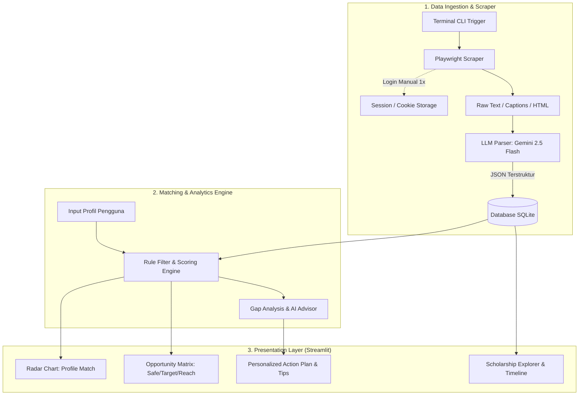

# 🎓 Scholarship Analytics & Matching System (Beasiswa Checker)

> **Sistem Cerdas Rekomendasi Beasiswa, Gap Analysis Berbasis AI, dan Dashboard Analitik Interaktif.**

[](https://www.python.org/)
[](https://streamlit.io/)
[](https://ai.google.dev/)
[](https://playwright.dev/)

---

## 📌 Ringkasan Proyek

**Scholarship Analytics & Matching System** adalah platform analitik dan mesin rekomendasi cerdas yang membantu calon pendaftar beasiswa mencocokkan profil mereka (IPK, skor bahasa, pengalaman kerja, publikasi, dll.) dengan katalog beasiswa yang tersedia.

Sistem ini tidak hanya menyaring syarat mutlak (*eligibility*), tetapi juga mengalkulasi probabilitas kelolosan (*Fit Score*), memetakan kuadran peluang (*Opportunity Matrix*), serta memberikan saran personal berbasis AI (*Gap Advisor*) untuk meningkatkan peluang pendaftar.

---

## ✨ Fitur Utama

- 🎯 **Hybrid Matching Engine**: 
  - **Tahap 1 (Hard Filter)**: Memfilter beasiswa berdasarkan syarat mutlak (batas usia, jenjang, IPK minimum, skor IELTS/TOEFL).
  - **Tahap 2 (Weighted Scoring)**: Menghitung skor kecocokan profil 0–100% dan mengelompokkannya ke kuadran **Safe (Peluang $\ge$ 80%)**, **Target (60–79%)**, dan **Reach/Dream (< 60%)**.
- 📊 **Interactive Analytics Dashboard**: Visualisasi radar perbandingan kriteria, matriks peluang, dan timeline *deadline* beasiswa interaktif menggunakan **Plotly & Streamlit**.
- 🤖 **AI-Powered Gap Advisor & Parser**: Memanfaatkan **Google Gemini** untuk mengubah data mentah hasil *scraping* menjadi format JSON terstruktur serta menganalisis *gap* profil pengguna dengan rekomendasi langkah konkret.
- 🌐 **Automated Scraping with Manual Login**: Pengambilan data beasiswa otomatis dengan **Playwright** yang mendukung sesi *login* manual via terminal untuk melewati proteksi CAPTCHA/2FA.

---

## 🏗️ Arsitektur Sistem



---

## 🛠️ Tech Stack

| Komponen | Teknologi / Library | Kegunaan |
| :--- | :--- | :--- |
| **Frontend / Dashboard** | [Streamlit](https://streamlit.io/) + [Plotly](https://plotly.com/) | Antarmuka interaktif dan visualisasi data grafis. |
| **Database** | [SQLite](https://www.sqlite.org/) / [SQLAlchemy](https://www.sqlalchemy.org/) | Penyimpanan data relasional lokal yang ringan. |
| **Automation & Scraping** | [Playwright Python](https://playwright.dev/python/) | Browser automation dan autentikasi sesi manual. |
| **AI / LLM Layer** | [Google Gemini API](https://ai.google.dev/) (`gemini-2.5-flash`) | Ekstraksi informasi mentah & AI gap advisor. |
| **Data Processing** | [Pandas](https://pandas.pydata.org/) & [Scikit-Learn](https://scikit-learn.org/) | Normalisasi data, pembobotan skor, dan kemiripan profil. |

---

## 📂 Struktur Direktori

```text
BEASISWA-CHECKER/
├── Brainstorming/
│   └── system_analytics_and_architecture.md   # Dokumen perancangan arsitektur lengkap
├── app.py                                     # Entry point aplikasi Streamlit
├── requirements.txt                           # Daftar dependensi Python
├── .env.example                               # Template konfigurasi environment / API Key
├── README.md                                  # Dokumentasi proyek
├── data/
│   ├── scholarships.db                        # Database SQLite
│   └── sessions/                              # Penyimpanan session cookies browser
├── modules/
│   ├── database.py                            # Manajemen model & CRUD SQLite
│   ├── matching_engine.py                     # Algoritma skoring & filter kecocokan
│   ├── ai_advisor.py                          # Integrasi AI Gemini (Gap Analysis)
│   └── visualizer.py                          # Generator grafik Plotly (Radar, Matrix)
└── scraper/
    ├── auth_login.py                          # Helper login manual Playwright via CLI
    ├── portal_scraper.py                      # Scraper portal beasiswa
    └── llm_parser.py                          # Ekstraktor teks mentah ke JSON via LLM
```

---

## 🚀 Panduan Memulai

### 1. Clone Repository
```bash
git clone https://github.com/Adikafazaa/Beasiswa-checker.git
cd Beasiswa-checker
```

### 2. Buat & Aktifkan Virtual Environment
```bash
# Windows
python -m venv venv
venv\Scripts\activate

# Linux / MacOS
python3 -m venv venv
source venv/bin/activate
```

### 3. Install Dependensi
```bash
pip install -r requirements.txt
playwright install
```

### 4. Konfigurasi Environment Variable
Salin file `.env.example` menjadi `.env` dan masukkan API Key Anda:
```env
GEMINI_API_KEY=your_google_gemini_api_key_here
```

### 5. Jalankan Aplikasi
```bash
streamlit run app.py
```

---

## 🗺️ Roadmap Pengembangan

- [x] **Perancangan Arsitektur & Logika Sistem** (`system_analytics_and_architecture.md`)
- [ ] **Fase 1**: Setup project structure & dependensi
- [ ] **Fase 2**: Skema Database SQLite & Operasi CRUD
- [ ] **Fase 3**: Implementasi *Matching & Scoring Engine*
- [ ] **Fase 4**: Pembuatan UI Dashboard Streamlit & Visualisasi Plotly
- [ ] **Fase 5**: Implementasi Playwright Scraper + LLM Parser
- [ ] **Fase 6**: Integrasi AI Gap Advisor & Final Testing

---

## 📄 Lisensi
Proyek ini dibuat untuk keperluan eksplorasi dan pengembangan sistem rekomendasi beasiswa berbasis analitik dan kecerdasan buatan.
