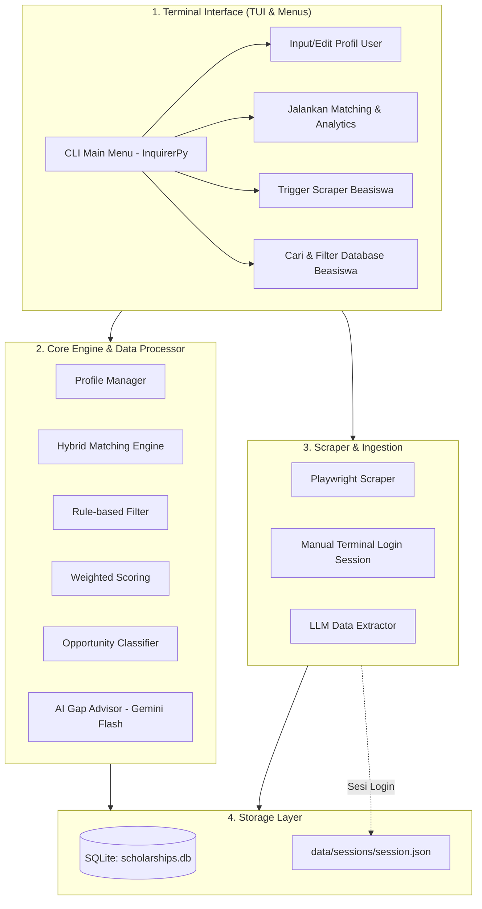

# 🎓 Scholarship Analytics & Matching System (Terminal / CLI Edition)

> **Platform Cerdas Analitik, Pencocokan Beasiswa, dan AI Gap Advisor Berbasis 100% Terminal (TUI).**

[](https://www.python.org/)
[](https://github.com/Textualize/rich)
[](https://github.com/piccolomo/plotext)
[](https://ai.google.dev/)
[](https://playwright.dev/)
[](https://www.sqlite.org/)

---

## 📌 Ringkasan & Konsep Proyek

**Scholarship Analytics & Matching System (Terminal Edition)** adalah sistem rekomendasi beasiswa dan analitik interaktif yang berjalan sepenuhnya di terminal (*Terminal User Interface / TUI*). Pengguna dapat mengelola profil pendaftar, menghitung skor kecocokan beasiswa, melihat visualisasi peluang dalam bentuk grafik ASCII/Unicode, hingga menjalankan web scraper secara terintegrasi langsung dari satu layar command prompt.

### 🌟 Keunggulan Berbasis Terminal (TUI):
- ⚡ **Sangat Ringan & Cepat**: Tanpa beban web browser / local web server, rendering data terjadi secara instan.
- ⌨️ **Keyboard-Driven & Interaktif**: Navigasi menu modern menggunakan tombol panah ($\uparrow \downarrow$), autocomplete, dan checklist berkat **`InquirerPy`**.
- 📊 **Visualisasi Estetik di Terminal**: Menggunakan **`Rich`** untuk layout tabel berwarna, panel, & live spinner, serta **`Plotext`** untuk grafik batang & sebaran skor.
- 🔐 **Alur Scraping Terpadu**: Login manual untuk bypass CAPTCHA/2FA dan proses parsing data beasiswa dipicu langsung dari menu CLI.

---

## 🖥️ Preview Tampilan Terminal Dashboard

```text
╭────────────────────────────── 🎓 BEASISWA CHECKER ANALYTICS ──────────────────────────────╮
│  Nama: Adika | Jenjang: S2 | Target: UK, Europe | IPK: 3.65 | IELTS: 6.5 | Pengalaman: 2 Th │
╰────────────────────────────────────────────────────────────────────────────────────────────╯

┏━━━━━━━━━━━━━━━━━━━━┳━━━━━━━━━━━━━━━━━━━━┳━━━━━━━━━━━━━┳━━━━━━━━━━━━━━━━┳━━━━━━━━━━━━━━━━┓
┃ Kategori           ┃ Nama Beasiswa      ┃ Peluang (%) ┃ Status Syarat  ┃ Kuadran        ┃
┣━━━━━━━━━━━━━━━━━━━━╋━━━━━━━━━━━━━━━━━━━━╋━━━━━━━━━━━━━╋━━━━━━━━━━━━━━━━╋━━━━━━━━━━━━━━━━┫
┃ 🟢 Safety (≥80%)   ┃ Chevening UK       ┃ 88% [█████] ┃ Lengkap (100%) ┃ Rekomendasi #1 ┃
┃ 🟢 Safety (≥80%)   ┃ Erasmus Mundus     ┃ 82% [████ ] ┃ Lengkap (100%) ┃ Rekomendasi #2 ┃
┃ 🟡 Target (60-79%) ┃ LPDP Reguler       ┃ 74% [███  ] ┃ Lolos Syarat   ┃ Prioritas #3   ┃
┃ 🔴 Reach (<60%)    ┃ Gates Cambridge    ┃ 52% [██   ] ┃ Perlu Riset    ┃ Tantangan      ┃
┗━━━━━━━━━━━━━━━━━━━━┻━━━━━━━━━━━━━━━━━━━━┻━━━━━━━━━━━━━┻━━━━━━━━━━━━━━━━┻━━━━━━━━━━━━━━━━┛

📊 Peluang & Distribusi Skor:
 100 ┼                                      ╭───╮
  80 ┼                    ╭───╮             │   │
  60 ┼                    │   │    ╭───╮    │   │
  40 ┼           ╭───╮    │   │    │   │    │   │
   0 ┴───────────┴───┴────┴───┴────┴───┴────┴───┴──────────
                 Gates    LPDP    Erasmus  Chevening

💡 AI Gap Analysis & Rekomendasi Tindakan:
 • Target Beasiswa: LPDP Reguler (74%)
   👉 Skor IELTS Anda saat ini 6.5. Jika ditingkatkan ke 7.0, peluang naik menjadi 84%.
   👉 Tambahkan 1 publikasi riset atau bukti leadership untuk memperkuat esai kontribusi.
```

---

## 🏗️ Arsitektur Sistem (Terminal Edition)



---

## 🛠️ Tech Stack & Library

| Komponen | Library / Tools | Peranan & Fungsi |
| :--- | :--- | :--- |
| **CLI Styling & Layout** | [Rich](https://github.com/Textualize/rich) | Merender tabel berwarna, panel berbingkai, teks Markdown, live progress bar & spinner. |
| **Interactive Prompts** | [InquirerPy](https://inquirerpy.readthedocs.io/) | Menyediakan navigasi menu keyboard ($\uparrow \downarrow$), list selector, input prompt, & checklist. |
| **Terminal Plotting** | [Plotext](https://github.com/piccolomo/plotext) | Merender grafik batang dan diagram sebaran langsung di terminal dengan karakter Unicode. |
| **Database** | [SQLite](https://www.sqlite.org/) + [SQLAlchemy](https://www.sqlalchemy.org/) | Penyimpanan data lokal mandiri, cepat, dan terstruktur. |
| **Scraper & Auth** | [Playwright Python](https://playwright.dev/python/) | Browser automation untuk login manual 1x di terminal & scraping data postingan beasiswa. |
| **AI Parser & Advisor** | [Google Gemini API](https://ai.google.dev/) (`gemini-2.5-flash`) | Ekstraksi postingan teks mentah menjadi JSON terstruktur dan pembuatan analisis kesenjangan profil (*Gap Analysis*). |
| **Data Processing** | [Pandas](https://pandas.pydata.org/) | Normalisasi data, pengurutan skor, dan pemrosesan query database. |

---

## 📂 Struktur Direktori Proyek

```text
BEASISWA-CHECKER/
├── Brainstorming/
│   └── system_analytics_and_architecture.md   # Dokumen perancangan arsitektur lengkap (CLI Edition)
├── main.py                                    # Entry point utama aplikasi CLI (Menu & Routing)
├── requirements.txt                           # Daftar dependensi library Python
├── .env.example                               # Template konfigurasi environment / API Key
├── README.md                                  # Dokumentasi proyek ini
├── data/
│   ├── scholarships.db                        # Database lokal SQLite
│   └── sessions/                              # Penyimpanan cookie sesi login Playwright
├── cli/
│   ├── menus.py                               # Prompt menu interaktif (InquirerPy)
│   ├── views.py                               # Render visual tabel, panel, & grafik (Rich + Plotext)
│   └── profile_cli.py                         # Form input data profil pendaftar via CLI
├── modules/
│   ├── database.py                            # Operasi CRUD SQLite & koneksi database
│   ├── matching_engine.py                     # Algoritma scoring & klasifikasi peluang beasiswa
│   └── ai_advisor.py                          # Integrasi Gemini API untuk gap analysis & saran
└── scraper/
    ├── auth_login.py                          # Helper login manual browser Playwright via CLI
    ├── portal_scraper.py                      # Scraper portal & halaman beasiswa
    └── llm_parser.py                          # Parser teks mentah ke format JSON via LLM
```

---

## 🚀 Panduan Memulai

### 1. Clone Repository
```bash
git clone https://github.com/Adikafazaa/Beasiswa-checker.git
cd Beasiswa-checker
```

### 2. Buat & Aktifkan Virtual Environment
```bash
# Windows
python -m venv venv
venv\Scripts\activate

# Linux / MacOS
python3 -m venv venv
source venv/bin/activate
```

### 3. Install Dependensi & Browser Playwright
```bash
pip install -r requirements.txt
playwright install chromium
```

### 4. Konfigurasi Environment Variable
Salin file `.env.example` ke `.env` dan masukkan API Key Gemini Anda:
```env
GEMINI_API_KEY=your_google_gemini_api_key_here
```

### 5. Jalankan Aplikasi CLI
```bash
python main.py
```

---

## 🗺️ Roadmap Pengembangan

- [x] **Perancangan Arsitektur CLI/TUI** (`system_analytics_and_architecture.md`)
- [ ] **Fase 1: Setup Environment & Dependensi** (`rich`, `inquirerpy`, `plotext`, `playwright`, dll.)
- [ ] **Fase 2: Database & Data Beasiswa Awal** (Inisialisasi SQLite & dataset awal beasiswa)
- [ ] **Fase 3: Matching & Analytics Engine** (Kalkulasi skor & matriks peluang Safety/Target/Reach)
- [ ] **Fase 4: Antarmuka Terminal (TUI Dashboard)** (Menu interaktif + visualisasi grafik Plotext)
- [ ] **Fase 5: Scraper Playwright + Manual Login + LLM Data Extractor**
- [ ] **Fase 6: AI Gap Advisor** (Rekomendasi personal langsung di terminal)

---

## 📄 Lisensi
Proyek ini dikembangkan secara independen sebagai platform analitik dan rekomendasi beasiswa berbasis terminal dengan bantuan AI.
